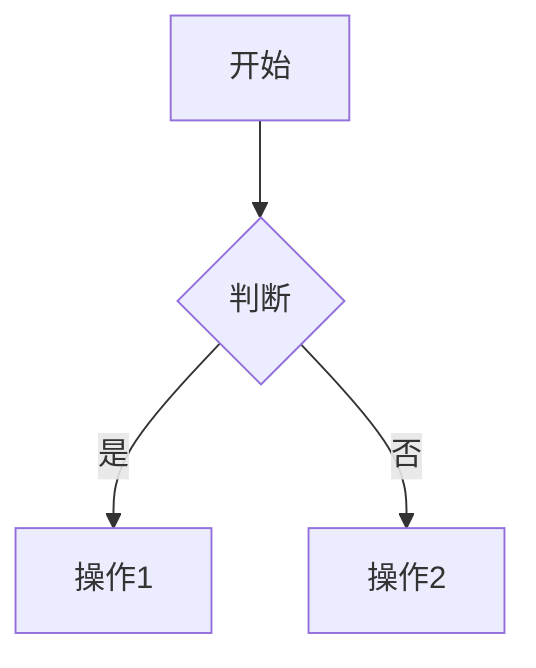

# 文档编写规范（AI 助手版）

> **目标**：为 AI 助手提供清晰、精简的文档编写标准。专注核心规则和决策逻辑。

## 核心原则

| 原则         | 说明                         | 关键决策                                    |
| ------------ | ---------------------------- | ------------------------------------------- |
| **内容优先** | 避免过度拆分，保持完整性     | 文档 > 1000 行 且包含多个独立子主题时才拆分 |
| **可读性**   | 清晰层级、TOC 导航、视觉分组 | 使用 H2-H6 标题，重要内容用引用块           |
| **可维护性** | 统一命名、相对路径、定期更新 | 所有内部链接使用相对路径                    |
| **渐进式**   | 从概述到细节                 | 先核心概念，后具体实现                      |

---

## 命名规范：统一使用 kebab-case

| 类型       | 规则                     | 正确示例                                                  | 错误示例                              |
| ---------- | ------------------------ | --------------------------------------------------------- | ------------------------------------- |
| **文件夹** | 全小写 + 短横线          | `web-front-end/`<br>`database-systems/`                   | `Web_Front_End/`<br>`webFrontEnd/`    |
| **文件**   | 全小写 + 短横线 + `.md`  | `auth-and-loading.md`<br>`package-managers.md`            | `Auth_Loading.md`<br>`authLoading.md` |
| **图片**   | 全小写 + 短横线 + 扩展名 | `architecture-diagram.png`<br>`screenshot-2024-04-03.jpg` | `Architecture_Diagram.png`            |

**特殊约定**：

- `README.md` - 目录索引（全大写）
- `index.md` - 主题概述（全小写）
- `resources.md` - 资源汇总

---

## 文档组织

### 目录结构（标准 3 层）

```
docs/
├── 技术领域/              # 一级：领域
│   ├── README.md         # 目录索引
│   ├── 主题文档.md        # 完整主题文档
│   ├── 子主题/            # 二级：子主题
│   │   ├── README.md
│   │   ├── 详细文档.md
│   │   └── assets/       # 资源文件
│   └── resources.md      # 外部资源
```

### 拆分决策矩阵

| 条件     | 保持单文档   | 拆分文档       |
| -------- | ------------ | -------------- |
| **长度** | < 1000 行    | > 1000 行      |
| **主题** | 单一完整     | 多个独立子主题 |
| **关联** | 频繁交叉引用 | 可独立阅读     |
| **受众** | 同一读者群   | 不同读者群     |

---

## Markdown 语法速查

| 元素         | 语法                             | 注意事项                         |
| ------------ | -------------------------------- | -------------------------------- |
| **标题**     | `# H1` ~ `###### H6`             | 不跳级，H1 唯一                  |
| **代码块**   | \`\`\`language<br>code<br>\`\`\` | 必须指定语言（js/ts/py/bash 等） |
| **行内代码** | \`code\`                         | 用于变量名、命令、文件名         |
| **内部链接** | `[文本](相对路径.md)`            | 只用相对路径                     |
| **外部链接** | `[文本](https://...)`            | 完整 URL                         |
| **锚点**     | `[文本](#标题)`                  | 文档内跳转                       |
| **图片**     | ``              | 相对路径                         |
| **表格**     | `\| 列1 \| 列2 \|`               | 用`:`对齐                        |
| **引用**     | `> 内容`                         | 重要说明                         |
| **提示框**   | `!!! note "标题"`                | note/warning/tip/danger          |

---

## 文档结构模板

### 1. 概念文档

```markdown
# 标题

> 一句话概述

## 概述

[背景、重要性、应用场景 2-3 段]

## 核心概念

### 概念 1

### 概念 2

## 工作原理

[深入解释]

## 实践示例

### 基础示例

### 高级示例

## 最佳实践

1. 实践 1
2. 实践 2

## 常见问题

### Q: 问题？

A: 回答

## 相关资源

- （可选）补充延伸阅读链接
```

### 2. 教程文档

```markdown
# 教程标题

> 目标简述

## 前置知识

- 要求 1
- 要求 2

## 学习目标

完成后你将：

1. 目标 1
2. 目标 2

## 步骤详解

### 步骤 1：准备

### 步骤 2：实现

### 步骤 3：测试

## 完整示例

[完整代码]

## 扩展阅读

- （可选）补充相关教程链接
```

### 3. README 索引

```markdown
# [主题标题]

> [一句话概述]

## 📚 内容导航

- [文档 1](path.md) - 说明
- [文档 2](path.md) - 说明

## 📖 推荐学习路径

1. 步骤 1
2. 步骤 2

## 🔗 外部资源

详见 [resources.md](resources.md)
```

---

## 面试题文档规范 {#面试题文档规范}

### 核心原则

| 原则             | 说明                              | 面试场景应用                         |
| ---------------- | --------------------------------- | ------------------------------------ |
| **自然语言优先** | 70%自然语言描述，30%代码辅助      | 先用口语化表达思路，代码只是补充说明 |
| **思路清晰**     | 先说"是什么"、"为什么"、"怎么做"  | 模拟真实面试回答顺序                 |
| **层次分明**     | 从宏观到微观，从简单到复杂        | 先整体方案，再技术细节               |
| **控制长度**     | 单个问题 100-300 行，代码 ≤ 30 行 | 避免冗长，突出重点                   |

### 回答结构（重要）

面试题的回答应该模拟真实面试场景，按以下顺序组织：

1. **核心思路**（自然语言）- 用 2-3 句话说清楚解决方案的本质
2. **方案对比**（自然语言）- 列举 2-3 种方案，说明各自的优缺点和适用场景
3. **技术要点**（自然语言）- 关键的技术考虑点，用列表形式
4. **代码示例**（可选）- 只在需要说明具体实现时才提供，且要精简
5. **常见追问**（自然语言）- 预判面试官可能的追问，提前准备答案

### 面试题模板

````markdown
## [问题标题] {#问题标题}

### 问题背景

[用 1-2 段自然语言描述问题场景和考察点]

### 解决方案

#### 核心思路

[用 2-3 段自然语言描述解决问题的核心思路，不要直接上代码]

例如：
"这个问题的核心是要解决 XXX。我们可以从三个维度考虑：架构选型、核心能力、用户体验。
首先在架构上，有纯前端、BFF、微服务三种方案可选..."

#### 方案对比

**方案一：[方案名称]**

[用自然语言描述方案]

优点：

- 优点 1
- 优点 2

缺点：

- 缺点 1
- 缺点 2

适用场景：[具体场景]

**方案二：[方案名称]**

[同上结构]

#### 技术要点

[用列表形式列出关键技术点，每个点用自然语言解释]

1. **要点 1**：解释说明
2. **要点 2**：解释说明
3. **要点 3**：解释说明

#### 代码示例（可选）

[只在必要时提供代码，且要精简到 30 行以内]

```typescript
// 简化的示例代码，展示核心逻辑
class Example {
  // 关键实现
}
```
````

[代码后面要用自然语言解释这段代码的作用]

### 常见追问

**Q1: [追问问题]？**

[用自然语言回答，不要直接贴代码]

主要有三种策略：

1. **策略 1**：说明
2. **策略 2**：说明
3. **策略 3**：说明

[如果需要代码辅助说明，再提供精简代码]

**Q2: [追问问题]？**

[同上结构]

````

### 写作要点

#### ✅ 推荐做法

1. **先写自然语言描述**
   - 用"这个问题的核心是..."开头
   - 用"我们可以从...角度考虑"展开
   - 用"具体来说..."深入细节

2. **使用对比和类比**
   - "A 和 B 的区别在于..."
   - "这就像..."（用生活中的例子类比）
   - "相比于传统方案，这种方式..."

3. **结构化表达**
   - 用"首先...其次...最后..."
   - 用"一方面...另一方面..."
   - 用数字列表"1. 2. 3."

4. **代码作为辅助**
   - 先说"以下是简化的实现示例"
   - 代码后说"这个例子展示了..."
   - 只展示核心逻辑，省略边界处理

#### ❌ 避免做法

1. **不要直接贴大段代码**
   - ❌ 一上来就是 100 行代码
   - ✅ 先用 3-5 段文字说清楚思路

2. **不要过度技术化**
   - ❌ "使用 Singleton Pattern 实现..."
   - ✅ "采用单例模式，确保全局只有一个实例..."

3. **不要假设面试官懂所有术语**
   - ❌ "用 SSE 实现"
   - ✅ "使用 SSE（Server-Sent Events，服务端推送）实现流式响应"

4. **不要忽略方案对比**
   - ❌ 只说一种方案
   - ✅ 列举 2-3 种方案，说明各自适用场景

### 示例对比

#### ❌ 不好的写法

```markdown
## 如何实现 Agent 服务？

```typescript
class Agent {
  constructor() {
    this.llm = new LLM();
    this.tools = [];
  }

  async execute(task) {
    // 100 行代码...
  }
}
````

````

#### ✅ 好的写法

```markdown
## 如何实现 Agent 服务？

### 核心思路

Agent 服务的核心是让 AI 具备"理解-规划-执行-反馈"的完整能力。不同于简单的 API 调用，
Agent 需要能够自主决策使用哪些工具、如何组合这些工具来完成复杂任务。

从架构角度，我们有三种主流方案：

1. **纯前端方案**：适合快速原型，但有安全风险
2. **BFF 方案**：最常见，平衡了安全性和复杂度
3. **微服务方案**：适合大型应用，但运维成本高

### 方案对比

**方案一：BFF 架构**

这是生产环境最常用的方案。前端负责 UI 交互，后端提供 Agent 服务的代理层。

优点：
- 安全性高，API Key 不暴露
- 便于监控和成本控制
- 可以实现复杂的业务逻辑

缺点：
- 需要维护后端服务
- 增加了系统复杂度

适用场景：企业应用、生产环境

[如果需要，再提供精简的代码示例]
````

### 组织方式

**推荐**：按场景分文件（一个文件包含多个相关题目）

```
scenarios/
├── README.md                       # 索引
├── auth-and-loading.md             # 认证场景题（3-5题）
├── page-navigation.md              # 导航场景题（3-5题）
├── data-display-optimization.md    # 数据展示题（3-5题）
├── ai-related.md                   # AI 相关场景题（3-5题）
└── performance-optimization.md     # 性能优化题（3-5题）
```

### 质量检查清单

**面试题文档发布前**：

- [ ] 70% 以上是自然语言描述
- [ ] 先有思路说明，再有代码示例
- [ ] 每个方案都说明了优缺点和适用场景
- [ ] 代码示例不超过 30 行
- [ ] 常见追问用自然语言回答
- [ ] 避免了过度技术化的表达
- [ ] 使用了对比、类比等表达技巧

---

## 代码示例规范

| 类型         | 长度      | 要求               |
| ------------ | --------- | ------------------ |
| **概念示例** | 10-20 行  | 展示核心概念       |
| **教程示例** | 50-100 行 | 完整可运行         |
| **对比示例** | 10-30 行  | ❌ 错误 vs ✅ 正确 |
| **面试题**   | ≤ 30 行   | 关键逻辑片段       |

**必须**：

- 指定语言类型
- 包含必要注释
- 遵循最佳实践
- 有意义的变量名

**示例对比**：

```javascript
// ❌ 避免：闭包问题
setCount(count + 1);

// ✅ 推荐：函数式更新
setCount((prev) => prev + 1);
```

---

## 图表使用指南

| 类型       | 使用场景           | 工具            |
| ---------- | ------------------ | --------------- |
| **流程图** | 业务流程、算法步骤 | Mermaid         |
| **时序图** | 组件交互、API 调用 | Mermaid         |
| **架构图** | 系统结构、模块划分 | Mermaid/Draw.io |

**Mermaid 示例**：

````markdown

````

```

---

## 维护规范

### Git Commit 格式

```

<type>(<scope>): <subject>

<body>
```

**Type 类型**：

- `docs`: 文档更新
- `fix`: 修复错误
- `feat`: 新增内容
- `refactor`: 重构结构
- `style`: 格式调整

**示例**：

```bash
docs(front-end): add React Hooks guide

- Add useState and useEffect explanation
- Include best practices
```

### 质量检查清单

**新文档发布前**：

- [ ] 文件名符合 kebab-case
- [ ] 代码块指定语言
- [ ] 内部链接用相对路径
- [ ] 无明显拼写错误
- [ ] 已更新相关 README.md

---

## 快速参考

### 常见场景决策树

```
需要创建文档？
├─ 是教程/概念/参考？ → 使用对应模板
├─ 是面试题？ → 使用面试题模板
├─ 文档长度会超过1000行？
│  ├─ 是 + 多个独立主题 → 拆分
│  └─ 否 or 单一主题 → 保持完整
└─ 需要图表？ → 优先 Mermaid
```

### 命名速查

- 文件夹：`web-front-end/`
- 文件：`package-managers.md`
- 图片：`architecture-diagram.png`
- 特殊：`README.md`、`resources.md`

### 链接速查

- 内部：`[文本](../path/file.md)`
- 外部：`[文本](https://...)`
- 锚点：`[文本](#标题)`
- 图片：``

---

**最后更新**：2024-10  
**版本**：v2.0（AI 助手精简版）
