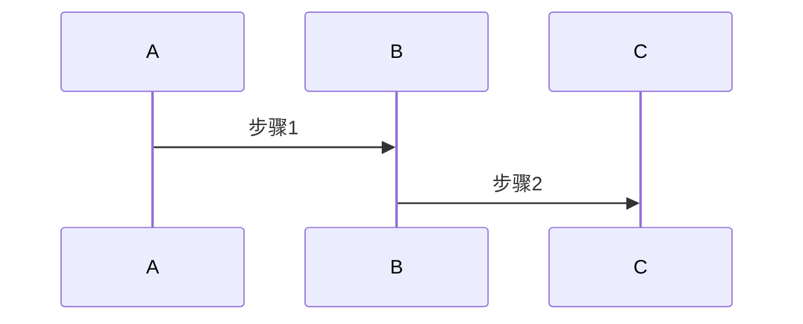
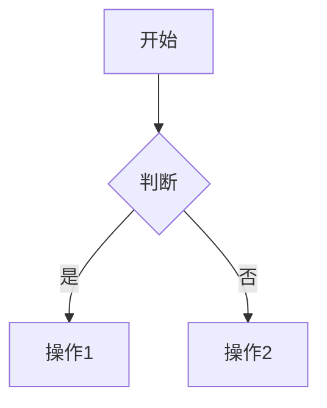

# 文档编写规范（AI助手版）

> **目标**：为AI助手提供清晰、精简的文档编写标准。专注核心规则和决策逻辑。

## 核心原则

| 原则 | 说明 | 关键决策 |
|------|------|---------|
| **内容优先** | 避免过度拆分，保持完整性 | 文档 > 1000行 且包含多个独立子主题时才拆分 |
| **可读性** | 清晰层级、TOC导航、视觉分组 | 使用 H2-H6 标题，重要内容用引用块 |
| **可维护性** | 统一命名、相对路径、定期更新 | 所有内部链接使用相对路径 |
| **渐进式** | 从概述到细节 | 先核心概念，后具体实现 |

---

## 命名规范：统一使用 kebab-case

| 类型 | 规则 | 正确示例 | 错误示例 |
|------|------|---------|---------|
| **文件夹** | 全小写 + 短横线 | `web-front-end/`<br>`database-systems/` | `Web_Front_End/`<br>`webFrontEnd/` |
| **文件** | 全小写 + 短横线 + `.md` | `auth-and-loading.md`<br>`package-managers.md` | `Auth_Loading.md`<br>`authLoading.md` |
| **图片** | 全小写 + 短横线 + 扩展名 | `architecture-diagram.png`<br>`screenshot-2024-04-03.jpg` | `Architecture_Diagram.png` |

**特殊约定**：
- `README.md` - 目录索引（全大写）
- `index.md` - 主题概述（全小写）
- `resources.md` - 资源汇总

---

## 文档组织

### 目录结构（标准3层）

```
docs/
├── 技术领域/              # 一级：领域
│   ├── README.md         # 目录索引
│   ├── 主题文档.md        # 完整主题文档
│   ├── 子主题/            # 二级：子主题
│   │   ├── README.md
│   │   ├── 详细文档.md
│   │   └── assets/       # 资源文件
│   └── resources.md      # 外部资源
```

### 拆分决策矩阵

| 条件 | 保持单文档 | 拆分文档 |
|------|-----------|---------|
| **长度** | < 1000行 | > 1000行 |
| **主题** | 单一完整 | 多个独立子主题 |
| **关联** | 频繁交叉引用 | 可独立阅读 |
| **受众** | 同一读者群 | 不同读者群 |

---

## Markdown 语法速查

| 元素 | 语法 | 注意事项 |
|------|------|---------|
| **标题** | `# H1` ~ `###### H6` | 不跳级，H1唯一 |
| **代码块** | \`\`\`language<br>code<br>\`\`\` | 必须指定语言（js/ts/py/bash等） |
| **行内代码** | \`code\` | 用于变量名、命令、文件名 |
| **内部链接** | `[文本](相对路径.md)` | 只用相对路径 |
| **外部链接** | `[文本](https://...)` | 完整URL |
| **锚点** | `[文本](#标题)` | 文档内跳转 |
| **图片** | `` | 相对路径 |
| **表格** | `\| 列1 \| 列2 \|` | 用`:`对齐 |
| **引用** | `> 内容` | 重要说明 |
| **提示框** | `!!! note "标题"` | note/warning/tip/danger |

---

## 文档结构模板

### 1. 概念文档

```markdown
# 标题
> 一句话概述

## 概述
[背景、重要性、应用场景 2-3段]

## 核心概念
### 概念1
### 概念2

## 工作原理
[深入解释]

## 实践示例
### 基础示例
### 高级示例

## 最佳实践
1. 实践1
2. 实践2

## 常见问题
### Q: 问题？
A: 回答

## 相关资源
- （可选）补充延伸阅读链接
```

### 2. 教程文档

```markdown
# 教程标题
> 目标简述

## 前置知识
- 要求1
- 要求2

## 学习目标
完成后你将：
1. 目标1
2. 目标2

## 步骤详解
### 步骤1：准备
### 步骤2：实现
### 步骤3：测试

## 完整示例
[完整代码]

## 扩展阅读
- （可选）补充相关教程链接
```

### 3. README 索引

```markdown
# [主题标题]
> [一句话概述]

## 📚 内容导航
- [文档1](path.md) - 说明
- [文档2](path.md) - 说明

## 📖 推荐学习路径
1. 步骤1
2. 步骤2

## 🔗 外部资源
详见 [resources.md](resources.md)
```

---

## 面试题文档规范 {#面试题文档规范}

### 核心原则

| 原则 | 说明 |
|------|------|
| **文字为主** | 70%文字描述思路，30%代码片段 |
| **图表优先** | 复杂流程用 Mermaid 图表 |
| **控制长度** | 100-300 行，代码片段 ≤ 30行 |
| **突出重点** | 思路 > 原理 > 关键代码 |

### 面试题模板

```markdown
# [面试题标题]
> 核心考察点一句话

## 问题分析
[背景、考察点、难点]

## 解决思路

### 方案一：[名称]
**核心思路**：
1. 步骤1 - 详细说明
2. 步骤2 - 详细说明

**技术要点**：
- 要点1
- 要点2

**优缺点**：
- 优点：...
- 缺点：...

### 方案二：[名称]
[同上]

## 关键代码（可选）
```javascript
// 核心逻辑，不超过30行
function key() {
  // 实现
}
```

## 流程图（可选）


## 常见追问
### Q1: [问题]？
A: [简洁回答]

## 相关知识点
- （预留）补充知识点链接
```

### 组织方式

**推荐**：按场景分文件（一个文件包含多个相关题目）

```
scenarios/
├── README.md                       # 索引
├── auth-and-loading.md             # 认证场景题（3-5题）
├── page-navigation.md              # 导航场景题（3-5题）
├── data-display-optimization.md    # 数据展示题（3-5题）
└── performance-optimization.md     # 性能优化题（3-5题）
```

---

## 代码示例规范

| 类型 | 长度 | 要求 |
|------|------|------|
| **概念示例** | 10-20行 | 展示核心概念 |
| **教程示例** | 50-100行 | 完整可运行 |
| **对比示例** | 10-30行 | ❌ 错误 vs ✅ 正确 |
| **面试题** | ≤ 30行 | 关键逻辑片段 |

**必须**：
- 指定语言类型
- 包含必要注释
- 遵循最佳实践
- 有意义的变量名

**示例对比**：
```javascript
// ❌ 避免：闭包问题
setCount(count + 1);

// ✅ 推荐：函数式更新
setCount(prev => prev + 1);
```

---

## 图表使用指南

| 类型 | 使用场景 | 工具 |
|------|---------|-----|
| **流程图** | 业务流程、算法步骤 | Mermaid |
| **时序图** | 组件交互、API调用 | Mermaid |
| **架构图** | 系统结构、模块划分 | Mermaid/Draw.io |

**Mermaid 示例**：
```markdown

```

---

## 维护规范

### Git Commit 格式

```
<type>(<scope>): <subject>

<body>
```

**Type 类型**：
- `docs`: 文档更新
- `fix`: 修复错误
- `feat`: 新增内容
- `refactor`: 重构结构
- `style`: 格式调整

**示例**：
```bash
docs(front-end): add React Hooks guide

- Add useState and useEffect explanation
- Include best practices
```

### 质量检查清单

**新文档发布前**：
- [ ] 文件名符合 kebab-case
- [ ] 代码块指定语言
- [ ] 内部链接用相对路径
- [ ] 无明显拼写错误
- [ ] 已更新相关 README.md

---

## 快速参考

### 常见场景决策树

```
需要创建文档？
├─ 是教程/概念/参考？ → 使用对应模板
├─ 是面试题？ → 使用面试题模板
├─ 文档长度会超过1000行？
│  ├─ 是 + 多个独立主题 → 拆分
│  └─ 否 or 单一主题 → 保持完整
└─ 需要图表？ → 优先 Mermaid
```

### 命名速查

- 文件夹：`web-front-end/`
- 文件：`package-managers.md`
- 图片：`architecture-diagram.png`
- 特殊：`README.md`、`resources.md`

### 链接速查

- 内部：`[文本](../path/file.md)`
- 外部：`[文本](https://...)`
- 锚点：`[文本](#标题)`
- 图片：``

---

**最后更新**：2024-10  
**版本**：v2.0（AI助手精简版）
