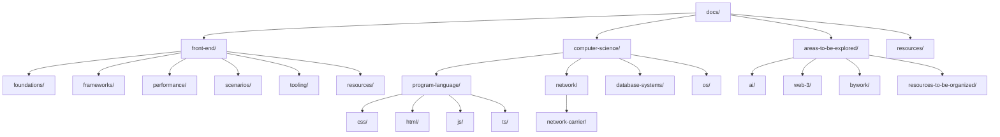

# 知识库架构

## 整体结构设计

本知识库采用 **领域（Domain）→ 子域（Subdomain）→ 主题（Topic）** 的三层组织结构：

## 目录结构说明

### 已完成规范化的领域
- **front-end/** - 前端开发：已完成 foundations/frameworks/performance/scenarios/tooling/resources 分层
- **computer-science/program-language/** - 编程语言：css/html/js/ts 子目录，每个子目录以 README.md 或 index.md 为入口
- **computer-science/network/** - 计算机网络：包含协议分层与传输相关主题
- **computer-science/database-systems/** - 数据库系统：基础与面试题入口

### 待探索与临时区域
- **areas-to-be-explored/** - 待探索主题（ai/web-3/bywork），保留为临时收纳区
- **areas-to-be-explored/resources-to-be-organized/** - 临时资源收集区，后续将并入对应领域的 resources/

## 统一约定

### 命名规范
- **文件与目录**：统一使用英文 kebab-case（短横线分隔）
- **入口文件**：每个目录内统一使用 `README.md` 或 `index.md` 作为索引入口
- **资源文件**：描述性命名，如 `react-rendering-flow.png`

### 导航策略
- **总索引**：`docs/README.md`（本文）提供全局概览
- **领域索引**：每个顶层领域都有 `README.md` 概览与导航
- **交叉引用**：使用相对路径，保持就近链接原则
- **延伸阅读**：同域页面末尾添加相关链接

### 资源管理
- **就近原则**：各领域资源存放在对应的 `assets/` 目录下
  - 例如：`front-end/assets/`、`computer-science/program-language/css/assets/`
- **避免跨域引用**：减少复杂的相对路径
- **外链集中**：外部资源链接集中在各域的 `resources/README.md`

### 图示规范
- **优先使用** Mermaid 绘制流程图、架构图
- **位图格式**：使用 webp/png，控制尺寸与密度
- **图片说明**：添加清晰的 alt 文本和图注
