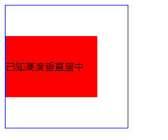

# CSS 布局与居中

## 布局


## 居中

[CSS居中完整指南_CSS, 水平居中, 垂直居中, 水平垂直居中 教程_W3cplus](https://www.w3cplus.com/css/centering-css-complete-guide.html)

### **水平居中**

**水平居中**可分为**`行内元素水平居中`**和**`块级元素水平居中`**

**1.1 行内元素水平居中**

这里行内元素是指文本text、图像img、按钮超链接等，只需给父元素设置`text-align:center`即可实现。

```html
<style>
    .center {
        text-align: center;
    }
</style>
<div class="center">水平居中</div>
```

**1.2 块级元素水平居中**

**定宽块级元素水平居中**

只需给需要居中的块级元素加 `margin:0 auto` 即可，**但这里需要注意的是，这里块状元素的宽度width值一定要有**

```html
<style>
    .center {
        width: 200px;
        margin: 0 auto;
        border: 1px solid red;
    }
</style>
<div class="center">水平居中</div>
```

**不定宽块级元素水平居中**

不定宽，即块级元素宽度不固定

**方法1：设置table**

**通过给要居中显示的元素**，设置`display:table`，然后设置`margin:0 auto`来实现

```html
<style>
    .center {
        display: table;
        margin: 0 auto;
        border: 1px solid red;
    }
</style>
<div class="center">水平居中</div>
```

**方法2：设置inline-block**（多个块状元素）

 子元素设置inline-block，同时父元素设置text-align:center

```html
 <style>
 .center{
      text-align:center;
  }
  .inlineblock-div{
      display:inline-block;
  }
</style>
  <div class="center">
      <div class="inlineblock-div">1</div>
      <div class="inlineblock-div">2</div>
  </div>
```

**方法3：设置flex布局**

只需把要处理的块状元素的父元素设置`display:flex`,`justify-content:center`;

```html
  <style>
.center{
      display:flex;
      justify-content:center;
  }
</style>
  <div class="center">
      <div class="flex-div">1</div>
      <div class="flex-div">2</div>
  </div>
```

**方法4：position + 负margin；** 

**方法5：position + margin：auto；** 

**方法6：position + transform；**

**注：**这里方法4、5、6同下面垂直居中一样的道理，只不过需要把top/bottom改为left/right，在垂直居中部分会详细讲述。


## 垂直居中

**2.1 单行文本垂直居中**

- 设置 `padding-top = padding-bottom` ；或
- 设置 `line-height = height` ；

**2.2 多行文本垂直居中**

通过设置父元素table，子元素table-cell和vertical-align vertical-align:middle的意思是把元素放在父元素的中部

```css
.center {
    width: 200px;
    height: 300px;
    display: table;
    border: 2px solid blue;
}

.table-div {
    display: table-cell;
    vertical-align: middle;
    border: 1px solid red;
}
```


**2.3 块级元素垂直居中**

**方法1：flex布局**

在需要垂直居中的父元素上，设置`display:flex`和`align-items：center`要求：父元素必须显示设置height值

**方法2：利用position和top和负margin**（需知宽高） 

1. 设置元素为absolute/relative/fixed
2. margin=负一半

```html
<style>
    .parent {
        position: relative;
        height: 200px;
        width: 200px;
        border: 1px solid blue;
    }

    .child {
        position: absolute;
        height: 100px;
        width: 150px;
        top: 50%;
        margin-top: -50px;
        Line-height: 100px;
        background-color: red;
    }
</style>
<div class="parent">
    <div class="child">已知高度垂直居中</div>
</div>
```



**方法3：利用position和top/bottom和margin:auto**（注意不是margin:0 auto） 

1. position：absolute/relative/fixed 
2. top/bottom：0 
3. margin：auto

```html
<style>
    .parent {
        position: relative;
        height: 200px;
        width: 200px;
        border: 1px solid blue;
    }

    .child {
        position: absolute;
        height: 100px;
        width: 150px;
        top: 0;
        bottom: 0;
        margin: auto;
        Line-height: 100px;
        background-color: red;
    }
</style>
<div class="parent">
    <div class="child">已知高度垂直居中</div>
</div>
```


方法4：利用position和top和transform

transform中translate偏移的百分比就是相对于元素自身的尺寸而言的。

注：

- 上述的块级垂直居中方法，稍加改动，即可成为块级水平居中方法，如top/bottom换成left/right
- transform方法，可用于未知元素大小的居中

水平垂直居中

**方法1：绝对定位+margin:auto**

```css
    div {    width: 200px;    height: 200px;    background: green;    position: absolute;    left: 0;    top: 0;    bottom: 0;    right: 0;    margin: auto;}
```

**方法2：绝对定位+负margin**

```css
    div {    width: 200px;    height: 200px;    background: green;    position: absolute;    left: 50%;    top: 50%;    margin-left: -100px;    margin-top: -100px;}
```

**方法3：绝对定位+transform**

```css
    div {    width: 200px;    height: 200px;    background: green;    position: absolute;    left: 50%; /* 定位父级的50% */    top: 50%;    transform: translate(-50%, -50%); /*自己的50% */}
```

**方法4：flex布局**

```css
   .box {    height: 600px;    display: flex;    justify-content: center;/ / 子元素水平居中 align-items: center;/ / 子元素垂直居中    /* aa只要三句话就可以实现不定宽高水平垂直居中。 */}.box > div {    background: green;    width: 200px;    height: 200px;}
```

**方法5：table-cell实现居中**

- 设置 display:table-cell; text-align:center; vertical-align: middle


## 用flex实现九宫格讲思路

利用了padding-top和flex-wrap: wrap，当设置background-color时，是包括盒子模型中的content和padding的，但是为什么不设置height呢？因为父元素没有高度，所以定义height: 30%是没有用的，且若想每个block都为正方形，最好的方式就是设置padding-top/padding-bottom：a%，因为此时的百分比是父元素宽度的百分比，而width也为父元素宽度的百分比，所以block可以成为正方形。

```html
<!DOCTYPE html><html><style>    .block {        padding-top: 30%;        margin-top: 3%;        border-radius: 10%;        background-color: orange;        width: 30%;    }    .container-flex2 {        display: flex;        flex-wrap: wrap;        justify-content: space-around;    }</style><body><div class="container-flex2">    <div class="block"></div>    <div class="block"></div>    <div class="block"></div>    <div class="block"></div>    <div class="block"></div>    <div class="block"></div>    <div class="block"></div>    <div class="block"></div>    <div class="block"></div></div></body></html>
```
