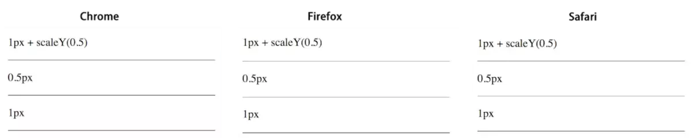

# CSS 图形与细节

## CSS实现一个等腰三角形

主要是通过把宽高设置成0，边框宽度设置宽一些，设置其中三个边透明，只留一个边显示

等边三角形是特殊的等腰三角形，它的三条边都相等，顶角为60度，而高是边长的3^(1/2) /2倍，约等于0.866……假设底为160px，则高约为138.56px，因此要做边长为160px的等边三角形，可以这么做：

```html
<style>
    div {
        width: 0px;
        height: 0px;
        border-left: 80px solid transparent;
        border-right: 80px solid transparent;
        border-bottom: 138.56px solid #A962CE; /*--三角形的高--*/
    }
</style>
<div></div>
```

**扩展：**

用CSS实现一个等边三角形：

根据各个边之间的长度关系，我们易知：需要展示的边框的宽度：相邻的透明的边框的宽度 = √3 ：1

```css
<style>
    .triangle {
        width: 0px;
        height: 0px;
        border-left: 10px solid transparent;
        border-right: 10px solid transparent;;
        border-top: 17.32px solid transparent;
        border-bottom: 17.32px solid red;
    }
</style>
```

### 实现扇形、圆形

**参考答案**：

圆形：

border-radius圆角的四个值按顺序取值分别为：左上、右上、右下、左下。这里只设置一个值，代表四个角的取值都为为50%

原理：border-radius: 50% 弯曲元素的边框以创建圆。 由于圆在任何给定点具有相同的半径，故宽和高都需要保证一样的值，不同的值将创建椭圆。

```html
<div class="circle"></div>
<style>
    .circle {
        border-radius: 50%;
        width: 80px;
        height: 80px;
        background: #666;
    }
</style>
```

扇形：

1. 利用border-radius，实现90度角的扇形：
    
    原理：
    
    左上角是圆角，其余三个角都是直角：左上角的值为宽和高一样的值，其他三个角的值不变（等于0）。
    

```html
<div class="sector"></div>
<style>
    .sector {
        border-radius: 80px 0 0;
        width: 80px;
        height: 80px;
        background: #666;
    }
</style>
```

1. 绘制任意角度的扇形

```html
<div class="shanxing shanxing1">
    <div class="sx1"></div>
    <div class="sx2"></div>
</div><!--*绘制一个85度扇形*/--p><div class="shanxing shanxing2">    <div class="sx1"></div>     <div class="sx2"></div></div><!--*绘制一个向右扇形，90度扇形*-->
<div class="shanxing shanxing3">
    <div class="sx1"></div>
    <div class="sx2"></div>
</div><!--*绘制一个颜色扇形 */--p><div class="shanxing shanxing4">    <div class="sx1"></div>     <div class="sx2"></div></div><!--/*绘制一个不同颜色半圆夹角 */-->
<div class="shanxing shanxing5">
    <div class="sx1"></div>
    <div class="sx2"></div>
</div>
<style>    .shanxing {
    position: relative;
    width: 200px;
    height: 200px;
    border-radius: 100px;
    background-color: yellow;
}

.sx1 {
    position: absolute;
    width: 200px;
    height: 200px;
    transform: rotate(0deg);
    clip: rect(0px, 100px, 200px, 0px); /*这个clip属性用来绘制半圆，在clip的rect范围内的内容显示出来，使用clip属性，元素必须是absolute的 */
    border-radius: 100px;
    background-color: #f00; /*-webkit-animation: an1 2s infinite linear; */
}

.sx2 {
    position: absolute;
    width: 200px;
    height: 200px;
    transform: rotate(0deg);
    clip: rect(0px, 100px, 200px, 0px);
    border-radius: 100px;
    background-color: #f00; /*-webkit-animation: an2 2s infinite linear;*/
}

/*绘制一个60度扇形*/
.shanxing1 .sx1 {
    transform: rotate(-30deg);
}

.shanxing1 .sx2 {
    transform: rotate(-150deg);
}

/*绘制一个85度扇形*/
.shanxing2 .sx1 {
    transform: rotate(-45deg);
}

.shanxing2 .sx2 {
    transform: rotate(-140deg);
}

/*绘制一个向右扇形，90度扇形*/
.shanxing3 .sx1 {
    transform: rotate(45deg);
}

.shanxing3 .sx2 {
    transform: rotate(-45deg);
}

/*绘制一个颜色扇形 */
.shanxing4 .sx1 {
    transform: rotate(45deg);
    background-color: #fff;
}

.shanxing4 .sx2 {
    transform: rotate(-45deg);
    background-color: #fff;
}

/*绘制一个不同颜色半圆夹角 */
.shanxing5 .sx1 {
    transform: rotate(45deg);
    background-color: #f00;
}

.shanxing5 .sx2 {
    transform: rotate(-45deg);
    background-color: #0f0;</style>
```

### 旋转45度

**参考答案**：

CSS中使用**rotate**方法来实现对元素的旋转，在参数中加入角度值，旋转方式为顺时针旋转。

```html
<style>
    div {
        width: 300px;
        margin: 150px auto;
        background-color: yellow;
        text-align: center;
        transform: rotate(45deg);
    }
</style>
```


## 画 0.5px 的直线

### 使用scale缩放

```xml
<style>    .hr.scale-half {    height: 1px;    transform: scaleY(0.5);    }</style><p>1px + scaleY(0.5)</p><div class="hr scale-half"></div>
```



Chrome/Safari都变虚了，只有Firefox比较完美看起来是实的而且还很细，效果和直接设置0.5px一样。所以通过transform: scale会导致Chrome变虚了，而粗细几乎没有变化。但是如果加上transform-origin: 50% 100%：

```css
.hr.scale-half {    height: 1px;    transform: scaleY(0.5);    transform-origin: 50% 100%;}
```

chrome现在的效果如下


### 线性渐变linear-gradient

```xml
<style>
    .hr.gradient {
        height: 1px;
        background: linear-gradient(0deg, #fff, #000);
    }
</style>
<p>linear-gradient(0deg, #fff, #000)</p>
<div class="hr gradient"></div>
```

linear-gradient(0deg, #fff, #000) 的意思是：渐变的角度从下往上，从白色#fff渐变到黑色#000，而且是线性的，在高清屏上，1px的逻辑像素代表的物理（设备）像素有2px，由于是线性渐变，所以第1个px只能是#fff，而剩下的那个像素只能是#000，这样就达到了画一半的目的。

### boxshadow

```xml
<style>    .hr.boxshadow {    height: 1px;    background: none;    box-shadow: 0 0.5px 0 #000;    }</style><p>box-shadow: 0 0.5px 0 #000</p><div class="hr boxshadow"></div>
```

1. viewport

```xml
<meta name="viewport" content="width=device-width,initial-sacle=0.5">
```

其中width=device-width表示将viewport视窗的宽度调整为设备的宽度，这个宽度通常是指物理上宽度。默认的缩放比例为1时，如iphone 6竖屏的宽度为750px，它的dpr=2，用2px表示1px，这样设置之后viewport的宽度就变成375px。但是我们可以改成0.5，viewport的宽度就是原本的750px，所以1个px还是1px，正常画就行，但这样也意味着UI需要按2倍图的出，整体面面的单位都会放大一倍。
