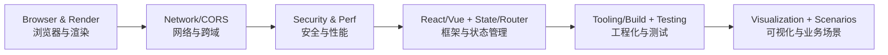

# 前端开发

> 本部分涵盖现代前端开发的核心知识，包括浏览器原理、框架使用、工程化实践、性能优化和业务场景等完整的前端知识体系。

## 目录

- [知识体系架构](#knowledge-architecture)
- [内容导航](#content-navigation)
- [推荐学习路径](#recommended-learning-path)
- [文档结构说明](#documentation-structure)
- [快速链接](#quick-links)

---

## 知识体系架构 {#knowledge-architecture}

前端知识体系采用分层模型组织，从底层浏览器运行时到上层业务场景，形成完整的技术栈：

```mermaid
graph TD
  P[Browser/Runtime<br/>浏览器与运行时] --> UI[UI/View<br/>框架与组件]
  UI --> STATE[State Mgmt<br/>状态管理]
  UI --> ROUTE[Routing<br/>路由]
  UI --> DATA[Data Access<br/>Fetch/Axios/WebSocket]
  DATA <--> NET[Network<br/>HTTP/CORS/WebSocket]
  P -.-> PERF[Performance]
  UI -.-> PERF
  DATA -.-> PERF
  UI -.-> TEST[Testing]
  DATA -.-> TEST
  UI -.-> SEC[Security]
  DATA -.-> SEC
  TOOL[Tooling/Build<br/>工程与构建] -.-> UI
  TOOL -.-> DATA
  VIZ[Visualization<br/>(ECharts/Canvas/SVG)] -.-> UI
  SCN[Scenarios/Best Practices] -.-> UI
```

---

## 📚 内容导航 {#content-navigation}

### 基础知识 (Foundations)

前端开发的核心基础，包括浏览器原理、网络通信和安全实践。

- **[浏览器原理](foundations/browser.md)** - 浏览器渲染、事件循环、存储机制、性能优化
- **[网络基础](foundations/network.md)** - HTTP/HTTPS、WebSocket、CORS 跨域、浏览器并发限制
- **[安全实践](foundations/security/README.md)** - XSS、CSRF、CSP 等前端安全主题

> **延伸阅读**：深入网络协议层请参考 [计算机网络](../computer-science/network/README.md)

### 框架与库 (Frameworks)

主流前端框架的深入理解和实践经验。

- **[React](frameworks/react/README.md)** - React 完整学习指南（特性、Hooks、Fiber 架构、状态管理、性能优化）
- **[Vue](frameworks/vue/README.md)** - Vue.js 深入理解（响应式原理、组合式 API、Vue 3）
- **[Vitest](frameworks/vitest/README.md)** - 现代化测试框架
- **[框架对比](frameworks/comparisons.md)** - React vs Vue vs Angular 技术选型参考

### 性能优化 (Performance)

前端性能优化策略和最佳实践。

- **[性能优化](performance/README.md)** - 渲染优化、资源加载、缓存策略、性能监控

### 工程化 (Tooling)

现代前端工程化工具链和开发流程。

- **[Babel](tooling/babel.md)** - JavaScript 编译器配置与使用
- **[CSS 工程化](tooling/css-engineering.md)** - CSS 预处理器、PostCSS、CSS Modules
- **[代码规范](tooling/linting.md)** - ESLint、Prettier、代码风格指南
- **[模块系统](tooling/module-systems.md)** - CommonJS、ES Modules、模块化最佳实践
- **[Monorepo](tooling/monorepo.md)** - 多包管理、工作区配置
- **[包管理器](tooling/package-managers.md)** - npm、yarn、pnpm 对比与选择
- **[测试](tooling/testing/README.md)** - 单元测试、集成测试、E2E 测试
- **[Vite](tooling/vite.md)** - 下一代前端构建工具
- **[Webpack](tooling/webpack.md)** - 模块打包器配置与优化
- **[工具资源](tooling/resources.md)** - 工程化工具汇总

### 可视化 (Visualization)

数据可视化和图表库的使用。

- **[可视化](visualization/README.md)** - ECharts、Canvas、SVG、WebGL 等可视化技术

### 业务场景 (Scenarios)

前端面试高频场景题，按场景分类组织，注重思路和原理。

- **[场景题完整索引](scenarios/README.md)** - 导航、题目列表、使用指南、学习建议

**核心场景**：
- **[认证与会话](scenarios/auth-and-session.md)** - Cookie/Session、Token、JWT、SSO、OAuth、扫码登录
- **[页面交互](scenarios/page-interaction.md)** - 路由导航、下拉刷新、无限滚动、输入监听、适配、换肤
- **[性能优化](scenarios/performance-optimization.md)** - QPS处理、并发控制、资源预加载、代码分割、虚拟列表

**专题场景**：
- **[网络与通信](scenarios/network-communication.md)** - DNS、SSE、WebSocket、通信协议选型
- **[系统设计](scenarios/system-design.md)** - 前端截图、弹窗组件、前端水印、大文件上传
- **[工程化与调试](scenarios/engineering-and-debugging.md)** - 前后端联调、线上调试、移动端适配
- **[AI 相关](scenarios/ai-related.md)** - Agent 服务、通信方式、上下文管理
- **[手撕代码](scenarios/coding-challenges.md)** - 算法题、编程题

**补充场景**：
- **[用户体验优化](scenarios/user-experience-optimization.md)** - 感知性能、交互反馈、无障碍设计
- **[国际化](scenarios/internationalization-language-switching.md)** - i18n 多语言切换方案
- **[样式规范化](scenarios/style-guidelines-standardization.md)** - BEM 命名、CSS 架构、主题管理
- **[代码扫描设计](scenarios/static-code-scanning-design.md)** - ESLint、Prettier、CI 门禁

### 学习资源 (Resources)

外部学习资源和参考文档汇总。

- **[资源清单](resources/README.md)** - 前端学习资源、工具推荐、社区链接

---

## 📖 推荐学习路径 {#recommended-learning-path}

根据技术栈的依赖关系和学习难度，建议按以下顺序学习：



### 学习阶段划分

**阶段 1：基础知识（必修）**
1. [浏览器原理](foundations/browser.md) - 理解浏览器工作机制
2. [网络基础](foundations/network.md) - 掌握 HTTP、CORS 等网络知识
3. [安全实践](foundations/security/README.md) - 了解常见安全问题和防护

**阶段 2：框架选择（二选一）**
- 选择 [React](frameworks/react/README.md) 或 [Vue](frameworks/vue/README.md)（根据项目需求）
- 学习相应的状态管理和路由方案

**阶段 3：工程化实践（进阶）**
1. [模块系统](tooling/module-systems.md) - 理解模块化
2. [Webpack](tooling/webpack.md) 或 [Vite](tooling/vite.md) - 构建工具
3. [包管理器](tooling/package-managers.md) - 依赖管理
4. [测试](tooling/testing/README.md) - 测试驱动开发

**阶段 4：性能与优化（提升）**
1. [性能优化](performance/README.md) - 性能分析和优化技巧
2. [业务场景](scenarios/README.md) - 实际场景解决方案

**阶段 5：专项技能（可选）**
- [可视化](visualization/README.md) - 数据可视化需求
- 更多业务场景实践

---

## 文档结构说明 {#documentation-structure}

本文档集采用以下组织原则：

### 目录结构

```
docs/front-end/
  README.md                    # 本文件：入口索引与导航
  foundations/                 # 基础知识
    browser.md                 # 浏览器原理
    network.md                 # 网络基础
    security/                  # 安全实践
  frameworks/                  # 框架与库
    react/                     # React 学习指南（拆分）
    vue/                       # Vue 生态
    vitest/                    # 测试框架
    comparisons.md             # 框架对比
  performance/                 # 性能优化
  tooling/                     # 工程化工具
    babel.md
    webpack.md
    vite.md
    testing/                   # 测试工具
  visualization/               # 可视化
  scenarios/                   # 业务场景
  resources/                   # 学习资源
  assets/                      # 图片等资源文件
```

### 命名规范

- **文件名**：统一使用 kebab-case（如：`auth-and-loading.md`）
- **目录名**：统一使用 kebab-case（如：`foundations/`）
- **链接**：使用相对路径，便于文档迁移

### 内容组织

- **完整性优先**：相关内容保持在同一文档，避免过度拆分
- **渐进式结构**：从概述到细节，从基础到进阶
- **交叉引用**：通过"延伸阅读"链接相关主题

---

## 快速链接 {#quick-links}

### 按主题查找

- **浏览器相关**：[浏览器原理](foundations/browser.md) | [性能优化](performance/README.md)
- **网络相关**：[网络基础](foundations/network.md) | [深入网络协议](../computer-science/network/README.md)
- **安全相关**：[Web 安全](foundations/security/README.md)
- **React 相关**：[React 指南](frameworks/react/README.md)
- **Vue 相关**：[Vue 指南](frameworks/vue/README.md)
- **构建工具**：[Webpack](tooling/webpack.md) | [Vite](tooling/vite.md)
- **测试相关**：[测试实践](tooling/testing/README.md)
- **业务场景**：[场景方案](scenarios/README.md)

### 按技术栈查找

- **React 技术栈**：[React](frameworks/react/README.md) → [Webpack](tooling/webpack.md)/[Vite](tooling/vite.md) → [测试](tooling/testing/README.md)
- **Vue 技术栈**：[Vue](frameworks/vue/README.md) → [Vite](tooling/vite.md) → [测试](tooling/testing/README.md)

---

## 贡献与维护

### 添加新文档

1. 确定合适的目录位置
2. 使用 kebab-case 命名
3. 遵循项目根目录的 `AGENTS.md` 通用文档规范；面试题遵循 `interview-question-library` skill
4. 更新本 README 的导航链接

### 更新现有文档

1. 保持原有结构和风格
2. 更新相关的交叉引用
3. 运行 `mkdocs serve` 验证链接

### 报告问题

如发现文档错误、链接失效或有改进建议，欢迎提交 Issue 或 PR。

---

**最后更新**：2024-10  
**维护说明**：本文档整合了前端知识体系架构和内容导航，为前端文档集的统一入口
