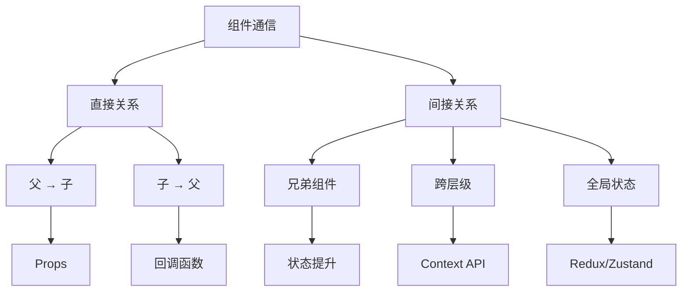
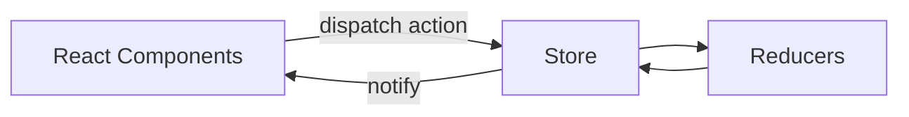
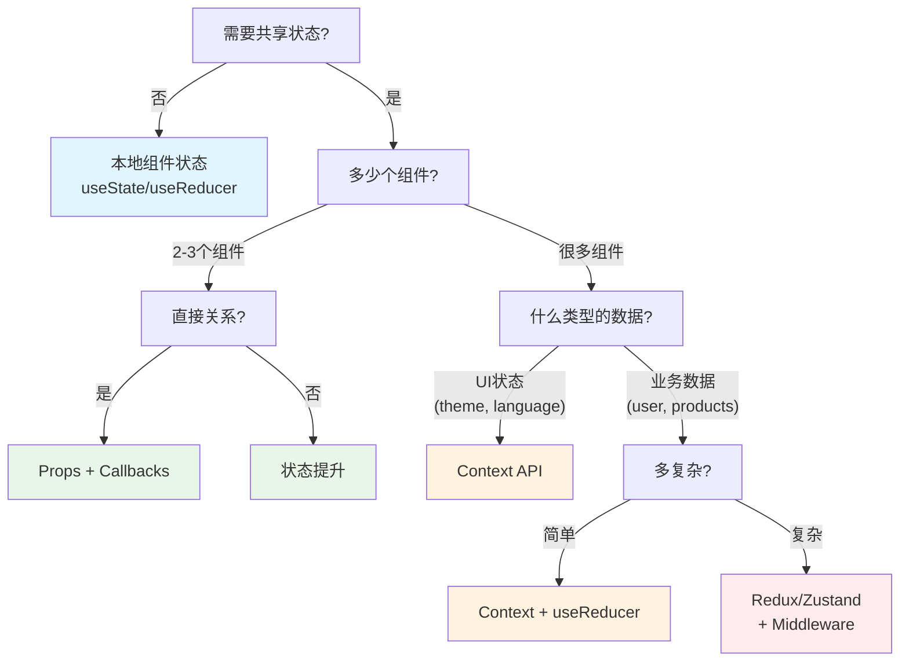
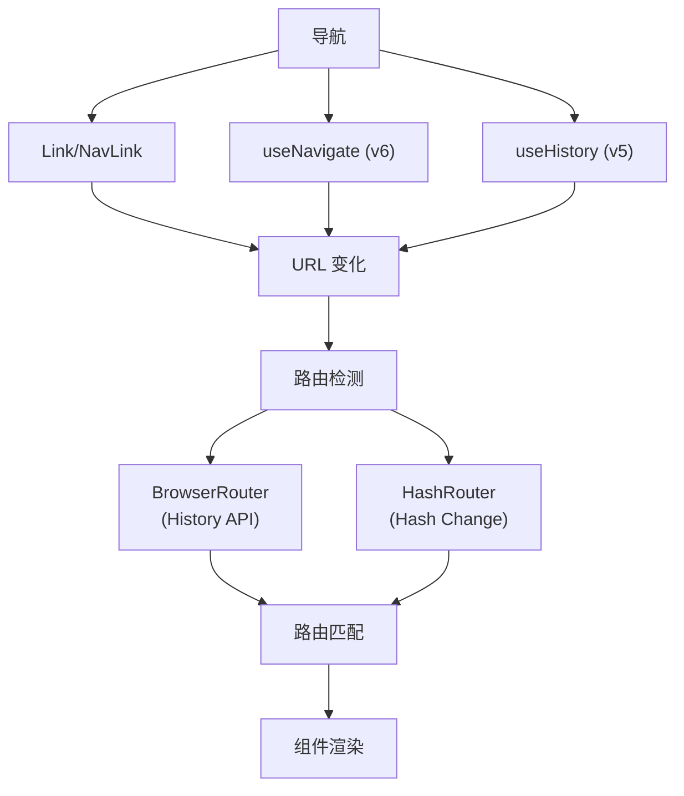

# React 通信与路由

## 组件通信 {#组件通信}

### 通信模式概览

### 通信方法对比

| 模式 | 复杂度 | 性能 | 使用场景 | 示例 |
|---|---|---|---|---|
| **Props** | ⭐ 简单 | ⭐⭐⭐ 高 | 父到子 | `<Child name={name} />` |
| **Callbacks** | ⭐⭐ 中等 | ⭐⭐⭐ 高 | 子到父 | `<Child onClick={handleClick} />` |
| **状态提升** | ⭐⭐ 中等 | ⭐⭐ 中等 | 兄弟通信 | 共同父级状态 |
| **Context API** | ⭐⭐⭐ 复杂 | ⭐⭐ 中等 | 跨层级共享 | 主题,用户数据 |
| **Redux/Zustand** | ⭐⭐⭐⭐ 很复杂 | ⭐ 低 | 全局状态管理 | 大型应用 |

---

## 状态管理 {#状态管理}

### Context API

**何时使用:**
- **全局配置/轻共享**: 主题、国际化、用户会话等
- **局部范围 Provider**: 避免全局污染

### Redux 要点

**三原则:**
1. **单一数据源**: 整个应用的状态存储在一个 store 中
2. **只读 state**: 唯一改变 state 的方法是触发 action
3. **纯函数修改**: 使用纯函数 reducer 来执行修改

**react-redux:**
- Provider + connect/hooks
- useSelector / useDispatch

**中间件:**
- thunk, logger
- 链式增强 dispatch

### 目录组织建议

- **按功能模块拆分**: actions/reducer/views 同目录
- **或按角色**: actions/reducers/...
- **统一导出入口**: index.ts 便于按需引入

### 状态管理决策树

### 选择指南表格

| 场景 | 推荐方案 | 优点 | 缺点 |
|---|---|---|---|
| **单个组件** | `useState` / `useReducer` | 简单,快速 | 不可共享 |
| **父子组件** | Props + Callbacks | 直接,高性能 | 范围有限 |
| **兄弟组件** | 状态提升 | 清晰数据流 | 可能导致属性钻取 |
| **主题/语言** | Context API | 内置,简单 | 重新渲染所有消费者 |
| **用户会话** | Context + `useRequest` | 响应式更新 | 中等复杂度 |
| **复杂业务逻辑** | Redux/Zustand | 可预测,可调试 | 学习曲线 |
| **实时数据** | `useRequest` + polling | 自动更新 | 网络开销 |

### 性能对比

| 方案 | 包大小 | 运行时性能 | 开发体验 |
|---|---|---|---|
| **本地状态** | ⭐⭐⭐ 最小 | ⭐⭐⭐ 优秀 | ⭐⭐⭐ 简单 |
| **Props/Callbacks** | ⭐⭐⭐ 最小 | ⭐⭐⭐ 优秀 | ⭐⭐ 良好 |
| **Context API** | ⭐⭐⭐ 最小 | ⭐⭐ 良好 | ⭐⭐ 良好 |
| **Redux** | ⭐ 大 | ⭐ 一般 | ⭐⭐⭐ 优秀 |
| **Zustand** | ⭐⭐ 小 | ⭐⭐ 良好 | ⭐⭐⭐ 优秀 |

---

## React Router {#react-router}

### 路由类型对比

| 路由类型 | URL 格式 | 服务器配置 | SEO 友好 | 使用场景 |
|---|---|---|---|---|
| **BrowserRouter** | `/about` | 需要回退 | ✅ 是 | 生产应用 |
| **HashRouter** | `/#/about` | 无需配置 | ❌ 否 | 静态托管 |

### React Router 架构

### 路由钩子对比

| 钩子 | 版本 | 用途 | 返回值 |
|---|---|---|---|
| **useParams** | v5 & v6 | 获取 URL 参数 | 参数对象 |
| **useLocation** | v5 & v6 | 获取当前位置 | 位置对象 |
| **useHistory** | v5 only | 编程式导航 | 历史对象 |
| **useNavigate** | v6 only | 编程式导航 | 导航函数 |

### 参数传递方法

| 方法 | 语法 | 使用场景 | 示例 |
|---|---|---|---|
| **动态路由** | `/user/:id` | 必需参数 | `/user/123` |
| **查询参数** | `?name=value` | 可选参数 | `/search?q=react` |
| **状态对象** | `{ state: data }` | 复杂数据 | 携带数据导航 |

---
