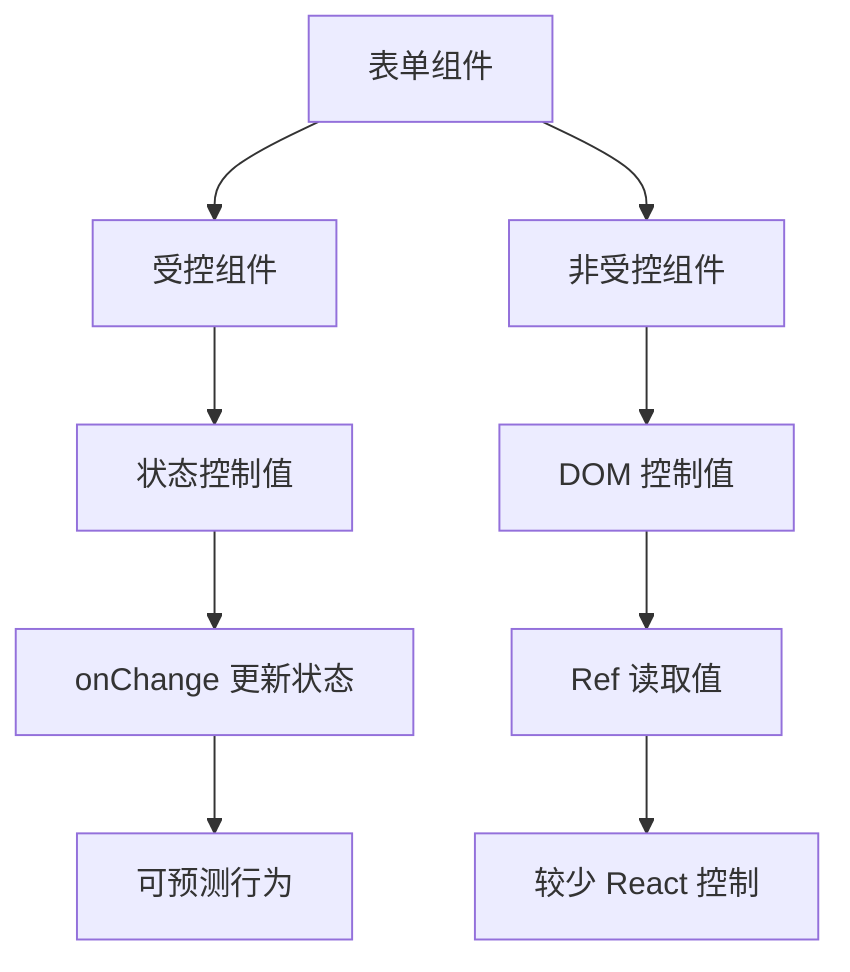
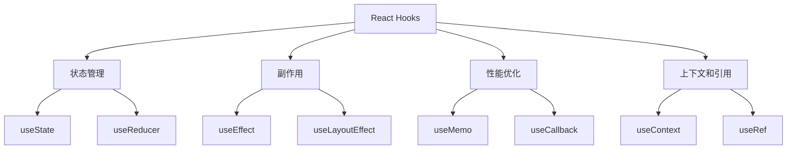
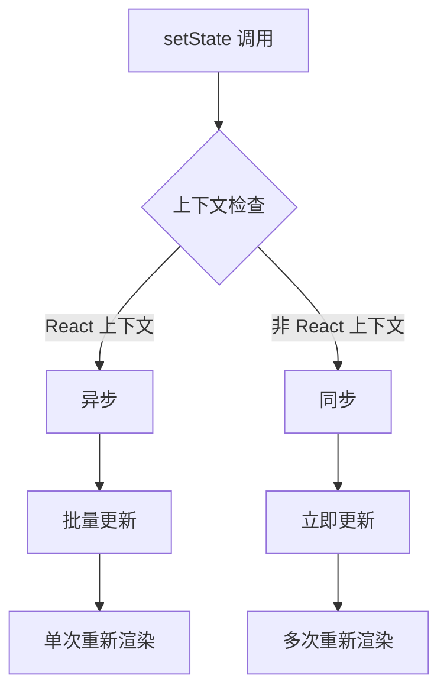
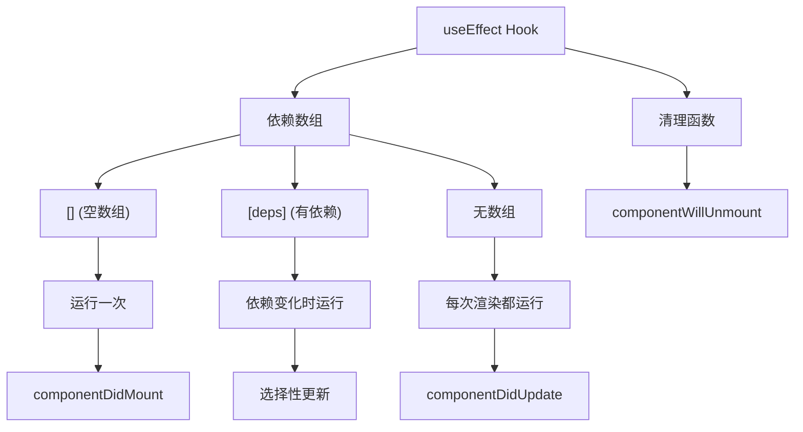
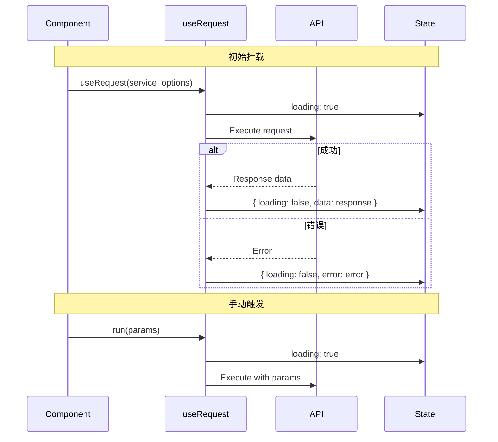

# React 组件与 Hooks

## 组件基础 {#组件基础}

### 组件类型对比

| 方面 | 函数组件 | 类组件 |
|---|---|---|
| **语法** | 简单函数 | ES6 类 |
| **状态管理** | Hooks (useState, useReducer) | this.state, this.setState |
| **生命周期** | useEffect 和其他钩子 | 生命周期方法 |
| **性能** | 更好的优化 | 需要手动优化 |
| **包大小** | 更小 | 更大 |
| **学习曲线** | 更容易 | 更陡峭 |
| **未来支持** | ✅ 推荐 | ⚠️ 遗留 |

### 受控与非受控组件

### 组件控制对比

| 特性 | 受控 | 非受控 |
|---|---|---|
| **数据源** | React 状态 | DOM 元素 |
| **值访问** | 直接从状态 | 通过 ref |
| **验证** | 实时 | 提交时 |
| **性能** | 更多重新渲染 | 更少重新渲染 |
| **使用场景** | 动态表单 | 简单表单 |

### Props 与 State 对比

| 方面 | Props | State |
|---|---|---|
| **来源** | 父组件 | 组件自身 |
| **可变性** | 不可变 | 可变 |
| **目的** | 配置 | 内部数据 |
| **触发重新渲染** | ✅ 是 | ✅ 是 |
| **访问模式** | `props.propName` | `state.stateName` |
| **更新方法** | 父组件更新 | `setState` / `useState` |

---

## React Hooks {#react-hooks}

### Hooks 概览

| Hook | 用途 | 返回值 | 常见用例 |
|---|---|---|---|
| **`useState`** | 管理组件状态 | `[state, setState]` | 表单输入,切换 |
| **`useEffect`** | 处理副作用 | 清理函数 | API 调用,订阅 |
| **`useContext`** | 访问上下文值 | 上下文值 | 主题,用户数据 |
| **`useReducer`** | 复杂状态逻辑 | `[state, dispatch]` | 状态机 |
| **`useMemo`** | 缓存昂贵计算 | 缓存值 | 性能优化 |
| **`useCallback`** | 缓存回调函数 | 缓存函数 | 防止重新渲染 |
| **`useRef`** | 访问 DOM 或存储可变值 | 引用对象 | DOM 操作 |

### Hooks 分类

### useState Hook 详解

#### 不同上下文中的 setState 行为

| 上下文 | 行为 | 批处理 | 示例 |
|---|---|---|---|
| **React 生命周期方法** | 异步 | ✅ 是 | `componentDidMount`, `componentDidUpdate` |
| **React 合成事件** | 异步 | ✅ 是 | `onClick`, `onChange` |
| **setTimeout/setInterval** | 同步 | ❌ 否 | `setTimeout(() => setState(), 0)` |
| **原生 DOM 事件** | 同步 | ❌ 否 | `addEventListener('click', ...)` |
| **Promise 回调** | 同步 | ❌ 否 | `.then(() => setState())` |

#### useState 执行流程

### useEffect Hook 详解

#### useEffect 与生命周期方法对比

| 生命周期方法 | useEffect 等价 | 依赖数组 |
|---|---|---|
| `componentDidMount` | `useEffect(() => {}, [])` | 空数组 |
| `componentDidUpdate` | `useEffect(() => {})` | 无依赖数组 |
| `componentWillUnmount` | `useEffect(() => { return () => {} }, [])` | 返回清理函数 |
| `componentDidMount` + `componentDidUpdate` | `useEffect(() => {}, [dependency])` | 特定依赖 |

#### useEffect 依赖模式

### useRequest (ahooks) 模式

#### 核心特性

| 特性 | 描述 | 优势 |
|---|---|---|
| **统一状态** | `{ loading, data, error }` | 一致的 API |
| **自动执行** | 挂载时运行 | 更少样板代码 |
| **手动触发** | `run()` 方法 | 按需请求 |
| **依赖刷新** | 依赖变化自动重试 | 响应式更新 |
| **内置优化** | 防抖、节流、轮询 | 更好的用户体验 |

#### 请求流程图

---
