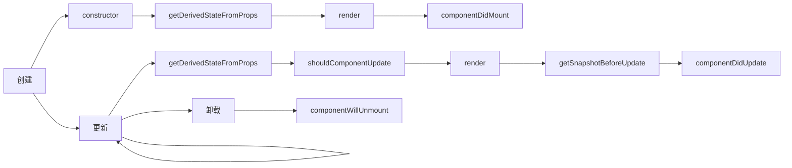
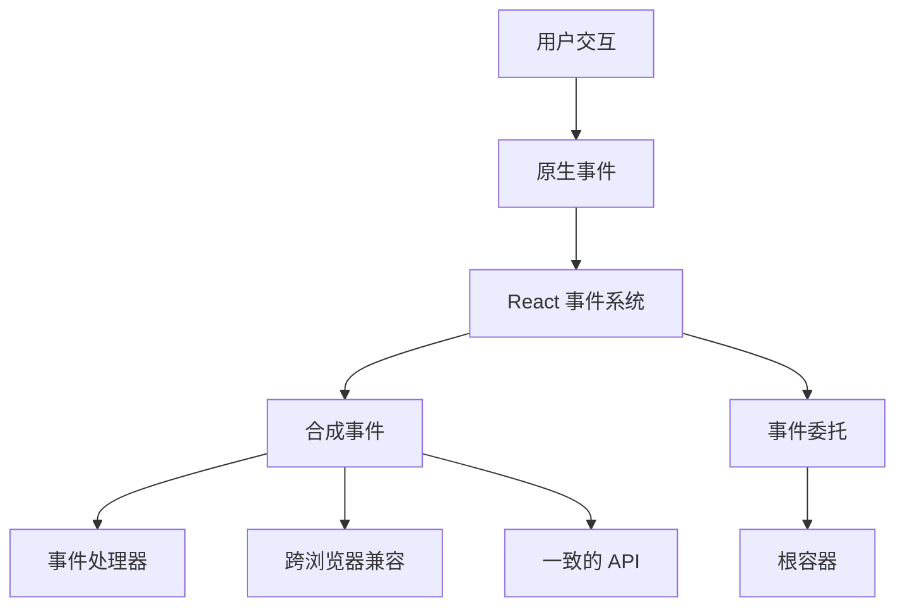
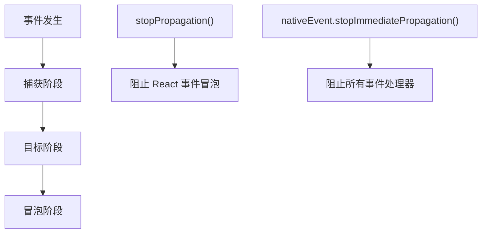

# React 生命周期与事件

## 组件生命周期 {#组件生命周期}

### 生命周期阶段概览

### 生命周期方法对比

| 阶段 | 方法 | 用途 | 可以 setState? | 常见用例 |
|---|---|---|---|---|
| **创建** | `constructor` | 初始化状态和绑定方法 | ✅ | 设置初始状态 |
| | `getDerivedStateFromProps` | 同步状态与属性 | ❌ | 罕见边缘情况 |
| | `render` | 返回 JSX | ❌ | 定义 UI 结构 |
| | `componentDidMount` | 首次渲染后 | ✅ | API 调用,DOM 操作 |
| **更新** | `getDerivedStateFromProps` | 同步状态与属性 | ❌ | 罕见边缘情况 |
| | `shouldComponentUpdate` | 控制重新渲染 | ❌ | 性能优化 |
| | `render` | 返回更新的 JSX | ❌ | 定义 UI 结构 |
| | `getSnapshotBeforeUpdate` | DOM 更新前捕获信息 | ❌ | 滚动位置 |
| | `componentDidUpdate` | 更新后 | ✅ | DOM 操作,API 调用 |
| **卸载** | `componentWillUnmount` | 清理 | ❌ | 移除监听器,取消请求 |

### 关键生命周期规则

| 规则 | 解释 | 原因 |
|---|---|---|
| render 中不要调用 setState | 导致无限重新渲染循环 | 性能和稳定性 |
| 谨慎使用 getSnapshotBeforeUpdate | 返回值传递给 componentDidUpdate | 维护滚动位置 |
| 在 componentWillUnmount 中清理 | 防止内存泄漏 | 资源管理 |

---

## 事件系统 {#事件系统}

### 事件架构

### 合成事件与原生事件对比

| 方面 | 合成事件 | 原生事件 |
|---|---|---|
| **浏览器兼容性** | 跨浏览器一致 | 浏览器特定差异 |
| **事件委托** | 自动 | 需要手动设置 |
| **性能** | React 优化 | 浏览器直接处理 |
| **内存使用** | 事件池化 | 独立事件对象 |
| **API 一致性** | 标准化 | 因浏览器而异 |

### 事件绑定性能对比

| 方法 | 性能 | 内存影响 | 推荐度 | 示例 |
|---|---|---|---|---|
| **构造器绑定** | ✅ 高 | ✅ 低 | ✅ 推荐 | `this.handleClick = this.handleClick.bind(this)` |
| **类字段箭头函数** | ✅ 高 | ✅ 低 | ✅ 推荐 | `handleClick = () => {}` |
| **渲染方法绑定** | ❌ 低 | ❌ 高 | ❌ 避免 | `onClick={this.handleClick.bind(this)}` |
| **渲染箭头函数** | ❌ 低 | ❌ 高 | ❌ 避免 | `onClick={() => this.handleClick()}` |

### 事件传播控制

### 事件控制方法

| 方法 | 作用范围 | 使用场景 |
|---|---|---|
| `e.stopPropagation()` | 仅 React 合成事件 | 阻止父级 React 处理器 |
| `e.nativeEvent.stopImmediatePropagation()` | 所有事件处理器 | 阻止包括原生在内的所有处理器 |
| `e.preventDefault()` | 默认浏览器行为 | 阻止表单提交,链接导航 |

---
