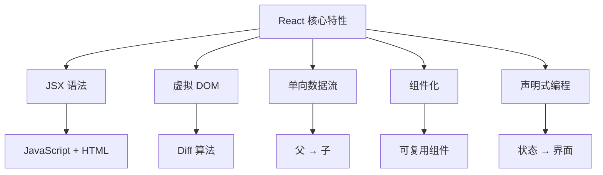
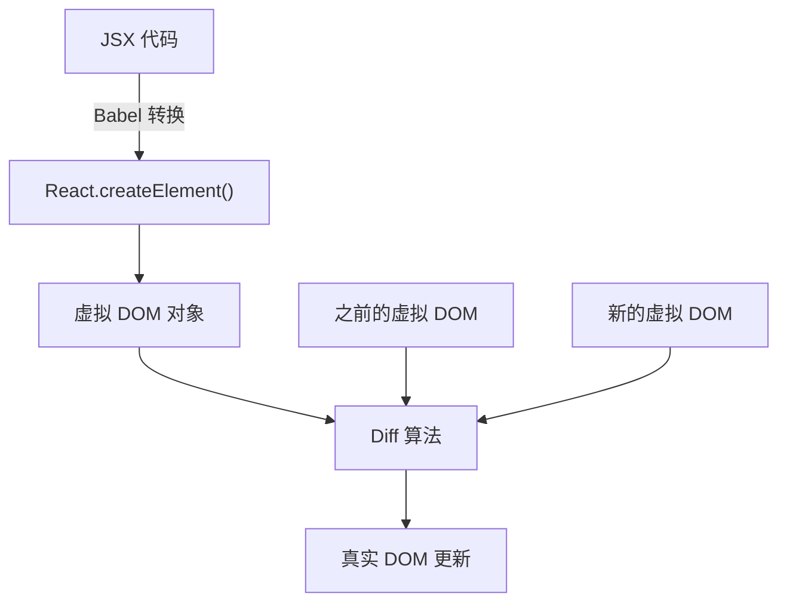

# React 概览

## React 特性概览 {#react-特性概览}

### 核心特性表格

| 特性 | 描述 | 优势 |
|---|---|---|
| **JSX 语法** | 在 JavaScript 中描述 UI 结构 | 类型安全,更好的工具支持 |
| **单向数据流** | 自上而下的数据流动,便于推理 | 可预测的状态变化 |
| **虚拟 DOM** | 基于 Diff 算法的高效更新 | 更好的性能 |
| **声明式编程** | 描述状态,React 负责渲染 | 更容易理解和调试 |
| **组件化** | 复用与组合 | 模块化开发 |

### React 架构概览



---


## 虚拟 DOM 与 Diff 算法 {#虚拟-dom-与-diff-算法}

### 真实 DOM 与虚拟 DOM 对比

| 方面 | 真实 DOM | 虚拟 DOM |
|---|---|---|
| **本质** | 浏览器 DOM 节点 | JavaScript 对象 |
| **性能** | 操作缓慢 | 操作快速 |
| **内存使用** | 高 | 低 |
| **更新成本** | 昂贵 | 便宜 |
| **直接操作** | 可能 | 不可能 |

### 虚拟 DOM 创建过程



### JSX 到虚拟 DOM 示例

**JSX 代码:**
```jsx
const vDom = <h1 className="title">Hello World</h1>;
```

**Babel 转换:**
```jsx
const vDom = React.createElement(
  'h1',
  { className: 'title' },
  'Hello World'
);
```

**虚拟 DOM 对象:**
```json
{
  "type": "h1",
  "key": null,
  "ref": null,
  "props": {
    "className": "title",
    "children": "Hello World"
  }
}
```

### Diff 算法策略

| 策略 | 描述 | 示例 |
|---|---|---|
| **同层比较** | 只比较同一层级的节点 | 维持父子关系 |
| **组件类型检查** | 不同类型触发完全替换 | `<div>` → `<span>` = 完全重建 |
| **基于 key 的识别** | 使用 `key` 属性识别列表项 | 高效列表更新 |

### Key 选择最佳实践

| Key 类型 | 性能 | 稳定性 | 推荐度 |
|---|---|---|---|
| **唯一 ID** | ⭐⭐⭐ 优秀 | ⭐⭐⭐ 稳定 | ✅ 推荐 |
| **数组索引** | ⭐ 差 | ⭐ 不稳定 | ❌ 避免 |
| **随机值** | ⭐ 差 | ⭐ 不稳定 | ❌ 永不使用 |

---
