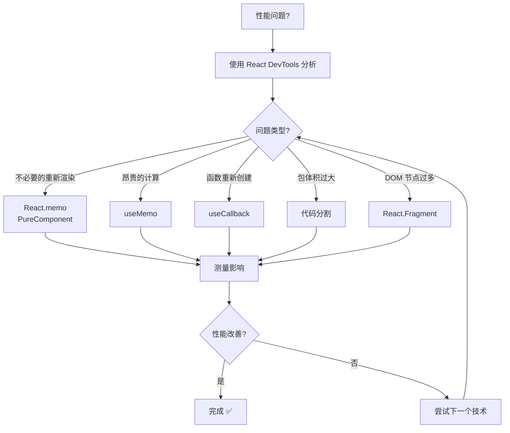
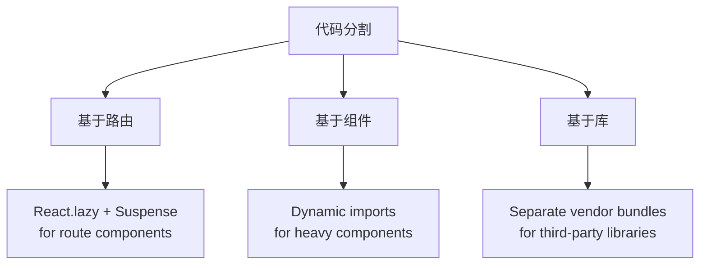
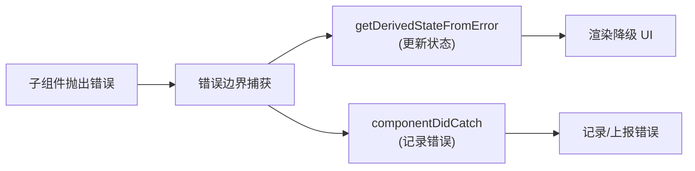
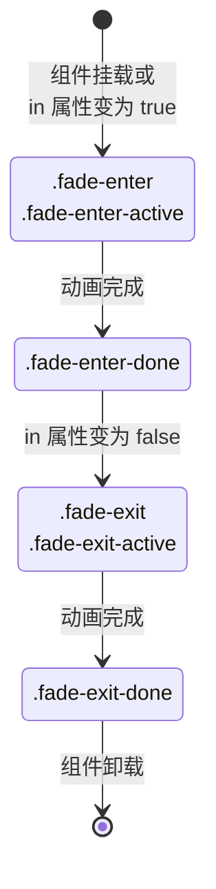

# React 模式与性能

## 高级组件模式 {#高级组件模式}

### 高阶组件 (HOC)

#### HOC 模式

```jsx
// HOC 示例
function withLoading(WrappedComponent) {
  return function WithLoadingComponent(props) {
    if (props.isLoading) {
      return <div>Loading...</div>;
    }
    return <WrappedComponent {...props} />;
  };
}

// 使用
const EnhancedComponent = withLoading(MyComponent);
```

#### HOC 与 Hooks 对比

| 方面 | HOC | Hooks |
|---|---|---|
| **复用性** | ✅ 高 | ✅ 高 |
| **组合** | 包装地狱 | ✅ 清洁 |
| **属性钻取** | ❌ 可能导致问题 | ✅ 无问题 |
| **类型安全** | ❌ 复杂 | ✅ 更好 |
| **性能** | ❌ 额外组件 | ✅ 直接 |

### 渲染属性模式

```jsx
// Render Props 示例
function DataProvider({ render }) {
  const [data, setData] = useState(null);
  
  useEffect(() => {
    fetchData().then(setData);
  }, []);
  
  return render(data);
}

// 使用
<DataProvider
  render={(data) => (
    <div>{data ? data.name : 'Loading...'}</div>
  )}
/>
```

### 复合组件模式

```jsx
// 复合组件示例
function Tabs({ children, defaultTab }) {
  const [activeTab, setActiveTab] = useState(defaultTab);
  
  return (
    <div className="tabs">
      {React.Children.map(children, (child) =>
        React.cloneElement(child, { activeTab, setActiveTab })
      )}
    </div>
  );
}

Tabs.Tab = function Tab({ label, children, activeTab, setActiveTab }) {
  return (
    <div
      className={activeTab === label ? 'active' : ''}
      onClick={() => setActiveTab(label)}
    >
      {children}
    </div>
  );
};
```

---


## 性能优化 {#性能优化}

### 性能优化技术

| 技术 | 影响 | 复杂度 | 使用场景 | 示例 |
|---|---|---|---|---|
| **React.memo** | ⭐⭐⭐ 高 | ⭐ 低 | 防止不必要重新渲染 | `React.memo(Component)` |
| **useMemo** | ⭐⭐ 中等 | ⭐⭐ 中等 | 昂贵计算 | `useMemo(() => expensiveCalc(), [deps])` |
| **useCallback** | ⭐⭐ 中等 | ⭐⭐ 中等 | 稳定函数引用 | `useCallback(fn, [deps])` |
| **React.lazy** | ⭐⭐⭐ 高 | ⭐⭐ 中等 | 代码分割 | `React.lazy(() => import('./Component'))` |
| **Fragments** | ⭐ 低 | ⭐ 低 | 减少 DOM 节点 | `<React.Fragment>` or `<>` |
| **Immutable Data** | ⭐⭐⭐ 高 | ⭐⭐⭐ 高 | 浅比较优化 | `const newState = {...oldState, updated: true}` |

### 性能优化流程



### React.memo vs PureComponent vs shouldComponentUpdate

| 方法 | 组件类型 | 比较类型 | 可定制 |
|---|---|---|---|
| **React.memo** | 函数组件 | 浅层 props 比较 | ✅ 自定义比较函数 |
| **PureComponent** | 类组件 | 浅层 props + state 比较 | ❌ 固定行为 |
| **shouldComponentUpdate** | 类组件 | 自定义逻辑 | ✅ 完全控制 |

### 代码分割策略



### 包优化技术

| 技术 | 包大小影响 | 性能影响 | 实现 |
|---|---|---|---|
| **摇树优化** | ⭐⭐⭐ 高 | ⭐⭐⭐ 高 | ES6 modules + webpack |
| **代码分割** | ⭐⭐⭐ 高 | ⭐⭐⭐ 高 | Dynamic imports |
| **懒加载** | ⭐⭐ 中等 | ⭐⭐⭐ 高 | React.lazy + Suspense |
| **包分析** | ⭐⭐ 中等 | ⭐⭐ 中等 | webpack-bundle-analyzer |

---


## 错误处理与边界 {#错误处理与边界}

### 错误边界能力

| 可以捕获 | 无法捕获 | 替代方案 |
|---|---|---|
| **渲染错误** | **事件处理器** | 在处理器中使用 try/catch |
| **生命周期方法** | **异步代码** | Promise.catch() 或 async/await try/catch |
| **构造器错误** | **setTimeout 回调** | 在回调中使用 try/catch |
| **子组件错误** | **服务端渲染** | 服务端错误处理 |
| | **错误边界自身** | 父级错误边界 |

### 错误边界方法对比

| 方法 | 目的 | 返回值 | 何时调用 |
|---|---|---|---|
| **`getDerivedStateFromError`** | 更新状态以显示降级 UI | 新状态对象 | 渲染阶段 |
| **`componentDidCatch`** | 记录错误信息 | void | 渲染阶段后 |

### 错误边界流程



### 错误边界实现

```jsx
class ErrorBoundary extends React.Component {
  constructor(props) {
    super(props);
    this.state = { hasError: false, error: null };
  }

  static getDerivedStateFromError(error) {
    // 更新状态以显示降级 UI
    return { hasError: true, error };
  }

  componentDidCatch(error, errorInfo) {
    // 记录错误到错误报告服务
    console.error('Error caught by boundary:', error, errorInfo);
  }

  render() {
    if (this.state.hasError) {
      return (
        <div className="error-fallback">
          <h2>Something went wrong.</h2>
          <details style={{ whiteSpace: 'pre-wrap' }}>
            {this.state.error && this.state.error.toString()}
          </details>
        </div>
      );
    }

    return this.props.children;
  }
}
```

### 错误处理最佳实践

| 实践 | 描述 | 优势 |
|---|---|---|
| **细粒度错误边界** | 在特定功能周围放置边界 | 隔离故障 |
| **降级 UI 设计** | 提供有意义的错误信息 | 更好的用户体验 |
| **错误报告** | 将错误记录到监控服务 | 生产环境调试 |
| **恢复机制** | 允许用户重试或重置 | 优雅降级 |

---


## 动画与过渡 {#动画与过渡}

### 动画库对比

| 库 | 包大小 | 学习曲线 | 性能 | 使用场景 |
|---|---|---|---|---|
| **react-transition-group** | ⭐⭐ 小 | ⭐⭐ 简单 | ⭐⭐⭐ 良好 | 基于 CSS 的过渡 |
| **Framer Motion** | ⭐ 大 | ⭐⭐ 中等 | ⭐⭐⭐ 优秀 | 复杂动画 |
| **React Spring** | ⭐⭐ 中等 | ⭐⭐⭐ 复杂 | ⭐⭐⭐ 优秀 | 基于物理的动画 |
| **Lottie React** | ⭐⭐ 中等 | ⭐ 简单 | ⭐⭐ 良好 | After Effects 动画 |

### CSS 过渡生命周期



### 动画类钩子

| 阶段 | CSS 类 | 持续时间 | 目的 |
|---|---|---|---|
| **进入开始** | `.fade-enter` | 1帧 | 设置初始状态 |
| **进入激活** | `.fade-enter-active` | 完整过渡 | 定义过渡属性 |
| **进入完成** | `.fade-enter-done` | 持续 | 最终状态 |
| **退出开始** | `.fade-exit` | 1帧 | 设置退出初始状态 |
| **退出激活** | `.fade-exit-active` | 完整过渡 | 定义退出过渡 |
| **退出完成** | `.fade-exit-done` | 直到卸载 | 隐藏状态 |

### 动画性能提示

| 提示 | 描述 | 影响 |
|---|---|---|
| **使用 CSS 变换** | 优先使用 transform 而不是改变布局属性 | ⭐⭐⭐ 高 |
| **启用 GPU 加速** | 使用 `will-change` 或 `transform3d` | ⭐⭐⭐ 高 |
| **最小化重排** | 避免动画化宽度、高度、内边距 | ⭐⭐⭐ 高 |
| **使用 requestAnimationFrame** | 用于基于 JavaScript 的动画 | ⭐⭐ 中等 |

---
