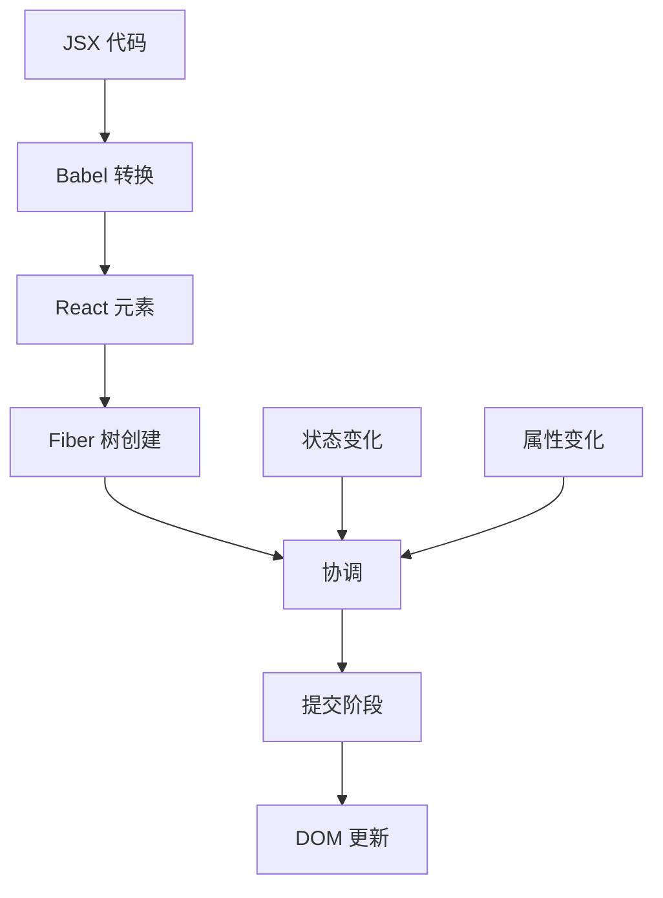
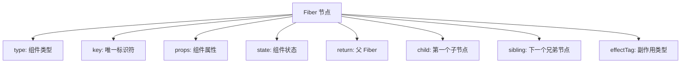
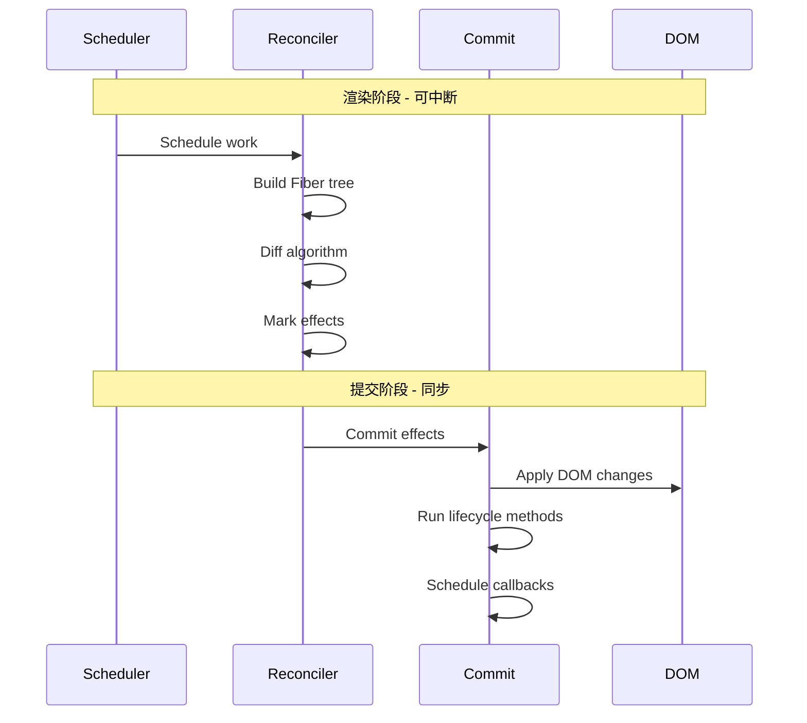

# React 内部架构

## React 内部架构 {#react-内部架构}

### React 渲染管道

### React 架构层次

| 层次 | 职责 | 关键组件 |
|---|---|---|
| **React 核心** | 组件定义和生命周期 | Components, Hooks, Context |
| **React 协调器** | Diff 算法和 Fiber 管理 | Fiber, Scheduler, Reconciler |
| **React 渲染器** | 平台特定渲染 | ReactDOM, React Native |

---

## Fiber 架构 {#fiber-架构}

### 什么是 Fiber?

**Fiber** 是一个代表工作单元的 JavaScript 对象。它对应组件实例、DOM 节点或 React 树中的任何其他元素。

### Fiber 节点结构

### Fiber 树遍历

| 指针 | 用途 | 导航 |
|---|---|---|
| **`return`** | 指向父 Fiber | 向上遍历 |
| **`child`** | 指向第一个子 Fiber | 向下遍历 |
| **`sibling`** | 指向下一个兄弟 Fiber | 水平遍历 |

### 为什么使用 Fiber?

| 问题 | 解决方案 | 优势 |
|---|---|---|
| **阻塞渲染** | 可中断工作 | 流畅用户体验 |
| **无优先级** | 基于优先级的调度 | 重要更新优先 |
| **同步更新** | 时间切片 | 更好的性能 |

### React 渲染阶段

### 渲染阶段与提交阶段对比

| 方面 | 渲染阶段 | 提交阶段 |
|---|---|---|
| **可中断性** | ✅ 可中断 | ❌ 同步 |
| **副作用** | ❌ 无副作用 | ✅ 允许副作用 |
| **DOM 访问** | ❌ 不修改 DOM | ✅ 修改 DOM |
| **生命周期方法** | 部分方法 | 大部分方法 |

---
