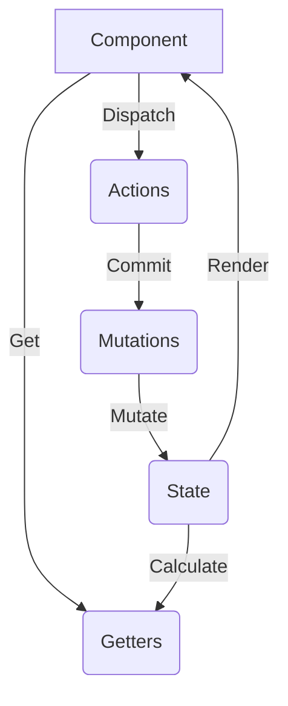

# 状态管理

本文聚焦于 Vue 应用的状态管理，涵盖 Vuex 基本用法与实现要点。对于 Vue 3 项目，官方更推荐使用 Pinia；本仓库仍保留 Vuex 相关知识以便理解与维护存量项目。

## Vuex 是什么

Vuex 是专为 Vue.js 设计的状态管理工具。它采用集中式存储管理应用的所有组件状态，并以可预测的方式变更。



核心模块：
1. State：单一状态树
2. Getters：对 state 的派生计算
3. Mutations：同步更改状态的唯一入口
4. Actions：提交 mutation，可包含异步
5. Modules：模块化 store

### Mutation 与 Action 区别

- Mutation：同步修改状态
```javascript
const store = new Vuex.Store({
  state: { count: 1 },
  mutations: {
    increment(state) { state.count++ }
  }
})
store.commit('increment')
```

- Action：提交 mutation，可执行异步
```javascript
const store = new Vuex.Store({
  state: { count: 0 },
  mutations: { increment(state) { state.count++ } },
  actions: {
    increment(context) {
      setTimeout(() => { context.commit('increment') }, 1000)
    }
  }
})
store.dispatch('increment')
```

### 实现要点（原理速记）

- 安装通过全局 mixin 在组件 `beforeCreate` 注入 `$store`
- `state` 借助 Vue 响应式系统实现联动
- `commit`/`dispatch` 分别定位并执行 `mutations`/`actions`

### 刷新丢失问题（持久化）

Vuex 状态存于内存，刷新会丢失：

- 手动：订阅变更并写入 `localStorage`，初始化时 `replaceState`
- 插件：`vuex-persistedstate`

```javascript
store.subscribe((mutation, state) => {
  localStorage.setItem('vuex', JSON.stringify(state));
})
const savedState = localStorage.getItem('vuex')
if (savedState) {
  store.replaceState(Object.assign({}, store.state, JSON.parse(savedState)))
}
```

