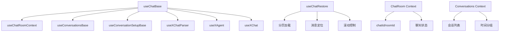
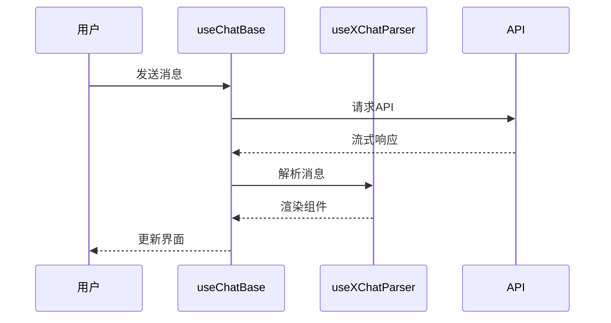

# Chat Hooks 设计文档

## 一句话定位
提供聊天功能的业务逻辑封装，包含消息管理、会话控制、状态处理等核心能力。

## 概览
- **功能范围**：聊天会话管理、消息收发、流式处理、历史恢复
- **目标用户**：需要集成聊天功能的开发者
- **关键用例**：
  1. 创建聊天会话并发送消息
  2. 处理流式消息响应
  3. 恢复历史聊天记录

## 信息架构



## 核心 Hooks 职责

| Hook | 主要职责 | 输入 | 输出 |
|------|----------|------|------|
| `useChatBase` | 聊天核心逻辑 | API实例、配置 | 消息状态、发送方法 |
| `useConversationSetupBase` | 会话初始化 | API实例、回调 | 创建会话方法 |
| `useXChatParser` | 消息解析 | API实例、回调 | 解析方法、渲染器 |
| `useChatRestore` | 历史恢复 | 会话ID、配置 | 加载方法、历史消息 |

## 状态管理

### ChatRoom Context 状态
| 字段 | 类型 | 说明 | 来源 |
|------|------|------|------|
| `chatId` | string | 后端真实聊天ID | API返回 |
| `roomId` | string | 前端聊天室ID | 前端生成 |
| `isChating` | boolean | 聊天进行状态 | 用户操作 |
| `index` | number | 历史对话索引 | 路由参数 |

### 消息数据流


## 关键特性

### 1. 双模式支持
- [x] 流式聊天：实时接收消息片段
- [x] 普通聊天：等待完整响应

### 2. 错误处理层级
| 层级 | 类型 | 处理策略 |
|------|------|----------|
| 网络层 | `NetworkError` | 重试机制 |
| 业务层 | `BusinessError` | 用户提示 |
| 解析层 | `ParseError` | 降级显示 |

### 3. 性能优化
- **消息缓存**：限制内存中消息数量（1000条）
- **请求去重**：避免重复请求
- **虚拟化渲染**：支持大量消息高效显示

## 使用示例

```typescript
// 基础使用
const {
  content,
  parsedMessages,
  handleContentChange,
  sendMessage,
  isLoading
} = useChatBase({
  axiosChat: chatApi,
  axiosEntWeb: entApi,
  isDev: false,
  wsid: 'workspace-123',
  baseUrl: 'https://api.example.com'
});
```

## 扩展点

1. **自定义消息解析器**：扩展 `useXChatParser`
2. **状态持久化**：扩展 Context 存储
3. **错误恢复策略**：扩展错误处理机制

## 相关文档
- [Chat Messages 设计文档](./chat-messages.md)
- [Chat Roles 设计文档](./chat-roles.md)
- @see packages/ai-ui/src/hooks/useChatBase.tsx