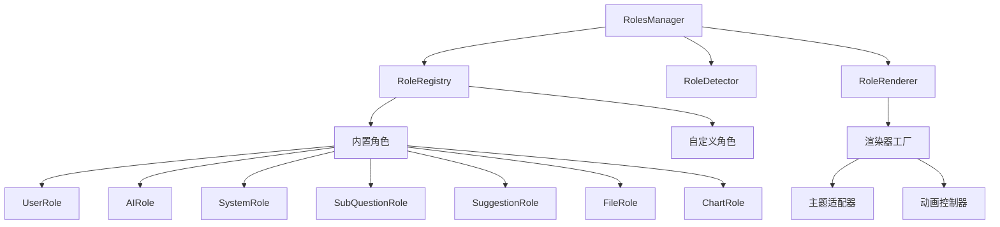
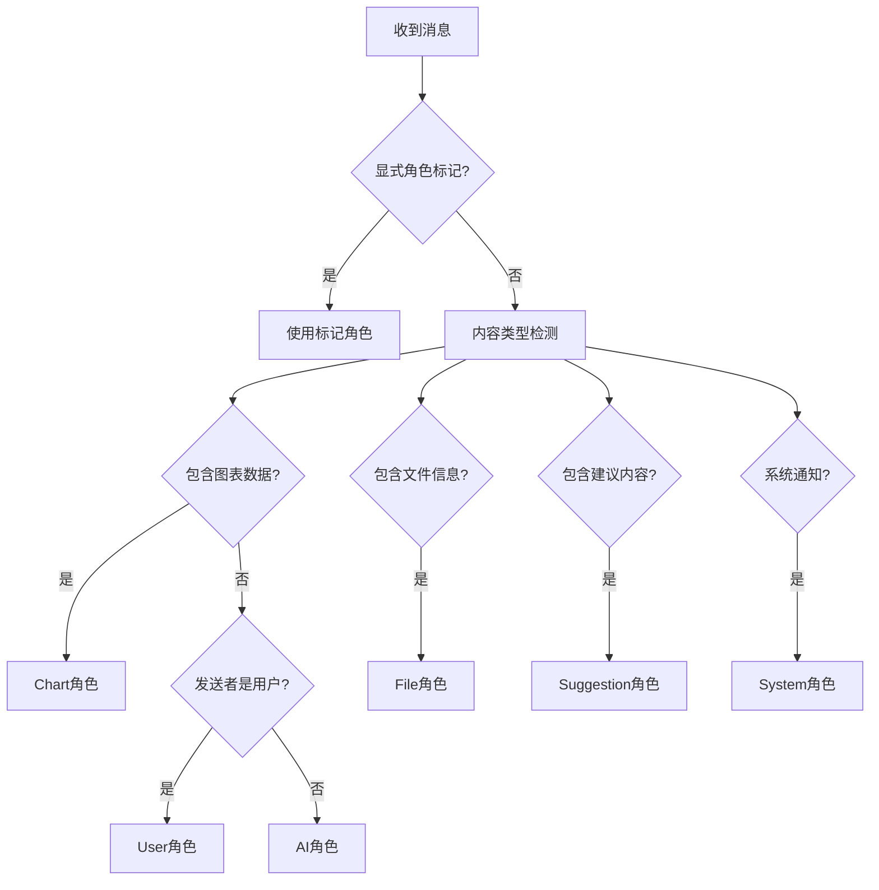
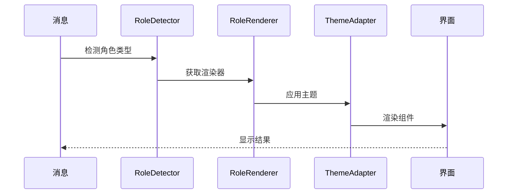

# Chat Roles 设计文档

## 一句话定位
提供完整的聊天角色定义、渲染和交互功能，支持多种角色类型、自定义样式和扩展机制。

## 概览
- **功能范围**：角色定义、渲染器、权限控制、主题定制
- **目标用户**：需要角色化聊天体验的开发者
- **关键用例**：
  1. 区分用户、AI、系统等不同角色
  2. 控制角色权限和交互行为
  3. 自定义角色样式和主题

## 信息架构



## 角色类型定义

### 基础角色类型
| 角色 | 标识 | 主要特征 | 典型样式 |
|------|------|----------|----------|
| 用户 | `user` | 右对齐、蓝气泡、可编辑 | 圆角头像、操作按钮 |
| AI助手 | `ai` | 左对齐、绿气泡、可复制 | 机器人头像、流式动画 |
| 系统 | `system` | 居中、黄底提示、只读 | 图标标识、无边框 |
| 子问题 | `sub_question` | 缩进、步骤式、进度条 | 问号图标、层级显示 |
| 建议 | `suggestion` | 卡片式、可点击、多选 | 灯泡图标、网格布局 |

### 角色权限系统
| 权限类型 | 标识 | 说明 | 适用角色 |
|----------|------|------|----------|
| 发送消息 | `send_message` | 允许发送聊天消息 | 用户、AI |
| 复制内容 | `copy_content` | 允许复制消息内容 | 所有角色 |
| 编辑消息 | `edit_message` | 允许编辑已发送消息 | 用户 |
| 生成图表 | `generate_chart` | 允许生成图表 | AI |
| 上传文件 | `upload_file` | 允许上传文件 | 用户 |

## 页面蓝图

### 角色渲染区域
| 区域 | 显示内容 | 可操作 | 条件 |
|------|----------|--------|------|
| 头像区 | 角色头像、在线状态 | 点击查看信息 | 显示头像的角色 |
| 内容区 | 消息内容、富媒体 | 复制、编辑、下载 | 所有角色 |
| 操作区 | 功能按钮、快捷操作 | 点赞、重试、删除 | 有权限的角色 |
| 元数据区 | 时间戳、来源、模型信息 | 点击展开详情 | 需要元数据的角色 |

## 流程图

### 角色检测流程


### 角色渲染流程


## 关键特性

### 1. 角色扩展机制
- [x] **自定义角色**：支持注册新的角色类型
- [x] **渲染器扩展**：可自定义渲染逻辑
- [x] **权限定制**：细粒度权限控制

### 2. 主题适配
- [x] **动态主题**：支持角色专属主题
- [x] **样式继承**：基础样式可被覆盖
- [x] **暗色模式**：自动适配系统主题

### 3. 交互控制
- [x] **权限检查**：操作前验证权限
- [x] **状态反馈**：交互状态实时反馈
- [x] **快捷操作**：常用操作快捷方式

## 使用示例

```typescript
// 定义自定义角色
const customRole: AIRole = {
  id: 'analyst',
  type: RoleType.AI,
  name: '数据分析师',
  model: 'gpt-4',
  permissions: [
    RolePermission.GENERATE_CHART,
    RolePermission.COPY_CONTENT
  ],
  config: {
    showAvatar: true,
    theme: { primaryColor: '#722ed1' }
  }
};

// 使用角色
<RoleProvider defaultRole={customRole}>
  <ChatInterface />
</RoleProvider>
```

## 扩展点

1. **角色渲染器**：实现 `RoleRenderer` 接口
2. **权限策略**：扩展权限检查逻辑
3. **主题系统**：自定义主题变量和样式

## 相关文档
- [Chat Hooks 设计文档](./chat-hooks.md)
- [Chat Messages 设计文档](./chat-messages.md)
- @see packages/ai-ui/src/ChatRoles/RolesBase/index.tsx