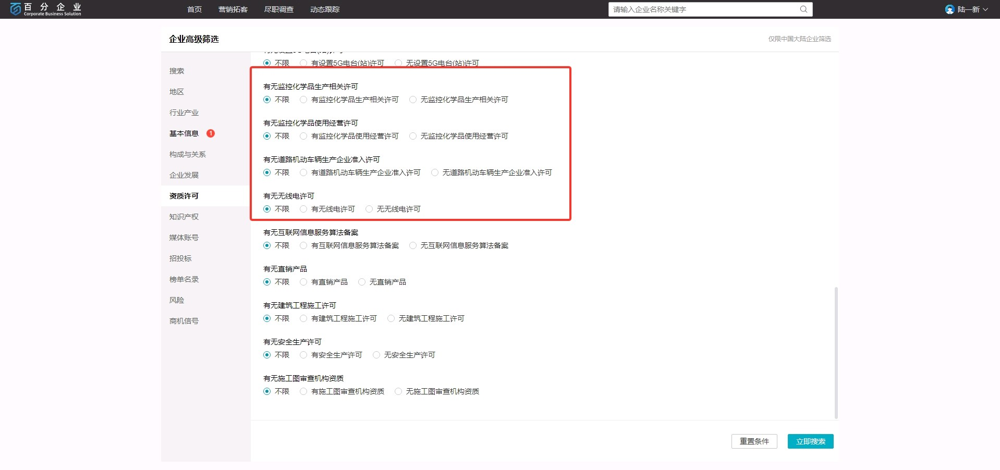
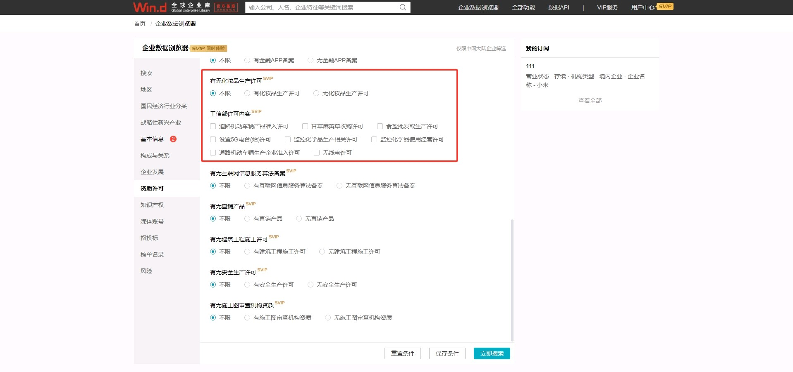
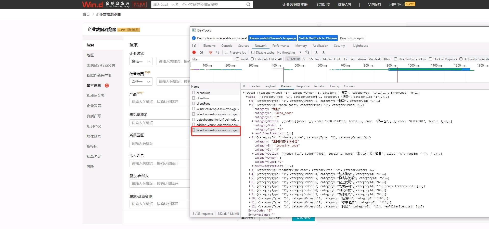
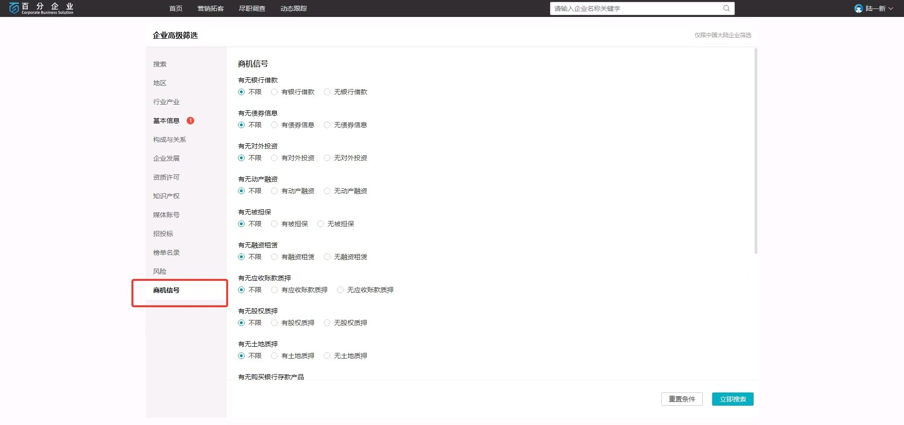

## 企业数据浏览器差异对比

以下是企业数据浏览器在不同场景下的界面截图对比。

### 场景一：

#### 资质许可（百分）

#### 资质许可（企业库）

### 场景二：企业库进入调用接口获取 json， 而百分没有

_可以看到，在新版中，部分筛选条件增加了 VIP 标识，同时界面布局有调整。_

### 场景三：招投标（百分和企业库不同）

### 场景五：商机信号只有百分有

