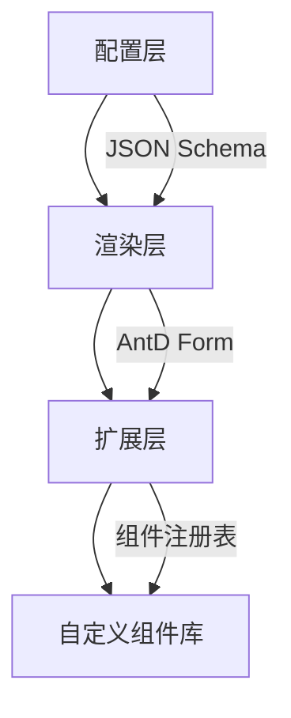
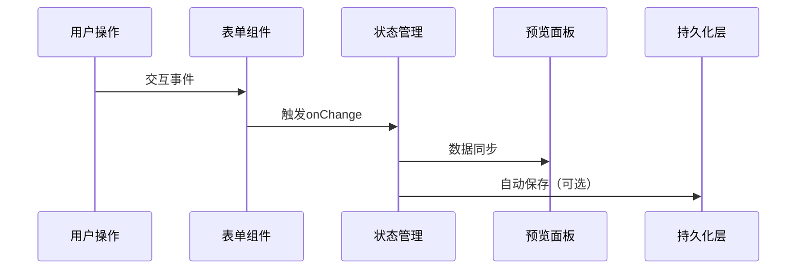
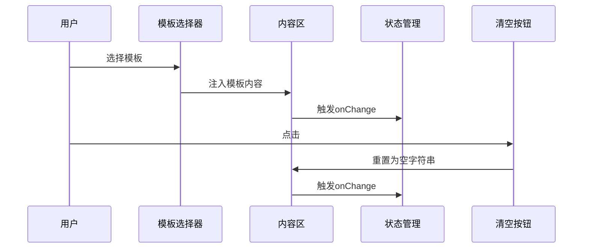

# 低代码动态表单系统设计文档

## 一、概述

### 1.1 项目目标

开发一个高扩展性的低代码表单系统，具备以下核心能力：

- 通过 JSON 配置快速生成复杂表单
- 支持无限级嵌套表单结构
- 内置常用业务组件（含全选/反选等高级功能）
- 灵活的自定义组件扩展机制
- 实时数据预览与调试能力

### 1.2 技术选型

| 技术栈     | 版本 | 作用领域     |
| ---------- | ---- | ------------ |
| React      | 18+  | 核心框架     |
| TypeScript | 4.9+ | 类型系统     |
| Ant Design | 5.x  | 基础组件库   |
| ahooks     | 3.7+ | 增强型 Hooks |

## 二、架构设计

### 2.1 分层架构



### 2.2 数据流向



## 三、核心模块

### 3.1 类型系统

```typescript
// 基础字段配置
interface BaseFieldConfig {
  name: string
  label?: string
  style?: React.CSSProperties
  hidden?: boolean
}

// 联合类型定义组件配置
type FieldConfig = BaseFieldConfig &
  (
    | { type: 'input'; placeholder?: string }
    | { type: 'custom-checkbox-group'; showSelectAll: boolean }
    | { type: 'special-input'; templateOptions: TemplateItem[] }
    | { type: string; component: React.ComponentType<CustomComponentProps> }
  )

// 自定义组件协议
interface CustomComponentProps<T = any> {
  value?: T
  onChange?: (value: T) => void
  config: FieldConfig
}
```

### 3.2 核心组件矩阵

| 组件名        | 职责         | 关键技术点              |
| ------------- | ------------ | ----------------------- |
| DynamicForm   | 表单渲染入口 | 递归渲染、路径拼接      |
| FieldRenderer | 字段分发器   | 类型守卫、组件匹配      |
| PreviewPanel  | 数据预览面板 | JSON 序列化、格式化显示 |

## 四、扩展机制

### 4.1 组件注册系统

```typescript
// 组件注册表
const componentRegistry = new Map<string, React.ComponentType>()

// 注册方法（带类型校验）
export const registerComponent = (type: string, component: React.ComponentType<CustomComponentProps>) => {
  if (componentRegistry.has(type)) {
    console.warn(`[表单系统] 组件 ${type} 已存在`)
  }
  componentRegistry.set(type, component)
}

// 使用示例
registerComponent('color-picker', ColorPicker)
```

### 4.2 自定义组件开发规范

1. **属性要求**：

   - 必须实现`value`/`onChange`双绑协议
   - 需处理`config`中的扩展属性
   - 需支持`disabled`状态

2. **样式要求**：

   - 使用 Ant Design 间距规范（8px 基准）
   - 容器宽度设置为 100%
   - 遵循`[prefix]-[component]`的 className 命名规则

3. **最佳实践**：

   ```tsx
   const CustomComponent: React.FC<CustomComponentProps> = ({ value, onChange, config }) => {
     // 从配置中获取自定义参数
     const { customParam } = config

     return (
       <div className="form-custom-component">
         <Input value={value} onChange={(e) => onChange(e.target.value)} addonBefore={customParam?.prefix} />
       </div>
     )
   }
   ```

## 五、使用示例

### 5.1 基础配置

```json
{
  "type": "custom-checkbox-group",
  "name": "cloud_services",
  "label": "云服务配置",
  "showSelectAll": true,
  "children": [
    {
      "name": "ecs",
      "label": "云服务器",
      "children": [
        {
          "type": "input",
          "name": "count",
          "label": "实例数量"
        }
      ]
    }
  ]
}
```

### 5.2 特殊输入组件配置

```tsx
const specialInputConfig = {
  type: 'contract-editor',
  name: 'contract_content',
  label: '合同编辑器',
  component: SpecialInput,
  templateOptions: [
    {
      value: 'standard',
      label: '标准模板',
      content: '根据《中华人民共和国合同法》...',
    },
  ],
  features: {
    clearable: true,
    history: 5,
  },
}
```

## 六、高级功能

### 6.1 字段联动

```typescript
// 配置示例
{
  "type": "select",
  "name": "service_type",
  "label": "服务类型",
  "dependencies": ["basic_config"],
  "options": [
    { "value": "standard", "label": "标准版" },
    { "value": "enterprise", "label": "企业版" }
  ]
}
```

### 6.2 性能优化策略

| 策略     | 实现方式            | 适用场景       |
| -------- | ------------------- | -------------- |
| 虚拟滚动 | react-virtualized   | 字段数量 > 50  |
| 组件缓存 | React.memo + 浅比较 | 静态字段       |
| 按需加载 | 动态 import()       | 大型自定义组件 |
| 批量更新 | ahooks useDebounce  | 高频输入字段   |

## 七、SpecialInput 组件实现

### 7.1 功能矩阵

| 功能     | 实现方式                | 相关配置项         |
| -------- | ----------------------- | ------------------ |
| 模板选择 | Select 组件 + 内容替换  | templateOptions    |
| 内容清空 | 按钮触发 + onChange('') | showClear          |
| 历史记录 | 环形缓冲区存储历史内容  | features.history   |
| 变量插值 | 正则匹配 + 弹出表单     | template.variables |

### 7.2 典型交互流程



## 八、注意事项

1. **性能基准**：

   - 单表单字段数 < 200
   - 嵌套层级 < 5 层
   - 渲染时间 < 1s（i7-12700H 基准）

2. **调试建议**：

   ```tsx
   // 在根组件添加调试面板
   <FormDevTools showFieldPaths enableValueTracking maxHistorySteps={10} />
   ```

3. **异常处理**：
   - 未注册组件显示占位符
   - 循环依赖检测
   - 字段冲突警告

## 附录：典型配置示例

```tsx
// 完整表单配置示例
const enterpriseFormConfig: FieldConfig[] = [
  {
    type: 'custom-checkbox-group',
    name: 'services',
    label: '服务选择',
    showSelectAll: true,
    children: [
      {
        name: 'compute',
        label: '计算服务',
        children: [
          {
            type: 'special-input',
            name: 'vm_config',
            label: '虚拟机配置',
            templateOptions: [...]
          }
        ]
      },
      {
        name: 'database',
        label: '数据库服务'
      }
    ]
  },
  {
    type: 'contract-editor',
    name: 'service_agreement',
    label: '服务协议',
    component: SpecialInput,
    features: {
      clearable: true,
      markdownPreview: true
    }
  }
];
```

本设计文档将持续迭代，最新版本维护于[内部文档平台地址]。任何扩展需求请遵循第四章扩展规范实现。
