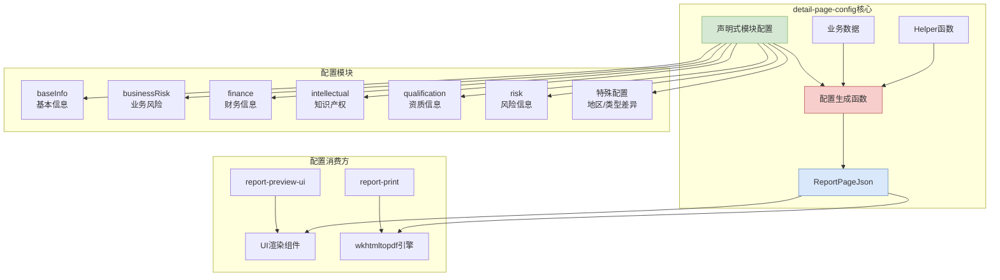
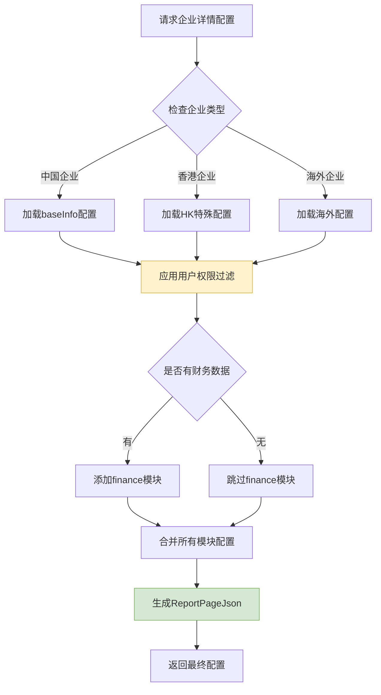

# detail-page-config 设计文档

## 概览

**功能范围**：提供配置即代码（Configuration as Code）的中央枢纽，生成驱动复杂详情页UI渲染的TypeScript配置对象。

**目标用户**：
- 前端开发人员：使用配置生成报告页面UI
- 系统架构师：理解配置驱动的UI渲染模式
- 维护人员：管理页面结构和业务规则的配置

**关键用例**：
1. 生成企业详情报告的页面配置结构
2. 根据用户权限和数据动态调整页面模块
3. 为不同类型企业（地区、行业）提供差异化配置

## 信息架构



**路由/入口说明**：
- `/corp` - 企业详情页配置主入口
- `/validation` - 配置验证模块入口
- 各子模块通过独立index.ts导出，支持按需导入

## 页面蓝图

### 区域职责表

| 区域 | 显示内容 | 可操作 | 可见条件 |
|------|----------|--------|----------|
| **基本信息模块** | 企业注册信息、股东结构、历史变更 | 查看、展开详情 | 始终显示 |
| **业务风险模块** | 经营异常、行政处罚、司法风险 | 查看、下载报告 | 根据企业类型过滤 |
| **财务信息模块** | 财务报表、融资信息、投资情况 | 查看、数据筛选 | 有财务数据时显示 |
| **知识产权模块** | 专利、商标、软著信息 | 查看、详情跳转 | 有知识产权时显示 |
| **资质信息模块** | 行业资质、认证信息 | 查看、证书下载 | 根据企业行业显示 |
| **特殊配置区域** | 地区差异化信息、特殊字段 | 查看 | 根据企业地区/类型动态显示 |

## 任务流程

### 主要配置生成流程



### 状态机说明

| 状态 | 触发条件 | 处理逻辑 | 输出结果 |
|------|----------|----------|----------|
| **初始化** | 接收配置请求 | 解析企业ID和用户信息 | 准备数据加载 |
| **数据加载** | API返回企业数据 | 验证数据完整性 | 基础配置对象 |
| **权限过滤** | 用户权限信息 | 移除无权查看模块 | 权限适配配置 |
| **动态调整** | 企业类型/地区 | 应用特殊配置规则 | 个性化配置 |
| **配置生成** | 所有数据处理完成 | 生成最终ReportPageJson | 可用配置对象 |

## 组件复用

### 组件层级结构

```
ReportPageJson (根配置)
├── ModuleConfig[] (模块配置数组)
│   ├── VerticalTableConfig (垂直表格)
│   ├── HorizontalTableConfig (横向表格)
│   └── CrossTableConfig (交叉表格)
└── TableCellConfig[] (单元格配置)
    ├── RenderConfig (渲染配置)
    └── ValidationRules (验证规则)
```

### 输入输出规范

| 组件层级 | 输入类型 | 输出类型 | 错误处理 |
|----------|----------|----------|----------|
| **配置生成函数** | 企业数据+用户信息 | ReportPageJson | 返回默认配置 |
| **Helper函数** | 特定业务数据 | 过滤后配置 | 返回空配置 |
| **验证器** | 配置对象 | 验证结果 | 抛出验证错误 |

## 相关文档

- @see ../README.md - 包概述和快速开始
- @see ./validation-design.md - 类型校验系统设计
- @see ./examples.md - 代码示例和使用方法
- @see ./data-structures.md - 核心数据结构说明
- @see ../architecture.md - 架构说明
- @see ./node-configuration-design.md - 节点配置设计详解
- @see ./custom-nodes-complete-list.md - 自定义节点完整列表