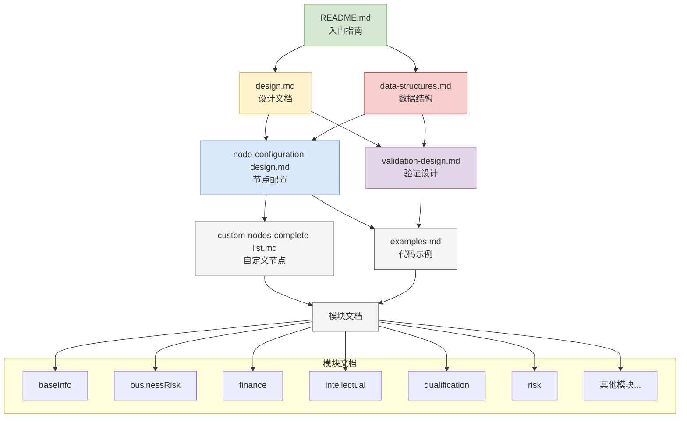

# 文档索引

## 概览

本文档提供 detail-page-config 包的完整文档索引，帮助您快速找到所需信息。

## 📚 核心文档

### 📖 基础文档
- **[README.md](../README.md)** - 包概述和快速开始指南
- **[架构说明](../architecture.md)** - 整体架构设计和模块关系
- **[设计文档](./design.md)** - 详细的设计方案和决策说明

### 🏗️ 数据结构文档
- **[数据结构详解](./data-structures.md)** - 核心数据结构和类型体系
- **[节点配置设计](./node-configuration-design.md)** - 各节点配置的详细说明
- **[类型校验设计](./validation-design.md)** - 配置验证系统设计

### 🔧 开发指南
- **[代码示例](./examples.md)** - 具体的使用示例和最佳实践
- **[自定义节点列表](./custom-nodes-complete-list.md)** - 完整的自定义节点类型说明

## 🎯 按需求查找文档

### 新手入门
1. 先阅读 **[README.md](../README.md)** 了解包的基本信息
2. 查看 **[数据结构详解](./data-structures.md)** 理解核心概念
3. 参考 **[代码示例](./examples.md)** 快速上手

### 深入开发
1. 阅读 **[设计文档](./design.md)** 了解架构设计
2. 查看 **[节点配置设计](./node-configuration-design.md)** 掌握配置方法
3. 参考 **[自定义节点列表](./custom-nodes-complete-list.md)** 了解扩展能力

### 问题排查
1. 查看 **[类型校验设计](./validation-design.md)** 了解验证机制
2. 参考 **[代码示例](./examples.md)** 的常见用例
3. 查看具体模块的 README 文件

## 📂 模块文档

### 核心模块
| 模块 | 说明 | 文档链接 |
|------|------|----------|
| **baseInfo** | 企业基本信息模块 | [📖 文档](../src/corp/baseInfo/README.md) |
| **businessRisk** | 业务风险模块 | [📖 文档](../src/corp/businessRisk/README.md) |
| **finance** | 财务信息模块 | [📖 文档](../src/corp/finance/README.md) |
| **intellectual** | 知识产权模块 | [📖 文档](../src/corp/intellectual/README.md) |
| **qualification** | 资质信息模块 | [📖 文档](../src/corp/qualification/README.md) |
| **risk** | 风险信息模块 | [📖 文档](../src/corp/risk/README.md) |

### 辅助模块
| 模块 | 说明 | 文档链接 |
|------|------|----------|
| **business** | 经营业务模块 | [📖 文档](../src/corp/business/README.md) |
| **history** | 历史变更模块 | [📖 文档](../src/corp/history/README.md) |
| **bussInfo** | 工商信息模块 | [📖 文档](../src/corp/bussInfo/README.md) |
| **IpoBusinessData** | IPO业务数据模块 | [📖 文档](../src/corp/IpoBusinessData/README.md) |

### 特殊配置模块
| 模块 | 说明 | 文档链接 |
|------|------|----------|
| **corpModuleCfgSpecial** | 特殊配置模块 | [📖 文档](../src/corp/corpModuleCfgSpecial/README.md) |
| **helper** | 辅助函数模块 | [📖 文档](../src/corp/helper/README.md) |

## 🔍 按功能查找

### 配置生成
- **企业配置生成** - 参考 **[设计文档](./design.md)**
- **模块配置说明** - 查看 **[数据结构详解](./data-structures.md)**
- **自定义节点开发** - 参考 **[自定义节点列表](./custom-nodes-complete-list.md)**

### 数据处理
- **数据映射规则** - 查看 **[节点配置设计](./node-configuration-design.md)**
- **API接口说明** - 参考具体模块文档
- **缓存策略** - 查看 **[节点配置设计](./node-configuration-design.md)** 的性能优化部分

### 类型安全
- **TypeScript类型定义** - 查看 **[数据结构详解](./data-structures.md)**
- **配置验证机制** - 参考 **[类型校验设计](./validation-design.md)**
- **错误处理** - 查看 **[节点配置设计](./node-configuration-design.md)** 的错误处理部分

## 🚀 快速导航

### 常见问题
- **如何添加新的节点类型？** → 参考 **[自定义节点列表](./custom-nodes-complete-list.md)**
- **如何配置表格渲染？** → 查看 **[节点配置设计](./node-configuration-design.md)**
- **如何进行配置验证？** → 参考 **[类型校验设计](./validation-design.md)**
- **如何优化性能？** → 查看 **[节点配置设计](./node-configuration-design.md)** 的性能优化部分

### 开发流程
1. **理解架构** → **[设计文档](./design.md)**
2. **学习配置** → **[数据结构详解](./data-structures.md)**
3. **查看示例** → **[代码示例](./examples.md)**
4. **参考实践** → **[自定义节点列表](./custom-nodes-complete-list.md)**
5. **验证配置** → **[类型校验设计](./validation-design.md)**

## 📊 文档关系图

## 📝 文档维护

### 贡献指南
- 文档更新请遵循项目文档规范
- 新增功能需要同步更新相关文档
- 文档间引用关系需要保持一致

### 版本对应
- 文档版本与包版本保持同步
- 重大变更需要更新文档版本号
- 废弃功能需要在文档中标注

### 反馈渠道
- 文档问题请提交 GitHub Issue
- 文档改进建议欢迎提交 Pull Request
- 使用疑问可以通过项目讨论区反馈

## 🔗 外部资源

### 相关包文档
- **[gel-types](../../types/README.md)** - 类型定义包
- **[report-preview-ui](../../packages/report-preview-ui/docs/overview.md)** - 预览UI组件
- **[report-print](../../apps/report-print/docs/README.md)** - 打印服务

### 技术规范
- **[TypeScript 规范](../../../docs/rule/code-typescript-style-rule.md)** - TypeScript 编码规范
- **[React 规范](../../../docs/rule/code-react-component-rule.md)** - React 组件规范
- **[文档规范](../../../docs/rule/doc-general-rule.md)** - 文档编写规范

### 工具和框架
- **[ahooks](https://ahooks.js.org/)** - React Hooks 工具库
- **[lodash](https://lodash.com/)** - JavaScript 工具库
- **[classnames](https://github.com/JedWatson/classnames)** - CSS 类名工具

---

**最后更新**: 2025-11-02
**维护者**: detail-page-config 开发团队
**版本**: 1.0.0
