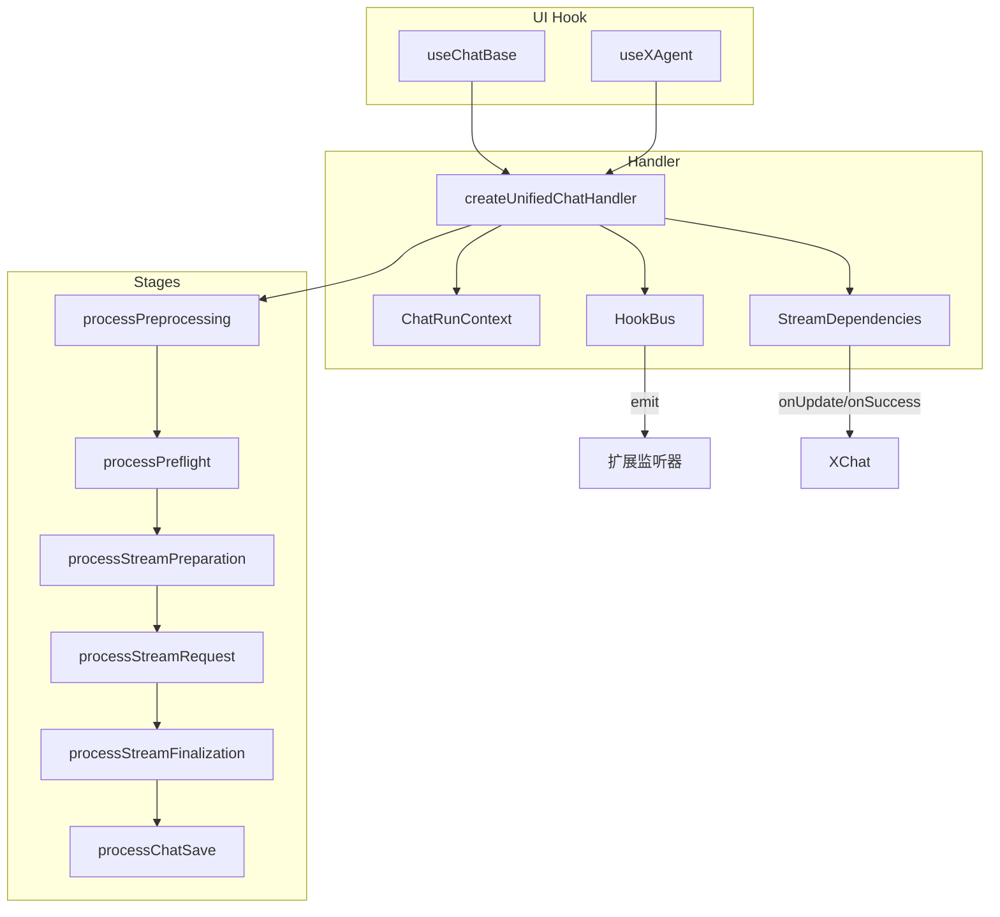
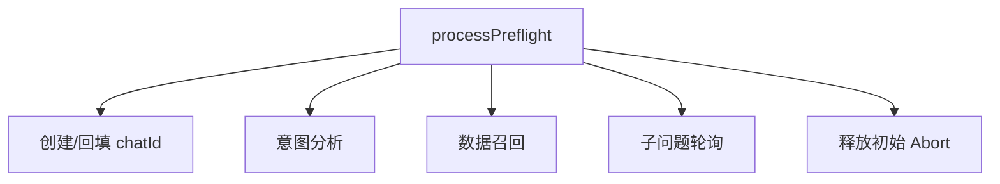
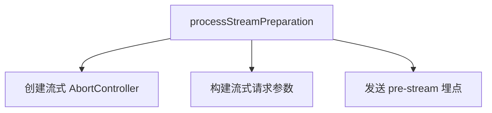
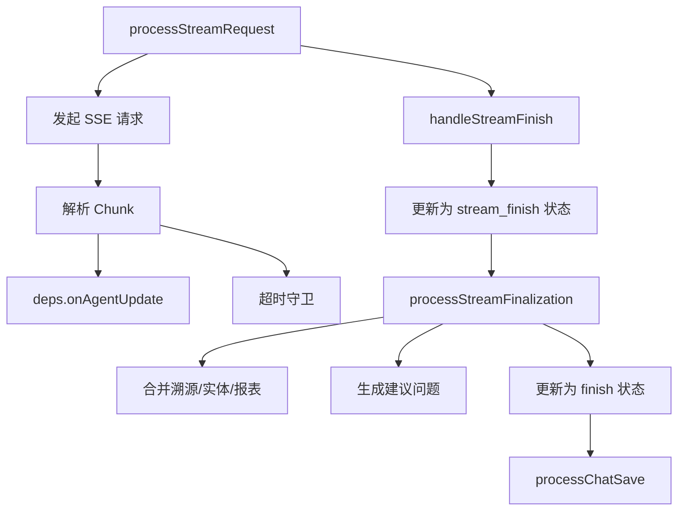
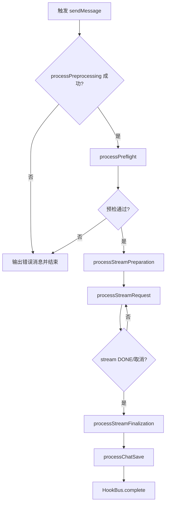
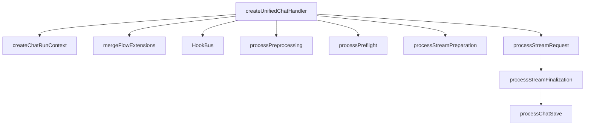

# 聊天核心流程前端设计文档（布局与功能）

## 🧭 设计概览

- 功能范围与边界：覆盖 `createUnifiedChatHandler` 四阶段（预处理→预检→流式准备→流式执行）以及 `processStreamFinalization` 与 `processChatSave` 的交互，不描述 UI 组件外观与 Markdown 渲染细节。
- 目标用户与场景：负责 AI 对话流程编排、扩展、排障的前端/服务层开发者；用于快速定位阶段职责、扩展切点和状态流转。
- 关键用例：
  1. 用户发送消息，流程按阶段推进并完成流式回答。
  2. 在预检阶段插入敏感词审核扩展并阻断非法请求。
  3. HookBus 监听 `stream:chunk` 进行实时埋点与质量监控。
  4. 用户在流式阶段取消请求，流程立即停机并给出可读提示。
  5. Finalization 阶段汇总溯源/实体后保存会话并刷新列表。

## 🗺 信息架构与导航



- **入口映射**：`useChatBase` 的 `onRequest` → `createUnifiedChatHandler`；取消操作通过 `StreamDependencies.cancel` 调用注入的 `AbortController`；`HookBus.register` 提供扩展事件入口。
- **导航规则**：阶段线性执行，扩展只能在各阶段声明的钩子前/后插入；任何阶段报错立即跳转 `handleError`，触发 `complete` 事件并终止后续流程；`HookBus` 监听需幂等，不得阻塞主阶段。
- **返回策略**：流程终止时都会调用 `processChatSave`，确保会话列表与消息时间线状态一致；失败时仍需写入一条系统消息。

## 🧱 页面蓝图（逐阶段）

### 预处理阶段

- 页面目标与完成标准：校验输入、初始化上下文、建立全局 Abort 控制并向 UI 返回发送中的状态。

```mermaid
graph TD
  Preprocess[processPreprocessing]
  Preprocess --> InputCheck[输入校验]
  Preprocess --> ContextInit[上下文初始化]
  Preprocess --> AbortInit[创建 AbortController]
  Preprocess --> StatusSync[setIsChating(true)]
```

| 区域         | 职责                               | 显示/写入数据                              | 允许操作         | 条件/可见性        |
| ------------ | ---------------------------------- | ------------------------------------------ | ---------------- | ------------------ |
| 输入校验     | 校验 `input.content`、上下文必填项 | 抛出友好错误码                             | 中断流程         | 首次进入阶段必执行 |
| 上下文初始化 | 重置 `runtime`、生成请求追踪 ID    | `context.runtime` 快照                     | 更新上下文       | 每次请求           |
| Abort 控制   | 创建并回调 `AbortController`       | `dependencies.setAbortController`          | Register/Release | 已有控制器时先释放 |
| 状态同步     | 设置 `isChating=true`、清空输入框  | `deps.setIsChating`、`deps.setContent('')` | 更新 UI          | 每次请求           |

- 状态与反馈：输入为空时抛出 `INVALID_PAYLOAD`，UI 展示“请补充问题内容”；阶段结束即进入 `runtime.status=pending`。

### 预检阶段

- 页面目标与完成标准：确保会话建联、意图分析、子问题轮询完成，并返回足够的上下文。



| 区域       | 职责                                               | 显示/写入数据                             | 允许操作                 | 条件/可见性        |
| ---------- | -------------------------------------------------- | ----------------------------------------- | ------------------------ | ------------------ |
| 会话创建   | 若无 `chatId` 调 `createChatCore` 并写入列表       | `context.runtime.chatId`                  | 更新会话列表             | 首问或手动清空时   |
| 意图分析   | 调 `analysisEngine` 获取 `rawSentenceID`、重写结果 | `runtime.intent`、`runtime.rawSentenceID` | 注入 HookBus 事件        | 必执行             |
| 数据召回   | 调 `handleDataRetrieval` 获取 `gelData/reportData` | `runtime.gelData` 等                      | 更新上下文               | 启用数据盘点时     |
| 子问题轮询 | 调 `getUserQuestion` 轮询，推送子问题消息          | `deps.onAgentUpdate`                      | 派发 `question:received` | 直到 `finish=true` |
| 控制器释放 | 释放预检阶段 Abort                                 | null                                      | 回调外部                 | 阶段结束           |

- 状态与反馈：阶段内保持 `runtime.status=pending`；任何接口失败映射为 `handleError` 并在消息列表展示错误。

### 流式准备阶段

- 页面目标与完成标准：准备 SSE 请求参数、注册流式阶段 Abort 控制器、发送阶段埋点。



| 区域       | 职责                              | 显示/写入数据                           | 允许操作         | 条件/可见性        |
| ---------- | --------------------------------- | --------------------------------------- | ---------------- | ------------------ |
| Abort 创建 | 创建流式阶段控制器并回调          | `dependencies.setStreamAbortController` | Register/Release | 每次进入阶段       |
| 参数构建   | 合并上下文生成 `GetResultRequest` | `runtime.streamPayload`                 | 扩展可修改参数   | 必执行             |
| 埋点通知   | 输出阶段埋点 `stream:start`       | 埋点事件 payload                        | 扩展可追加维度   | 可选（视埋点配置） |

- 状态与反馈：完成后将 `runtime.status` 切至 `receiving`，通知 UI 切换到流式展示。

### 流式执行与收尾阶段

- 页面目标与完成标准：消费 SSE 分片、更新 UI、执行 finalization、保存会话和刷新列表。
- **重要说明**：流式结束分为两个阶段：
  1. **流式完成 (`stream_finish`)**：SSE 流结束，内容接收完毕
  2. **整体完成 (`finish`)**：获取 entity 和 trace 数据后的最终状态



| 区域         | 职责                                              | 显示/写入数据                                               | 允许操作                           | 条件/可见性                               |
| ------------ | ------------------------------------------------- | ----------------------------------------------------------- | ---------------------------------- | ----------------------------------------- |
| SSE 请求     | 调 `deps.create` 建立流式连接                     | SSE 响应流                                                  | 监听 abort、重连                   | 必执行                                    |
| 分片解析     | `parseStreamThunk` 解析 `UPDATE/DONE`             | `runtime.aigcContent`、`runtime.entities`                   | 累积内容                           | 每个分片                                  |
| 状态更新     | `deps.onAgentUpdate` 推送 AgentMsgDepre           | UI 消息列表                                                 | 滚动到最新、渲染流式文本           | 每个分片                                  |
| 超时守卫     | `resetTimeout/clearTimeoutTimer` 保障 chunk 间隔  | 定时器引用                                                  | 触发全局超时                       | 配置启用时                                |
| 流式完成     | SSE 流结束，更新为 `stream_finish` 状态           | `status: 'stream_finish'`                                   | 触发 `onAgentUpdate`               | SSE DONE 时                               |
| Finalization | 拉取补充数据（entity/trace）、插入溯源、生成建议  | `runtime.traces`、`runtime.entities`、`runtime.suggestions` | 转换 Markdown→HTML（委托渲染文档） | 必执行，防重复通过 `entitiesFetched` 标志 |
| 整体完成     | 生成最终消息，更新为 `finish` 状态                | `runtime.finalMessage`、`status: 'finish'`                  | 触发 `onAgentSuccess`              | Finalization 完成后                       |
| 保存         | `processChatSave` 写入历史并发出 HookBus.complete | 会话记录、刷新标记                                          | 触发外部刷新                       | 必执行                                    |

- 状态与反馈：流式阶段状态路径：`receiving → streaming → stream_finish → finish/error`；取消触发 `AbortController.abort()` 后进入 `error` 分支并生成“已取消”消息。

## 🔄 交互流程与状态



- **状态机（`runtime.status`）**：`idle → pending → receiving → streaming → stream_finish → finish | error`。任何阶段错误进入 `error`，随后 `processChatSave` 仍需执行。
- **交互规则**：

| 触发条件          | 系统行为                                | 用户反馈                     | 可撤销         | 备注                                |
| ----------------- | --------------------------------------- | ---------------------------- | -------------- | ----------------------------------- |
| 输入为空          | 抛出 `INVALID_PAYLOAD`，不中断 UI       | Toast“请补充问题内容”        | 否             | 预处理阶段                          |
| 扩展阻断          | 抛出 `CreateHandleError` 并写入错误消息 | 流水线停止，展示扩展返回文案 | 是（重试）     | 扩展需自带文案                      |
| SSE chunk 到达    | 解析分片并 `onAgentUpdate`              | 消息列表增量渲染             | 否             | 同时重置超时                        |
| 用户取消          | 流式 Abort + `handleError`              | 展示“请求已取消”消息         | 是（重新发送） | HookBus 发出 `error`                |
| Finalization 成功 | 生成完整消息并保存                      | 消息带溯源/实体/建议         | 否             | `transformerOnStreamSuccess` 可改写 |

## 🧮 数据与本地状态

- **运行时上下文 (`ChatRunContext.runtime`)**：`chatId`、`requestId`、`status`、`aigcContent`、`aigcReason`、`gelData`、`reportData`、`entities`、`traces`、`suggestions`、`questionStatus`。
- **依赖注入 (`StreamDependencies`)**：`setIsChating`、`setContent`、`create`(SSE)、`onAgentUpdate`、`onAgentSuccess`、`onAgentError`、`setAbortController`、`setStreamAbortController`、`metrics`。
- **刷新/缓存策略**：每次请求重建 `ChatRunContext`；Finalization 后统一写入缓存；`HookBus.complete` 触发外部会话列表刷新；缓存命中逻辑可在 `flowExtensions.streamPreparation` 中提前返回。
- **并发控制**：同一 handler 仅允许一个进行中请求；`isChating` 为 UI 禁用开关；取消后需释放两个 AbortController 并重置定时器。

## 🧩 组件分解与复用



- 输入/输出：
  - Handler 输入：`ChatSendInput`、`StreamDependencies`、可选 `flowExtensions`。
  - Handler 输出：通过 `onAgentUpdate/onAgentSuccess` 推送的 `AgentMsgDepre[]`；HookBus 事件提供扩展通知。
- 边界与错误处理：各阶段 catch 后会抛出 `CreateHandleError`；`handleError` 负责插入错误消息、调用 `processChatSave`、发出 `HookBus.error/complete`。
- 扩展策略：`flowExtensions` 提供 `preprocess/preflight/streamPreparation/streamRequest/finalize` 列表；HookBus 订阅需在 `registerEvents` 中声明并在 `complete` 时自动反注册。

## 🚫 非目标与不包含

- 不描述 Markdown/HTML 渲染、溯源点击跳转（详见 `md-rendering-design.md`）。
- 不涉及具体 UI 组件结构（参见 `component-optimization-design.md`）。
- 不定义后端接口契约及错误码映射表（另有 API 文档）。

## ✅ 检查清单（布局与功能）

- [x] 四个主阶段均给出了职责蓝图与区域表
- [x] 主要任务的端到端流程图与状态机齐备
- [x] 加载、取消、错误路径及 HookBus 反馈明确
- [x] `ChatRunContext` 与 `StreamDependencies` 字段说明完整
- [x] 扩展与复用策略覆写所有阶段
- [x] 非目标范围已列出以避免重复内容
