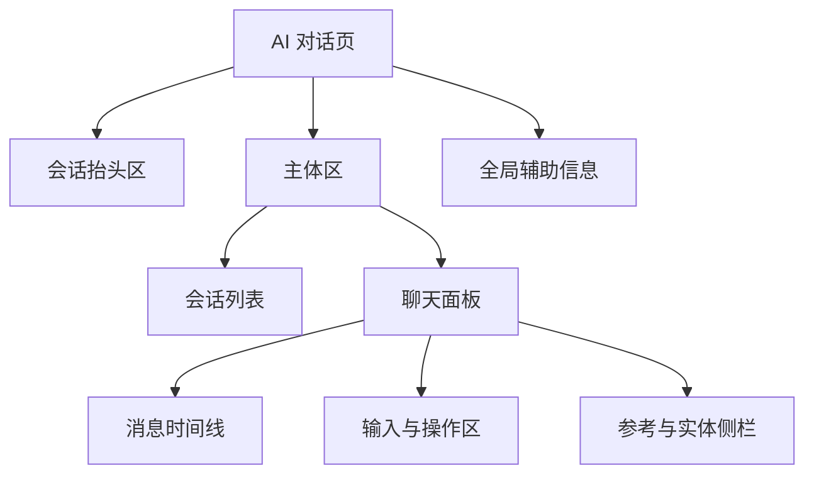
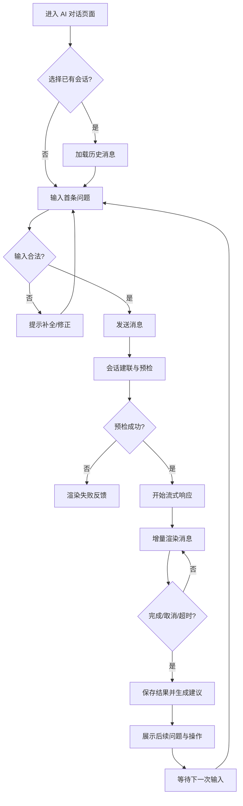

# AI 对话模块需求文档

## 功能说明
- 提供一个面向业务用户的自然语言问答入口，支持多轮会话与上下文理解。
- 允许用户在单一界面内创建新会话、切换历史记录、查看 AI 回答和补充问题建议。
- 支持 AI 响应的流式展示、图表与结构化数据挂载、溯源与实体提示等扩展信息。
- 需要提供取消、重试、复制、跟进提问等常规操作，并保证错误场景有可读的降级反馈。
- 系统需在不同业务实体上下文下运行，具备扩展新的消息类型与额外流程检查的能力。

## 页面布局

| 区域 | 内容要素 | 主要操作 | 显示条件 |
| ---- | -------- | -------- | -------- |
| 会话抬头区 | 当前会话标题、实体上下文、刷新入口 | 切换实体、刷新数据 | 始终显示 |
| 会话列表 | 历史会话、搜索框、置顶状态 | 打开会话、固定、删除 | 拥有会话记录时显示 |
| 消息时间线 | 用户消息、AI 消息、图表、子问题、溯源标记 | 滚动查看、点击溯源、点击子问题/建议 | 始终显示 |
| 参考与实体侧栏 | 溯源列表、实体详情、结构化报表 | 切换标签、查看明细、跳转外链 | 仅当 AI 返回相关数据时显示 |
| 输入与操作区 | 文本输入框、附件入口、发送/取消/重试按钮 | 输入、发送、取消、重试、复制、快捷操作 | 始终显示 |
| 全局辅助信息 | Loading、错误提示、版本信息 | 反馈状态、指引恢复 | 视状态显示 |

## 操作流程

- 取消操作可在 `StreamResp` 及 `Chunk` 阶段随时触发，立即停止流式并返回取消态。
- 重试操作基于最后一条用户消息重新进入 `Submit` → `Setup` 流程。
- 提交后的页面需保持 `isChating=true` 状态直至流程到达 `Finalize`。

## 数据信息

| 数据块 | 字段 | 说明 | 来源 | 校验/格式 |
| ------ | ---- | ---- | ---- | --------- |
| 会话元数据 | `chatId`, `title`, `updateTime`, `entityCode` | 标识当前会话及实体上下文 | 会话列表 API / 首问建会 | `title` ≤ 60 字符；`entityCode` 可选 |
| 用户消息 | `messageId`, `role`, `content`, `attachments` | 记录用户输入及附件 | 输入区域；上传服务 | `content` 必填，长度 ≤ 2000 字符 |
| AI 消息主体 | `content`, `reason`, `status`, `questionStatus` | AI 主体回答、推理过程和状态 | 流式接口 `handleStreamRequest` | `status` 取值：`pending/receiving/streaming/finish/error` |
| 子问题 / 建议 | `subQuestions[]`, `suggestions[]` | AI 澄清问题与后续推荐 | 预检轮询 / Finalize | 最多展示 4 条，可点击自动填充输入框 |
| 溯源数据 | `traceContent[]` | DPU/RAG 数据索引、位置范围 | Finalize 服务 | 仅保留有效来源，按段落去重 |
| 实体/报表 | `entities[]`, `gelData`, `reportData` | 结构化参考、图表、数据表 | Finalize 服务 | 有结构标题与唯一 key；实体具备跳转编码 |
| 操作记录 | `questionStatus`, `errorCode` | 最终状态及可读错误 | 保存接口 `saveChatItem` | 错误需映射用户可读文案 |

## 交互反馈
- **加载与禁用**：提交后输入框禁用，展示进度条或“正在思考”提示；流式结束或失败后恢复输入。
- **流式展示**：增量内容在消息尾部平滑追加，滚动容器跟随最新内容；当 AI 提供子问题或建议时以卡片形式插入。
- **取消/重试**：取消成功展示“已取消”系统消息；重试沿用最近一次用户输入，生成新的 AI 消息卡片。
- **错误反馈**：
  - 预检失败：在消息列表插入错误卡片，并保留重试按钮。
  - 流式异常或超时：展示部分回答，并附“连接中断/超时，请重试”提示。
  - 解析失败：回退到原始 Markdown 文本，同时在侧栏提示“暂无法展示结构化信息”。
- **状态提示**：会话列表同步更新最近问题状态；右上角 Toast/通知提示保存成功或失败。
- **辅助引导**：首问缺少上下文时提示补充实体信息；当溯源为空时展示“暂无参考资料”的灰色占位。
