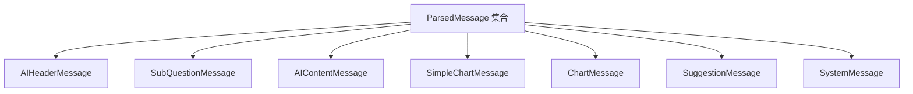
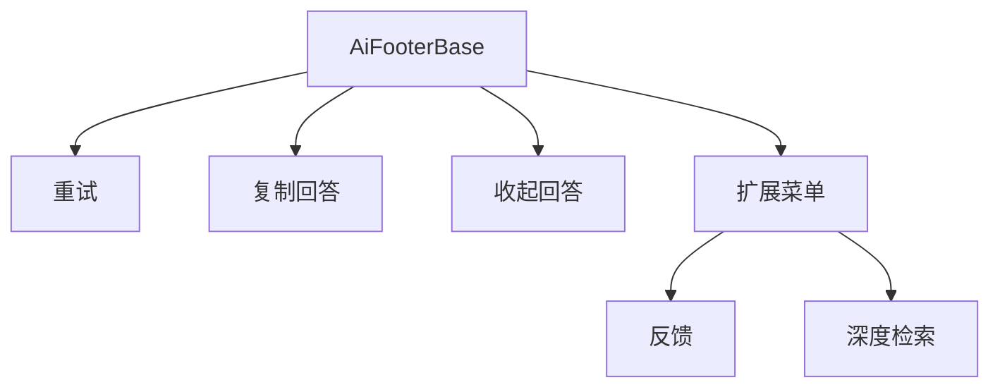
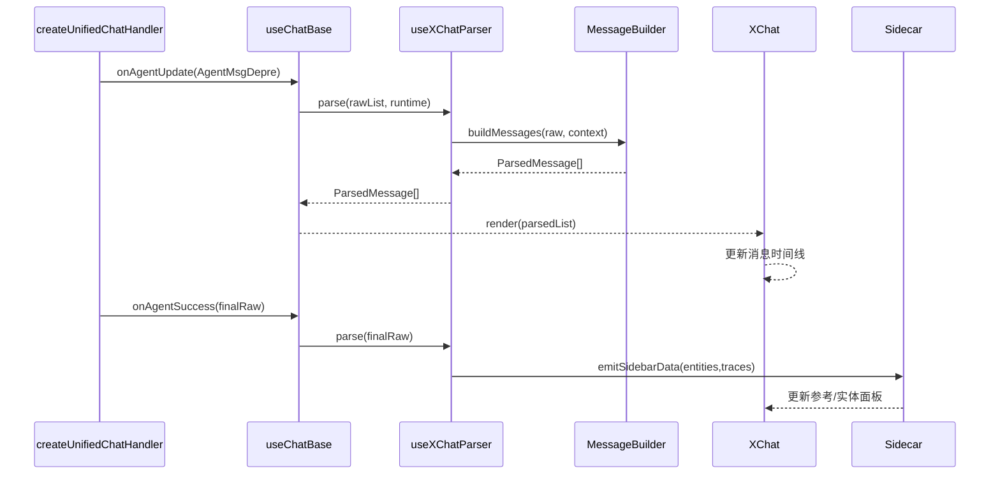
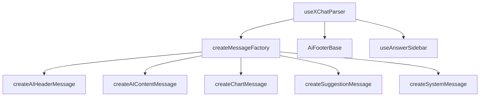

# AI 对话消息模型与解析设计文档（布局与功能）

## 🧭 设计概览

- 功能范围与边界：聚焦 AI 对话中的消息模型、解析流程与 UI 组合。描述后端 `AgentMsgDepre` → `useXChatParser` → XChat 渲染的转换逻辑，不涉及请求阶段编排（见《聊天核心流程前端设计文档》）及 Markdown 富文本处理（见《md-rendering-design.md》）。
- 目标读者：负责维护消息模型、扩展新消息类型、定制聊天界面呈现的前端工程师与研发同学。
- 使用场景：新增/修改消息类型、排查渲染异常、优化消息交互、扩展消息页脚或工具栏。
- 关键用例：
  1. 后端增加“结构化报表”节点，前端在解析层新增对应消息卡片。
  2. 需要在 AI 消息头部追加模型标识或角色信息。
  3. 用户点击建议问题后自动复用原流程并插入新的用户消息。
  4. 渲染失败时回退到纯文本消息并保留重试操作。

## 🗺 信息架构与导航

```mermaid
flowchart TD
  Backend[Backend APIs
(AgentMsgDepre)] --> Parser[useXChatParser]
  Parser --> Builder[MessageBuilder 工厂]
  Builder --> Timeline[MessageTimeline]
  Timeline --> XChat[Ant Design XChat]
  Parser --> Footer[AiFooterBase]
  Parser --> Sidecar[ContextSidebar]
  Timeline --> Actions[消息级操作]
```

- **入口与路由**：`createUnifiedChatHandler` 通过 `onAgentUpdate/onAgentSuccess` 将 `AgentMsgDepre[]` 推送给 `useChatBase`；`useChatBase` 再调用 `useXChatParser` 输出 `ParsedMessage[]` 供 XChat 渲染。
- **导航规则**：解析输出按照“头部 → 子问题 → 回答 → 图表 → 建议”的固定顺序拼装；若某类数据缺失则自动跳过；错误场景转换为 `SystemErrorMessage`。
- **返回策略**：每次 `onAgentSuccess` 会生成一组完整的 `ParsedMessage`，并在同一事务中同步侧栏数据（溯源/实体）。

## 🧱 页面蓝图（消息构成）

### 消息集合结构



| 区域                 | 职责                   | 显示数据                          | 允许操作                   | 条件/可见性             |
| -------------------- | ---------------------- | --------------------------------- | -------------------------- | ----------------------- |
| `AIHeaderMessage`    | 展示助手身份、模型标签 | 角色名、模型信息                  | 折叠/展开详情              | 所有 AI 消息            |
| `SubQuestionMessage` | 提示澄清问题           | 子问题文案、按钮                  | 点击按钮转化为用户消息     | 当返回 `subQuestions`   |
| `AIContentMessage`   | 展示主回答、推理过程   | Markdown 内容、推理摘要、页脚操作 | 复制、重试、收藏、复制溯源 | 当返回 `content/reason` |
| `SimpleChartMessage` | 快速指标图/表          | 简单统计数据                      | 展开、导出                 | 有 `simpleCharts` 时    |
| `ChartMessage`       | 复杂互动图表           | 报表、图形组件                    | 查看详情、跳转页面         | 有 `charts` 时          |
| `SuggestionMessage`  | 推荐后续问题           | 建议列表、快捷操作                | 点击自动填充输入框         | 返回 `suggestions` 时   |
| `SystemMessage`      | 错误或提示信息         | 状态文案、重试按钮                | 重试、查看详情             | 流程异常或取消时        |

### 页脚/操作区域



- 页脚在 `AIContentMessage` 中渲染，提供统一的操作插槽；业务可通过配置注入自定义按钮。
- 行为约定：重试重发最后一条用户消息；复制调用渲染层 `stripMarkdownAndTraces`；深度检索触发外部工作流。

## 🔄 交互流程与状态



- **状态机（消息级）**：
  - `AgentMsgDepre.status`：`pending` → `receiving` → `streaming` → `finish|error`；解析层将该状态映射到 UI 徽标与加载骨架。
  - `SystemMessage.type`：`loading`、`error`、`cancelled`、`info`。
- **交互规则**：

| 触发条件            | 系统行为                        | 用户反馈                 | 可撤销 | 备注                 |
| ------------------- | ------------------------------- | ------------------------ | ------ | -------------------- |
| 返回 `subQuestions` | 生成 `SubQuestionMessage` 卡片  | 按钮高亮，可点击         | 否     | 点击触发 sendMessage |
| 返回 `charts`       | 创建对应消息并挂载图表组件      | 图表可展开/导出          | 否     | 组件需懒加载         |
| 无内容但有错误码    | 生成 `SystemMessage` + 错误页脚 | 显示错误文案与重试       | 是     | 走最后一次用户重试   |
| Markdown 渲染失败   | 回退到纯文本消息                | 显示原始 Markdown + 提示 | 否     | 同步 Toast 提醒      |

## 🧮 数据与本地状态

- **原始数据模型**：
  - `AgentMsgDepre`: `messageId`, `role`, `content`, `reason`, `status`, `questionStatus`, `references`, `entities`, `charts`, `subQuestions`, `suggestions`, `metadata`。
  - `SidebarContext`: `traces`, `entities`, `gelData`, `reportData`, `modelType`。
- **解析输出**：
  - `ParsedMessage`: `id`, `type`, `role`, `content`(ReactNode), `status`, `actions`, `payload`。
  - `ParsedSidebar`: `traces[]`, `entities[]`, `metrics[]`, `activeTab`。
- **缓存策略**：`useXChatParser` 维护最近一次解析结果，避免重复解析；当 `messageId` 未变时跳过渲染；侧栏数据在 `processStreamFinalization` 完成后统一刷新。
- **排序与分页**：消息按 `createAt` 升序；子问题与建议最多 4 条，按权重排序；图表采用 `order` 字段控制显示顺序。

## 🧩 组件分解与复用



- **输入/输出**：
  - 输入：`AgentMsgDepre[]`、流程上下文（模型类型、错误码、是否首问）。
  - 输出：`ParsedMessage[]`、`SidebarContent`、页脚操作定义。
- **复用策略**：
  - 消息工厂函数保持纯函数特性，方便单元测试与复用。
  - 页脚操作通过配置注入，默认提供“复制/重试/深度检索”等通用按钮。
  - 侧栏解析 (`useAnswerSidebar`) 将渲染与数据组织解耦，允许其他业务复用同一数据结构。
- **错误边界**：任何工厂抛错将被捕获并回退为 `SystemMessage`；页脚操作失败需通过 Toast 提示但不影响消息展示。

## 🌍 可访问性与国际化

- 消息头与页脚按钮需提供 `aria-label`；键盘 Tab 顺序：头部 → 主体 → 页脚 → 子问题/建议。
- 所有文案通过多语言 key 管理；建议消息应考虑长文本换行，侧栏实体名称需支持 2 行展示。

## 🚫 非目标与不包含

- 不描述流式阶段的网络行为与 Abort 控制。
- 不覆盖溯源标记插入与 Markdown 渲染细节（见 `md-rendering-design.md`）。
- 不定义后端接口参数或错误码映射。

## ✅ 检查清单（布局与功能）

- [x] 消息集合与子模块职责清晰
- [x] 解析流程与状态流具有图表辅助
- [x] 错误、回退、建议等交互规则覆盖
- [x] 数据模型与缓存策略说明完整
- [x] 组件拆分与扩展点界限明确
- [x] 国际化与可访问性注意事项补充
