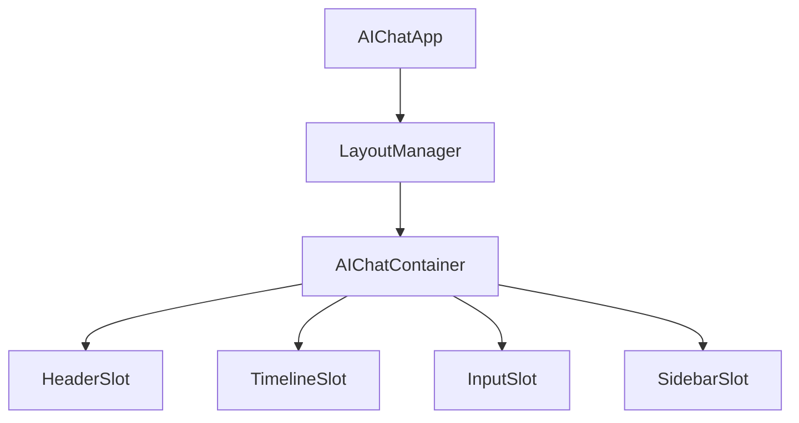
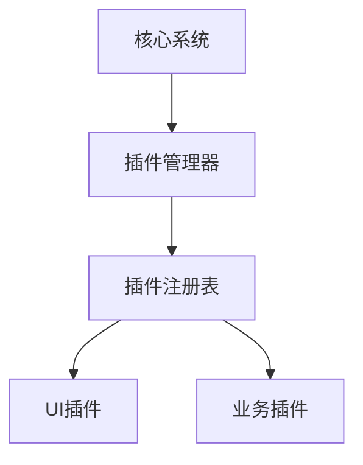

# AI Chat 组件架构设计

## 设计概览

构建插件化的UI组件体系，支持插槽化布局和业务定制。

## 组件层次结构



### 插槽系统

| 层级 | 组件类型 | 职责边界 | 扩展点 |
|------|----------|----------|--------|
| L1 | 应用容器 | 全局配置、主题管理 | 主题、布局模式 |
| L2 | 布局容器 | 插槽管理、响应式 | 插槽注册、布局策略 |
| L3 | 功能组件 | 核心交互逻辑 | 消息渲染、角色展示 |
| L4 | 业务组件 | 业务功能实现 | 建议卡片、会话管理 |

## 配置驱动

### 基础配置
```typescript
interface AIChatConfig {
  layout: {
    mode: 'default' | 'compact' | 'expanded';
    sidebar: { position: 'left' | 'right'; width: number };
    header: { show: boolean; height: number };
  };
  theme: {
    primary: string;
    background: string;
    typography: FontConfig;
  };
  features: {
    enableSuggestions: boolean;
    enableAttachments: boolean;
    enableVoiceInput: boolean;
  };
}
```

### 扩展机制
- **插槽注册**: 动态注册自定义组件
- **主题定制**: 覆盖样式变量
- **配置覆盖**: 运行时配置更新

## 插件化架构



### 扩展能力
- **UI组件扩展**: 自定义渲染器
- **交互扩展**: 新增交互类型
- **数据扩展**: 自定义数据处理器
- **样式扩展**: 主题和样式定制

---

*相关实现: `src/components/ai-chat/`*
*参见文档: [系统架构设计](./architecture-design.md)*