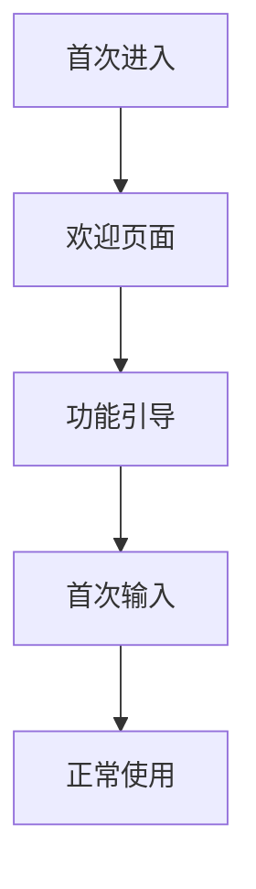
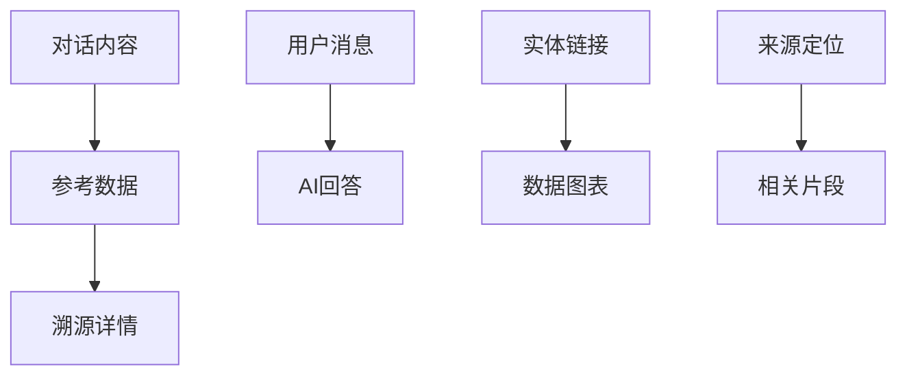
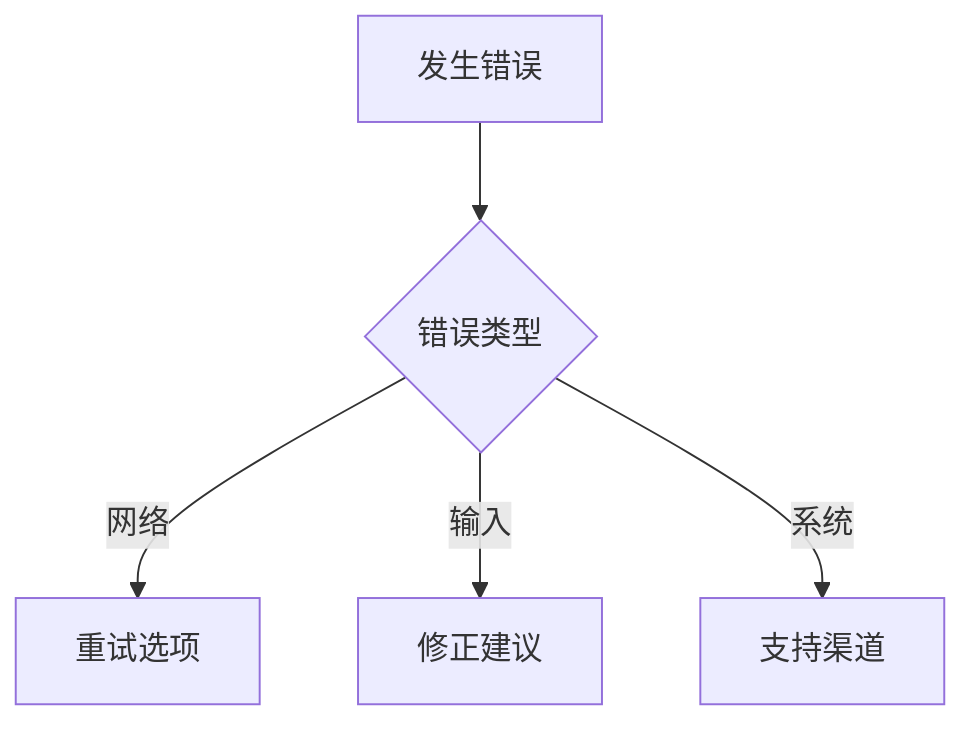

# AI Chat 用户体验设计

## 设计目标

提供流畅、直观的AI对话体验，降低学习成本，提升交互满意度。

## 用户角色

| 角色 | 核心需求 | 主要场景 | 痛点 |
|------|----------|----------|------|
| 业务分析师 | 数据洞察、业务分析 | 日常查询、报表生成 | 数据获取复杂 |
| 产品经理 | 市场调研、需求梳理 | 反馈分析、功能规划 | 信息分散耗时 |
| 技术开发 | 方案咨询、代码生成 | 架构设计、技术选型 | 验证周期长 |

## 交互流程

### 首次使用

### 核心交互

#### 输入体验
- 智能提示和快捷操作
- 历史消息快速引用
- 多模态输入支持

#### 响应体验
- 流式内容渐进展示
- 实时状态反馈
- 中断和续传支持

## 视觉层次

### 信息架构

### 视觉权重
| 元素 | 权重 | 优先级 | 交互 |
|------|------|--------|------|
| 输入框 | 高 | 持续显示 | 强 |
| AI回答 | 高 | 实时更新 | 中 |
| 错误提示 | 中 | 按需显示 | 可操作 |
| 侧栏信息 | 低 | 按需展开 | 弱 |

## 响应式布局

| 设备 | 布局特点 | 关键尺寸 |
|------|----------|----------|
| 桌面端 | 三栏布局 | >1200px |
| 平板端 | 两栏布局 | 768-1200px |
| 移动端 | 单栏布局 | <768px |

## 微交互

- **状态反馈**: 发送中、思考中、输入中的视觉提示
- **悬停效果**: 消息、链接、实体的交互反馈
- **过渡动画**: 消息滑入、侧栏展开的平滑效果

## 可访问性

- **键盘导航**: Tab切换、Enter确认、Esc取消
- **屏幕阅读器**: 语义化HTML、aria标签
- **视觉辅助**: 高对比度、字体调节、焦点指示

## 错误体验

### 错误提示原则
- 具体明确的问题说明
- 可操作的解决路径
- 友好的表达方式
- 保持用户工作状态

## 性能体验

- **加载优化**: 骨架屏、渐进加载、智能缓存
- **流畅度**: 60fps动画、<100ms响应、虚拟滚动

---

*相关实现: `src/biz/ai-chat/`, `src/components/`*