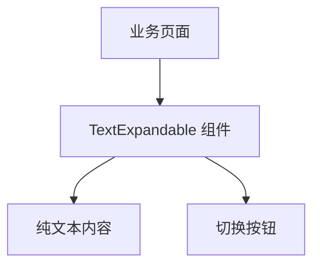
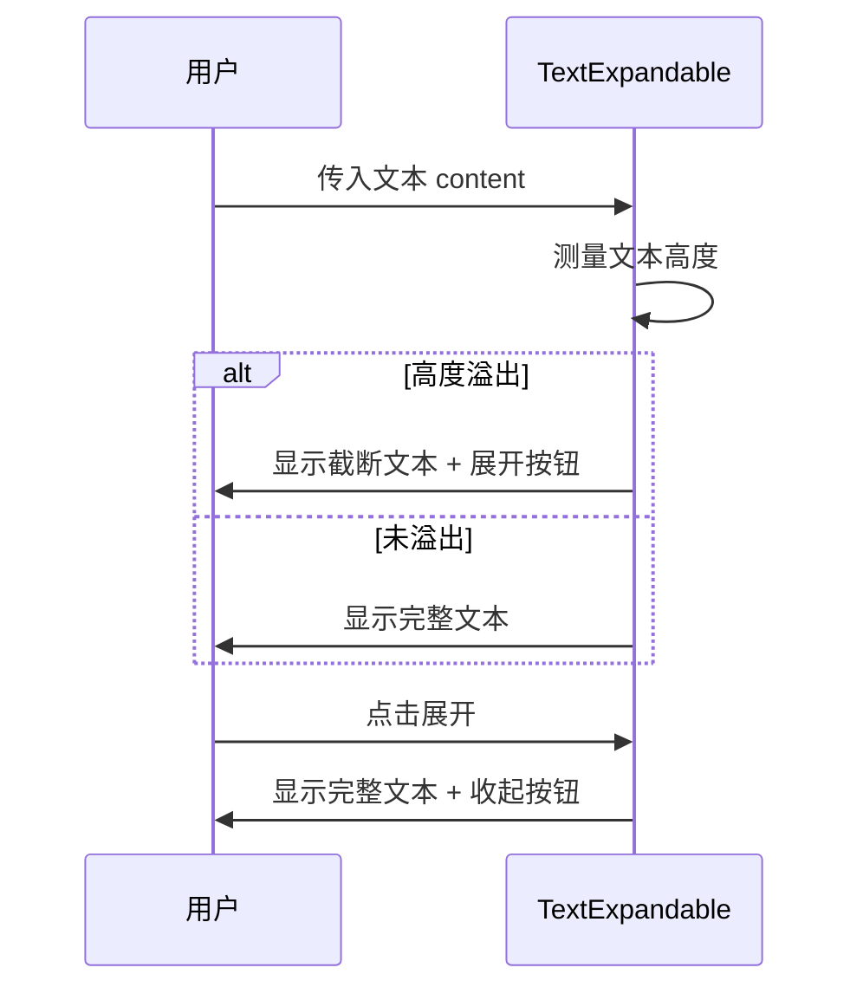

# TextExpandable 组件设计文档

## 1. Overview (概览)

`TextExpandable` 是一个专门用于展示纯文本的折叠组件。它通过 CSS 的 `line-clamp` 属性限制文本行数，并提供简单的展开/收起功能。该组件主要用于处理简单的字符串内容展示。

### 关键场景

- **简单备注展示**: 表格中的备注列，超过 2 行省略。
- **日志文本**: 简单的纯文本日志信息。

## 2. Architecture (信息架构)

## 3. Blueprint (页面蓝图)

| 区域         | 数据来源        | 交互动作          | 可见条件       | 备注                     |
| :----------- | :-------------- | :---------------- | :------------- | :----------------------- |
| **文本区域** | `props.content` | 无                | 常驻           | 仅支持 String 类型       |
| **操作按钮** | 内部逻辑        | 点击切换展开/收起 | 文本溢出时显示 | 按钮嵌入在文本流后或下方 |

## 4. Task Flow (任务流程)

## 5. States (状态)

- **Collapsed**: 文本截断，显示“展开”。
- **Expanded**: 文本完全展示，显示“收起”。
- **Normal**: 文本较短，无按钮。

## 6. Components (组件复用与局限性)

### 局限性分析

- **内容限制**: 仅接受 `string` 类型的 `content` 属性，无法处理带有 HTML 标签或 React 组件的复杂内容。
- **样式硬编码**: 按钮样式和位置相对固定，灵活性较低。
- **Safari 兼容性**: 历史版本中包含针对 Safari 的特定样式处理 (`containerSafari`)。

### 替代方案

请优先使用功能更强大的 **`AutoExpandable`** 组件，它支持任意类型的子元素并提供更完善的溢出检测机制。

### 代码引用

- 源文件: `@see packages/gel-ui/src/common/TextExpandable/index.tsx`
