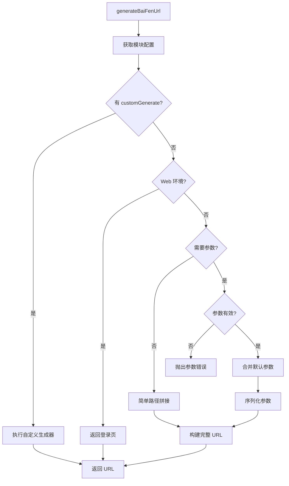

# 百分 URL 生成器设计方案

> 回链：[README.md](./README.md) | 状态：🔄 编写中

## 一、设计目标

从**函数式**转向**配置式**，统一管理所有百分链接。

| 目标       | 说明                               |
| ---------- | ---------------------------------- |
| 配置化管理 | 路径、参数、环境判断集中到配置对象 |
| 统一生成器 | 单一函数处理所有模块的 URL 生成    |
| 类型安全   | 完整的类型定义和类型推导           |
| 灵活扩展   | 支持自定义生成逻辑，处理特殊场景   |
| 向后兼容   | 保留现有 API，不影响现有调用       |

## 二、模块分类

根据 URL 生成特点，将模块分为三类：

| 类别     | 特点                   | 示例                             | 处理方式          |
| -------- | ---------------------- | -------------------------------- | ----------------- |
| 简单模块 | 无参数，固定路径       | HOME, BUSINESS, REPORT_ANALYSIS  | 配置 path         |
| 参数模块 | 需要参数，标准格式     | FINANCING_DETAILS, WEB_MARKET    | 配置 + 通用处理   |
| 特殊模块 | 特殊逻辑或复杂参数映射 | REPORT_ANALYSIS_PROCESS, GOV_MAP | 配置 + 自定义函数 |

## 三、配置结构设计

### 3.1 配置接口

| 字段           | 类型     | 说明             |
| -------------- | -------- | ---------------- |
| path           | string   | 路径或 hash      |
| requireParams  | boolean  | 是否需要参数     |
| useFullPath    | boolean  | 是否使用完整路径 |
| defaultParams  | object   | 默认参数         |
| appendHash     | boolean  | 是否添加 #/      |
| customGenerate | function | 自定义生成器     |
| description    | string   | 配置说明         |

### 3.2 配置示例

| 模块类型 | 配置项                                           | 说明                     |
| -------- | ------------------------------------------------ | ------------------------ |
| 简单模块 | `path: '#/web-home'`                             | 固定路径，无参数         |
| 参数模块 | `path: '#/corpInfo', requireParams: true`        | 需要参数，标准格式       |
| 特殊模块 | `path: '/govmap/index.html', customGenerate: fn` | 自定义生成器，参数名映射 |

@see ../../../src/link/out/baiFen.ts:L120-L145

## 四、统一生成器流程

## 五、类型安全设计

### 5.1 核心类型

| 类型               | 说明                                   |
| ------------------ | -------------------------------------- |
| BaiFenModule       | 模块枚举（HOME, FINANCING_DETAILS 等） |
| BaiFenModuleParams | 参数类型映射（模块 → 参数接口）        |
| BaiFenModuleConfig | 配置接口                               |

### 5.2 类型推导

使用泛型约束实现类型推导：

- 函数签名：`generateBaiFenUrl<M extends BaiFenModule>`
- 参数类型：`params?: BaiFenModuleParams[M]`
- 编译时检查：参数类型不匹配时报错

## 六、技术细节

| 技术点     | 方案                                          |
| ---------- | --------------------------------------------- |
| 参数序列化 | 统一使用 `qs` 库（支持复杂参数）              |
| 占位符替换 | 正则表达式替换 `{marketId}` 等占位符          |
| 错误处理   | 自定义 `LinkGenerationError` 类               |
| 配置缓存   | 使用 `Object.freeze` 冻结配置                 |
| 向后兼容   | 保留 `BaiFenSites` 等现有 API，内部调用新实现 |

## 七、设计权衡

| 方案       | 优势           | 劣势           | 选择 |
| ---------- | -------------- | -------------- | ---- |
| 完全配置化 | 统一、易维护   | 灵活性不足     | ❌   |
| 完全自定义 | 灵活性高       | 不统一、难维护 | ❌   |
| 混合模式   | 兼顾统一和灵活 | 复杂度略高     | ✅   |

**选择混合模式原因：**

- 大部分模块使用配置化（简单、统一）
- 特殊模块使用自定义生成器（灵活）
- 配置中明确标注特殊处理原因

## 八、更新记录

| 日期       | 修改人 | 更新内容     |
| ---------- | ------ | ------------ |
| 2024-11-13 | Kiro   | 创建设计方案 |
