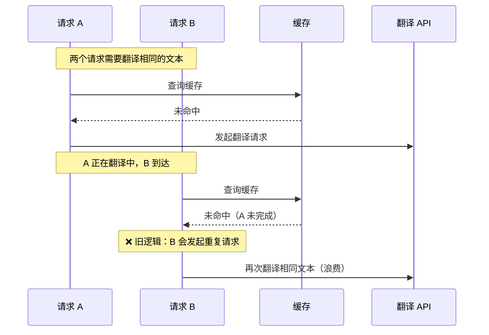
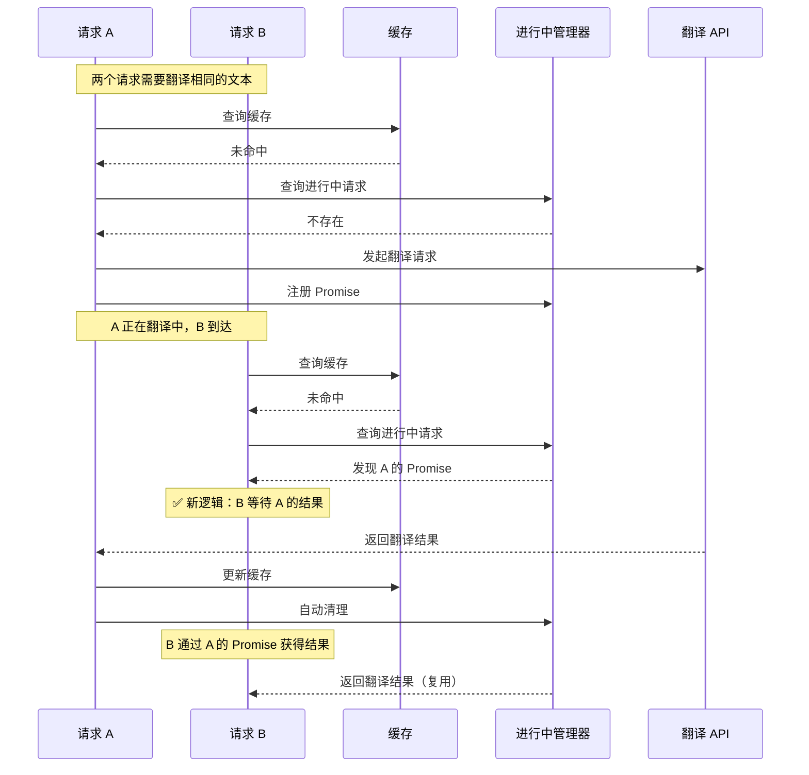
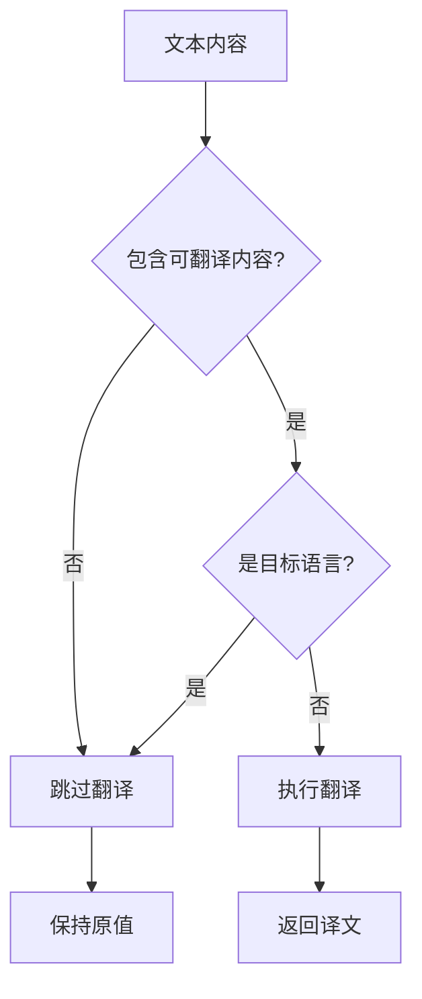

# 翻译模块

## 功能概述

该模块提供了完整的文本翻译功能，支持：
- 递归翻译复杂数据结构（对象、数组、HTML字符串）
- 字段级翻译控制（允许/跳过特定字段）
- **内存缓存机制**，避免重复翻译相同文本
- 分块批量翻译以提高效率
- 智能语言检测，自动过滤纯数字、符号等不应翻译的内容

## 缓存机制

### 设计说明

翻译缓存基于**源语言 + 目标语言 + 原文**三者组合作为缓存键，将翻译结果存储在内存中。相同的文本在相同的翻译方向下不会重复调用翻译接口。

### 缓存特性

- **默认启用**：所有翻译自动使用缓存
- **内存存储**：使用 Map 存储，性能高效
- **容量限制**：默认最多缓存 10,000 条翻译结果
- **FIFO 策略**：缓存满时自动删除最早的条目
- **批量操作**：支持批量查询和批量更新
- **并发去重**：自动识别正在进行中的相同翻译请求，避免重复调用 API

### 基本使用

```typescript
import { translateDataWithApi, translationCache, type TranslateResult } from 'gel-util/misc/translate'

// 1. 正常使用翻译功能（默认启用缓存）
const result: TranslateResult<YourDataType> = await translateDataWithApi(data, apiTranslateService, {
  targetLocale: 'en-US',
})

// 检查翻译是否成功
if (result.success) {
  console.log('翻译成功:', result.data)
  console.log('缓存命中率:', `${result.cacheStats.hits}/${result.cacheStats.total}`)
} else {
  console.error('翻译失败:', result.error?.message)
  console.log('返回原始数据:', result.data)
}

// 2. 使用解构（简化代码）
const { data: translatedData, success, error } = await translateDataWithApi(data, apiTranslateService, {
  targetLocale: 'en-US',
})

if (!success) {
  console.warn('翻译失败，使用原始数据:', error)
}

// 3. 禁用缓存（如果需要）
const result = await translateDataWithApi(data, apiTranslateService, {
  targetLocale: 'en-US',
  enableCache: false, // 禁用缓存
})

// 4. 查看缓存统计
const stats = translationCache.getStats()
console.log('缓存统计:', stats)
// 输出: { size: 150, maxSize: 10000, utilization: "1.50%" }

// 5. 手动清空缓存
translationCache.clear()
```

### 高级用法

#### 创建独立的缓存实例

```typescript
import { createTranslationCache } from 'gel-util/misc/translate'

// 创建自定义容量的缓存
const customCache = createTranslationCache(5000) // 最多缓存 5000 条

// 查询缓存
const cached = customCache.get('zh-CN', 'en-US', '你好')

// 批量查询
const result = customCache.getBatch('zh-CN', 'en-US', ['你好', '世界', '测试'])
console.log('命中:', result.hits) // Map<string, string>
console.log('未命中:', result.misses) // string[]
```

#### 缓存管理

```typescript
import { translationCache } from 'gel-util/misc/translate'

// 获取缓存大小
console.log('缓存条目数:', translationCache.size())

// 获取详细统计
const stats = translationCache.getStats()
console.log('缓存利用率:', stats.utilization)

// 清空缓存
translationCache.clear()
```

### 并发请求去重

#### 问题场景

在高并发场景下，多个翻译请求可能同时触发：



#### 优化方案

新增**进行中请求管理器**（Pending Translation Manager），记录正在进行的翻译请求：



#### 工作流程

1. **步骤 1**：查询缓存，获取已完成的翻译
2. **步骤 2**：对于缓存未命中的文本，查询进行中请求管理器
3. **步骤 3**：
   - 如果发现正在翻译中，等待已有的 Promise
   - 如果不存在，发起新的 API 请求，并注册到管理器
4. **步骤 4**：等待所有 Promise 完成（包括复用的和新发起的）
5. **步骤 5**：更新缓存，返回翻译结果

#### 优化效果

| 场景 | 旧逻辑 | 新逻辑 | 优化效果 |
|-----|-------|-------|---------|
| 请求 A、B 同时翻译相同文本 | 两次 API 调用 | 一次 API 调用 | 减少 50% 调用 |
| 10 个请求并发翻译相同字段 | 10 次 API 调用 | 1 次 API 调用 | 减少 90% 调用 |
| 高频页面快速切换 | 每次都调用 API | 复用进行中的请求 | 显著降低延迟 |

#### 自动化管理

进行中的请求会自动管理生命周期：

- **自动注册**：发起翻译请求时自动注册到管理器
- **自动清理**：Promise 完成后自动从管理器中移除
- **内存安全**：不会产生内存泄漏
- **线程安全**：基于 Promise 机制，天然支持并发

#### 使用方式

该功能**自动启用**，无需任何配置。翻译模块会自动识别并发重复请求，开发者无需关心实现细节。

## 语言检测与过滤

### 智能内容识别

翻译模块会自动识别文本内容，只翻译包含实际语言文字的内容，自动跳过纯数字、纯符号等不应翻译的内容。

### 自动过滤的内容类型

以下类型的内容会被自动识别并跳过翻译：

| 内容类型 | 示例 | 是否翻译 | 说明 |
|---------|------|---------|------|
| 纯数字 | `"123"`, `"456.78"` | ❌ 否 | 不包含任何语言文字 |
| 纯符号 | `"$%^&"`, `"..."`, `"---"` | ❌ 否 | 仅包含特殊字符 |
| 数字+符号 | `"$100"`, `"50%"`, `"(123)"` | ❌ 否 | 数字与符号的组合 |
| 空白字符 | `""`, `"   "`, `"\t"` | ❌ 否 | 空或仅包含空白 |
| 中文文本 | `"你好"`, `"测试123"` | ✅ 是 | 包含中文字符 |
| 英文文本 | `"Hello"`, `"Test123"` | ✅ 是 | 包含英文字母 |
| 混合文本 | `"Hello世界"`, `"用户123"` | ✅ 是 | 包含语言文字 |

### 检测函数

模块导出了以下检测函数供外部使用：

```typescript
import { hasTranslatableContent, detectChinese, detectEnglish } from 'gel-util/misc/translate'

// 检测是否包含可翻译内容（推荐使用）
hasTranslatableContent("Hello")  // true
hasTranslatableContent("你好")   // true
hasTranslatableContent("123")    // false
hasTranslatableContent("$%^&")   // false

// 检测是否包含中文
detectChinese("你好")            // true
detectChinese("Hello")           // false

// 检测是否为英文（不含中文且包含英文字母）
detectEnglish("Hello")           // true
detectEnglish("Hello你好")       // false
detectEnglish("123")             // false
```

### 自定义检测逻辑

如果需要自定义哪些文本需要翻译，可以通过 `textFilter` 选项提供自定义过滤函数：

```typescript
import { translateDataWithApi, type TextDetector } from 'gel-util/misc/translate'

// 自定义过滤器：只翻译包含中文的文本
const onlyChineseFilter: TextDetector = (text: string) => {
  return /[\u4e00-\u9fff]/.test(text)
}

const result = await translateDataWithApi(data, apiService, {
  targetLocale: 'en-US',
  textFilter: onlyChineseFilter, // 使用自定义过滤器
})
```

### 检测流程



### 优化效果

- **减少API调用**：自动过滤不需要翻译的内容，减少翻译API的调用次数
- **提高准确性**：避免将数字、符号等内容发送给翻译API，防止被错误转换
- **提升性能**：减少不必要的文本处理和网络请求

## 错误处理

### 错误处理策略

翻译模块采用**不抛出异常**的错误处理方式：失败时返回原始数据，通过 `success` 字段标识状态。

### 为什么需要明确的错误处理？

以前的设计问题：
```typescript
// ❌ 旧设计：无法区分是翻译失败还是本来就是这样
const data = await oldTranslate(input) // 返回原始数据，但不知道是否翻译成功
```

新设计的优势：
```typescript
// ✅ 新设计：明确知道翻译状态
const { data, success, error } = await translateDataWithApi(input, api, options)
if (!success) {
  // 可以根据错误类型做不同处理
  if (error?.message.includes('网络')) {
    showToast('网络错误，请稍后重试')
  } else {
    reportError(error) // 上报错误
  }
}
```

### 错误处理特点

1. **不抛异常**：所有错误都通过返回值传递，不会中断程序执行
2. **保留原始数据**：失败时 `data` 字段包含原始输入数据，确保功能降级
3. **明确的状态**：通过 `success` 字段快速判断翻译是否成功
4. **详细的错误信息**：通过 `error` 字段获取具体的错误原因

## 使用示例

### 翻译对象数据

```typescript
import { translateDataWithApi } from 'gel-util/misc/translate'

const companyData = {
  name: '阿里巴巴',
  description: '中国领先的电子商务公司',
  products: ['淘宝', '天猫', '支付宝'],
}

const result = await translateDataWithApi(companyData, apiService, {
  targetLocale: 'en-US',
})

if (result.success) {
  console.log('翻译完成:', result.data)
} else {
  console.error('翻译失败:', result.error)
}
```

### 跳过特定字段

```typescript
const result = await translateDataWithApi(data, apiService, {
  targetLocale: 'en-US',
  skipFields: ['id', 'code', 'companyName'], // 不翻译这些字段
})
```

### 只翻译指定字段

```typescript
const result = await translateDataWithApi(data, apiService, {
  targetLocale: 'en-US',
  allowFields: ['description', 'summary'], // 只翻译这些字段
})
```

### 实际业务场景示例

```typescript
// 场景1：用户界面，翻译失败时使用原始数据
const displayCompanyInfo = async (companyId: string) => {
  const data = await fetchCompanyData(companyId)
  
  const result = await translateDataWithApi(data, apiService, {
    targetLocale: getCurrentLocale(),
  })
  
  if (!result.success) {
    // 记录错误但不影响用户体验
    console.warn('翻译失败，显示原始数据:', result.error)
  }
  
  // 无论翻译是否成功，都显示数据
  renderCompanyInfo(result.data)
}

// 场景2：批量导出，收集失败信息并继续处理
const exportCompanyList = async (companyIds: string[]) => {
  const results = []
  const failures = []
  
  for (const id of companyIds) {
    const data = await fetchCompanyData(id)
    
    const result = await translateDataWithApi(data, apiService, {
      targetLocale: 'en-US',
    })
    
    if (result.success) {
      results.push(result.data)
    } else {
      // 记录失败的公司ID，但继续处理
      console.error(`公司 ${id} 翻译失败:`, result.error)
      failures.push({ id, error: result.error?.message })
      // 使用原始数据继续
      results.push(result.data)
    }
  }
  
  if (failures.length > 0) {
    showToast(`${failures.length} 条数据翻译失败，已使用原始数据`)
  }
  
  downloadExcel(results)
}

// 场景3：API接口，需要明确告知调用方翻译状态
const apiHandler = async (req, res) => {
  const data = await getBusinessData(req.params.id)
  
  const result = await translateDataWithApi(data, translateService, {
    targetLocale: req.query.locale || 'en-US',
  })
  
  res.json({
    data: result.data,
    meta: {
      translationSuccess: result.success,
      translationError: result.error?.message,
      cacheHitRate: `${result.cacheStats.hits}/${result.cacheStats.total}`,
    },
  })
}
```

## 性能优化

### 缓存命中率

控制台会输出缓存命中信息：
```
翻译缓存命中 45/50 条
```

这表示 50 条文本中有 45 条从缓存获取，只有 5 条需要调用 API。

### 最佳实践

1. **保持缓存启用**：默认情况下保持 `enableCache: true`
2. **合理的数据结构**：将重复的文本提取为可复用的常量
3. **分批翻译**：使用 `chunkSize` 参数控制并发请求数量
4. **监控缓存**：定期查看缓存统计，评估缓存效果

```typescript
// 在应用初始化时设置监控
setInterval(() => {
  const stats = translationCache.getStats()
  if (parseFloat(stats.utilization) > 90) {
    console.warn('翻译缓存接近满载:', stats)
  }
}, 60000) // 每分钟检查一次
```

## API 文档

### 类型定义

#### `TranslateResult<T>`

翻译结果类型，包含数据、状态和错误信息。

```typescript
interface TranslateResult<T> {
  /** 翻译后的数据（失败时为原始数据） */
  data: T
  /** 是否翻译成功 */
  success: boolean
  /** 错误信息（成功时为 undefined） */
  error?: Error
  /** 缓存命中统计 */
  cacheStats?: {
    hits: number
    total: number
  }
}
```

### `translationCache`

全局翻译缓存实例。

**方法：**

- `get(sourceLocale, targetLocale, originalText)` - 获取缓存的翻译
- `set(sourceLocale, targetLocale, originalText, translatedText)` - 设置缓存
- `getBatch(sourceLocale, targetLocale, originalTexts)` - 批量获取
- `setBatch(sourceLocale, targetLocale, translations)` - 批量设置
- `clear()` - 清空缓存
- `size()` - 获取缓存大小
- `getStats()` - 获取统计信息

### `createTranslationCache(maxSize?: number)`

创建新的翻译缓存实例。

**参数：**
- `maxSize` - 可选，缓存最大条目数，默认 10000

**返回：** `TranslationCache` 实例

### `translateDataWithApi<T>(data, apiService, options)`

使用 API 翻译数据。

**参数：**
- `data` - 需要翻译的数据
- `apiService` - 翻译服务接口
- `options` - 翻译配置
  - `sourceLocale?` - 源语言，默认 'zh-CN'
  - `targetLocale` - 目标语言（必填）
  - `enableCache?` - 是否启用缓存，默认 true
  - `chunkSize?` - 分块大小，默认 50
  - `skipFields?` - 跳过的字段列表
  - `allowFields?` - 允许的字段列表

**返回：** `Promise<TranslateResult<T>>` - 翻译结果对象，失败时不抛异常，返回原始数据

**示例：**

```typescript
// 标准用法：检查成功状态
const result = await translateDataWithApi(data, api, { targetLocale: 'en-US' })
if (result.success) {
  console.log('翻译成功:', result.data)
} else {
  console.error('翻译失败，使用原始数据:', result.error)
  // result.data 包含原始数据，可以继续使用
}
```

## 注意事项

### 缓存相关

1. **内存限制**：缓存存储在内存中，重启应用后会清空
2. **容量管理**：默认缓存 10,000 条，可根据实际情况调整
3. **缓存键**：基于源语言、目标语言和原文的完全匹配，任何差异都会视为不同的条目
4. **多语言**：不同语言方向的翻译会分别缓存（如 zh-CN→en-US 和 en-US→zh-CN 是独立的）

### 错误处理相关

1. **破坏性变更**：从返回 `T` 改为返回 `TranslateResult<T>`，需要更新调用代码
2. **向后兼容**：可以通过 `result.data` 快速获取数据，简化迁移
3. **不抛异常**：所有错误都通过返回值传递，保证程序不会中断
4. **日志记录**：错误信息会自动记录在控制台，便于调试

### 升级指南

如果你的代码之前使用旧的翻译 API：

```typescript
// 旧代码
const translated = await translateDataWithApi(data, api, options)

// 新代码（快速迁移）
const { data: translated } = await translateDataWithApi(data, api, options)

// 新代码（推荐，增加错误处理）
const result = await translateDataWithApi(data, api, options)
if (!result.success) {
  console.warn('翻译失败，使用原始数据:', result.error)
}
const translated = result.data
```

