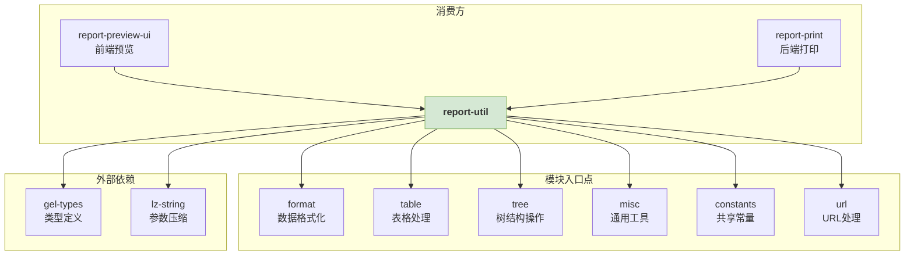
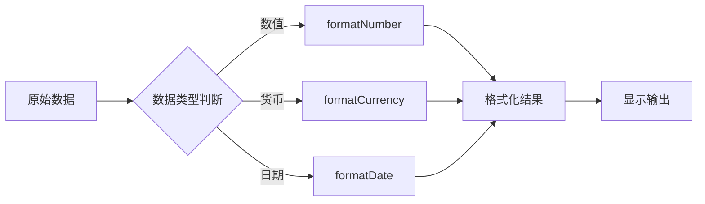
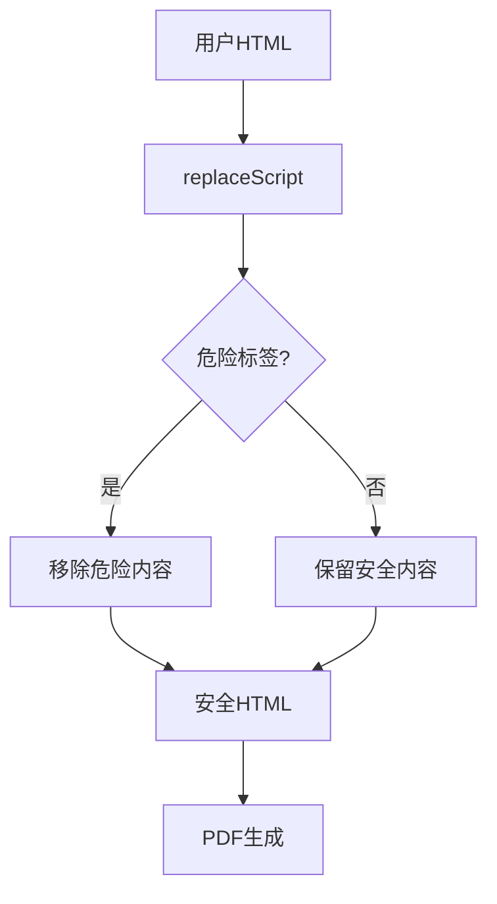
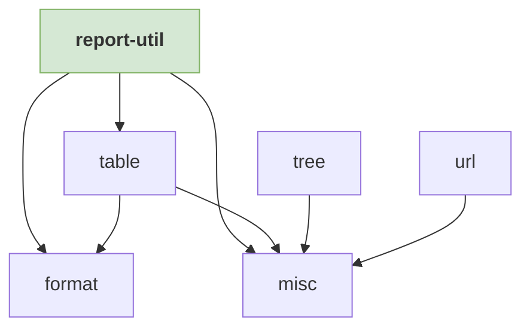

# report-util 设计文档

## 🎯 概览

**功能范围**: 为报告系统提供底层工具函数，支撑数据格式化、表格处理、树状操作等核心能力。

**目标用户**: 前端报告预览组件 (`report-preview-ui`)、后端PDF打印服务 (`report-print`) 的开发者。

**关键用例**:
- 确保预览与打印的数据格式化一致性
- 提供安全的HTML处理，防止XSS攻击
- 支持报告配置在页面间的URL传递

## 🏗️ 信息架构

**路由/入口说明**: 通过 package.json 的 `exports` 字段定义多个模块入口点，支持按需导入。

## 🎨 模块蓝图

| 模块 | 核心职责 | 输入 | 输出 | 状态处理 |
| :--- | :--- | :--- | :--- | :--- |
| **format** | 数据格式化 | 数值、配置 | 格式化字符串 | 容错返回`'--'` |
| **table** | 表格配置处理 | 原始配置 | 标准化配置 | 加载/空/错误 |
| **tree** | 树状态管理 | 节点、状态 | 隐藏节点数组 | 状态传播 |
| **misc** | 通用工具 | 各种数据 | 处理结果 | 安全过滤 |

## 🔄 任务流程

### 数据格式化流程

### 安全处理流程

## 📊 数据流

| 模块 | 输入 | 输出 | 错误处理 |
| :--- | :--- | :--- | :--- |
| **format** | 数值、配置 | 格式化字符串 | 返回`'--'` |
| **tree** | 节点、状态 | 隐藏节点数组 | 类型校验 |
| **misc** | 各种数据 | 处理结果 | 安全过滤 |

## 🧩 组件复用

### 模块依赖关系

## 📖 代码关联

- [格式化核心](../src/format/formatNumber.ts) - 数值格式化算法
- [安全处理核心](../src/misc/replaceScript.ts) - XSS防护实现
- [技术约束说明](./technical-constraints.md) - wkhtmltopdf兼容要求
- [测试覆盖](../src/__test__/) - 各模块单元测试

---

*设计文档与代码同步，重大变更需同步更新。*