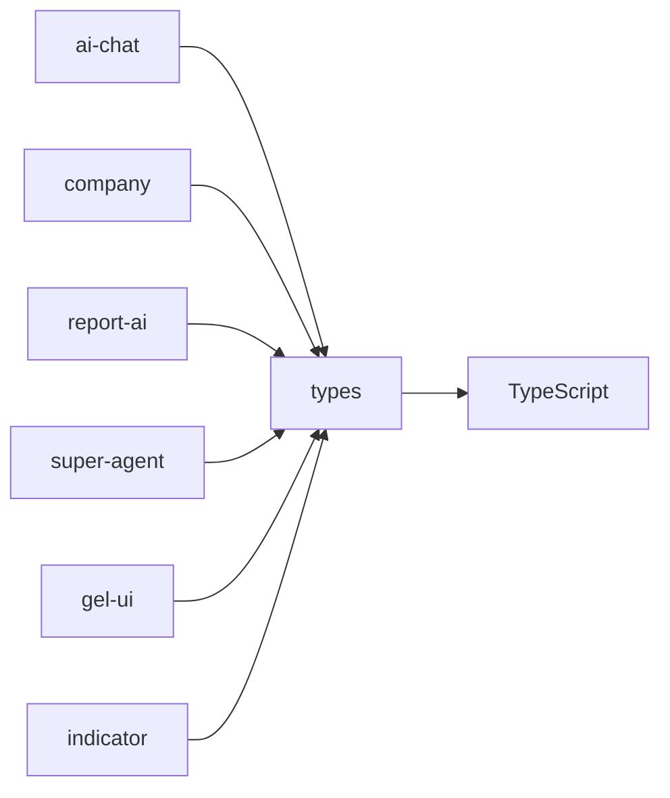

# types - 全局类型定义包

为整个 monorepo 提供共享的类型定义，确保类型一致性和开发体验。

## 目录结构

```
packages/types/
├── src/
│   ├── api/              # API 相关类型
│   ├── common/           # 通用基础类型
│   ├── components/       # UI 组件相关类型
│   ├── models/           # 数据模型类型
│   ├── utils/            # 工具函数相关类型
│   └── index.ts          # 主入口文件
├── scripts/              # 类型生成脚本
├── package.json          # 项目配置
└── tsconfig.json         # TypeScript 配置
```

## 关键文件说明

| 文件 | 作用 |
|------|------|
| `src/index.ts` | 类型定义统一导出入口 |
| `src/api/index.ts` | API 请求/响应类型定义 |
| `src/models/index.ts` | 业务数据模型类型定义 |
| `src/common/index.ts` | 通用基础类型定义 |

## 依赖关系



## 使用方法

### 导入类型

```typescript
// 导入全局类型
import { ApiResponse, PaginationParams } from 'types';

// 导入特定模块类型
import { UserInfo, CompanyInfo } from 'types/models';
import { HttpMethod, RequestOptions } from 'types/api';
import { TableColumn, Size } from 'types/components';
import { Dictionary, Status } from 'types/common';
```

## 相关文档

- [TypeScript 使用规范](../../docs/rule/typescript-rule.md)
- [架构设计](./architecture.md)