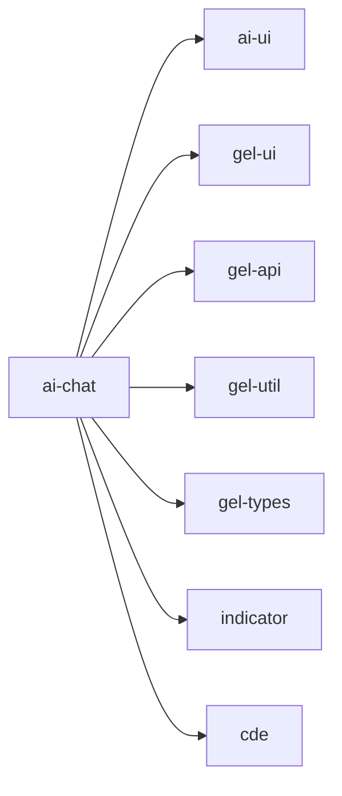

# ai-chat - AI对话应用

AI对话应用，提供智能问答和交互功能，支持多轮对话、历史记录、文件处理和数据分析等核心功能。

## 目录结构

```
apps/ai-chat/
├── src/                      # 应用主要源代码
│   ├── api/                  # API接口层
│   ├── assets/               # 静态资源
│   ├── components/           # 应用特有的React组件
│   │   ├── CDE/              # CDE相关组件
│   │   ├── ChatBase/         # 聊天基础组件
│   │   ├── ChatMessage/      # 聊天消息组件
│   │   ├── ChatRoles/        # 聊天角色组件
│   │   ├── Conversation/     # 对话组件
│   │   ├── ETable/           # 表格组件
│   │   ├── Favorites/        # 收藏组件
│   │   ├── History/          # 历史记录组件
│   │   ├── Indicator/        # 指标组件
│   │   ├── Modal/            # 模态框组件
│   │   ├── Subscribe/        # 订阅组件
│   │   ├── SuperList/        # 超级列表组件
│   │   ├── VisTable/         # 可视化表格组件
│   │   ├── common/           # 通用组件
│   │   ├── layout/           # 布局组件
│   │   ├── markdown/         # Markdown组件
│   │   └── misc/             # 杂项组件
│   ├── config/               # 配置文件
│   ├── contexts/             # React上下文
│   ├── hooks/                # 自定义React Hooks
│   ├── locales/              # 国际化文件
│   ├── pages/                # 页面组件
│   │   ├── Chat/             # 聊天页面
│   │   ├── Credits/          # 积分页面
│   │   ├── EmbedChat/        # 嵌入聊天页面
│   │   ├── MyFile/           # 我的文件页面
│   │   ├── SuperChat/        # 超级聊天页面
│   │   ├── SuperChatHistory/ # 超级聊天历史页面
│   │   ├── SuperHome/        # 超级主页
│   │   └── VisTable/         # 可视化表格页面
│   ├── router/               # 路由配置
│   ├── services/             # 服务层
│   ├── store/                # Redux状态管理
│   ├── styles/               # 样式文件
│   ├── types/                # 类型定义
│   ├── utils/                # 工具函数
│   ├── App.css               # 应用样式
│   ├── App.tsx               # 应用根组件
│   ├── index.less            # 入口样式
│   └── main.tsx              # 应用入口文件
├── public/                   # 公共静态资源
├── docs/                     # 文档目录
├── .storybook/               # Storybook组件文档配置
├── stories/                  # Storybook故事文件
├── __mocks__/                # 模拟文件
├── __tests__/                # 测试文件
├── .env.development          # 开发环境变量
├── .env.production           # 生产环境变量
├── .env.test                 # 测试环境变量
├── index.html                # 应用HTML入口文件
├── package.json              # 项目依赖和脚本配置
├── tsconfig.app.json         # 应用TypeScript配置
├── tsconfig.json             # TypeScript配置
├── tsconfig.node.json        # Node TypeScript配置
├── vite.config.ts            # Vite构建配置文件
└── vitest.workspace.ts       # Vitest工作区配置
```

## 关键文件说明

| 文件 | 作用 |
|------|------|
| `src/api/axios.ts` | Axios配置，设置请求拦截器和响应拦截器 |
| `src/components/ChatBase/` | 聊天基础组件，提供聊天界面核心功能 |
| `src/components/ChatMessage/` | 聊天消息组件，处理消息展示和交互 |
| `src/contexts/ChatRoom/` | 聊天室上下文，管理聊天状态 |
| `src/hooks/useChat.ts` | 聊天Hook，处理聊天逻辑 |
| `src/store/` | Redux状态管理，管理应用全局状态 |
| `src/router/routes.tsx` | 路由定义，配置页面路由 |

## 依赖关系



## 相关文档

- [架构设计](./architecture.md) - 系统架构和设计决策
- [组件文档](./docs/components/) - 组件详细文档和使用说明
- [Hooks文档](./docs/hooks/) - 自定义Hooks文档
- [状态管理文档](./docs/store/) - Redux状态管理文档
- [页面文档](./docs/pages/) - 页面功能文档
- [开发规范](../../docs/rule/) - TypeScript、React、样式等开发规范
