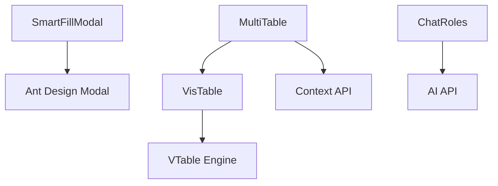

# AI Chat 组件库

## 定位
提供 AI 聊天应用所需的核心 React 组件，支持复杂表格操作、模态交互和 AI 功能集成。

## 目录结构
```
components/
├── ChatRoles/          # 聊天角色相关组件
│   └── suggestion/     # 角色建议组件
├── CDE/               # 代码编辑器组件
├── MultiTable/        # 多功能表格组件（基于 VTable）
│   ├── components/    # 表格子组件
│   ├── context/       # 表格上下文管理
│   ├── hooks/         # 表格操作 hooks
│   └── utils/         # 表格工具函数
├── VisTable/          # 可视化表格组件
├── file-table/        # 文件表格组件
├── modal/             # 模态框组件
└── vis-table/         # 表格操作日志
```

## 核心组件
- **MultiTable**: 高性能表格组件，支持虚拟滚动和复杂操作
- **VisTable**: 可视化表格，提供统一操作处理系统
- **SmartFillModal**: AI 数据生成弹窗组件

## 依赖关系


## 相关文档
- [MultiTable design](./MultiTable/design.md)
- [VisTable design](./VisTable/design.md)
- [Modal design](./modal/design.md)