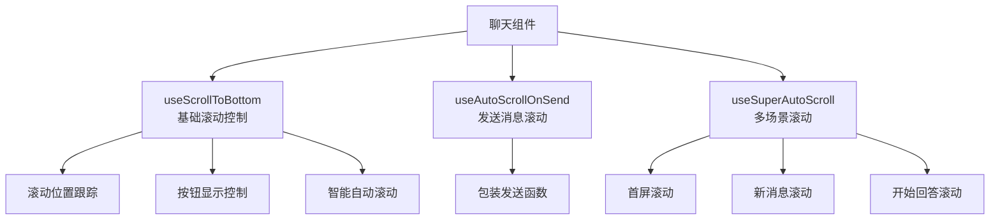

# 聊天组件自动滚动机制

## 概述

聊天组件的自动滚动功能，确保用户始终能看到最新消息。采用三层架构设计，支持多种滚动场景。

**适用组件**:

- `ChatMessageBase` - 基础聊天（AI 详情页）
- `ChatMessageSuper` - 超级名单聊天（一句话找企业）

## 架构设计



## 核心 Hook

### useScrollToBottom（基础层）

**位置**: `packages/gel-ui/src/hooks/useScrollToBottom.ts`

**功能**: 提供基础滚动控制能力

| 功能         | 说明                                                 |
| ------------ | ---------------------------------------------------- |
| 滚动位置跟踪 | 监听容器滚动，判断用户是否在底部（误差 80px）        |
| 按钮显示控制 | 距离底部 >40px 时显示"滚动到底部"按钮                |
| 智能自动滚动 | 新消息到达且用户在底部时自动滚动；流式响应中保持滚动 |

**返回值**:

```typescript
{
  chatContainerRef: RefObject<HTMLDivElement>  // 容器引用
  showScrollBottom: boolean                    // 是否显示按钮
  scrollToBottom: () => void                   // 滚动方法
}
```

### useAutoScrollOnSend（通用层）

**位置**: `packages/gel-ui/src/hooks/useAutoScrollOnSend.ts`

**功能**: 包装发送消息函数，返回自动滚动版本

**类型定义**:

```typescript
function useAutoScrollOnSend<TSendFn>({
  scrollToBottom: () => void,
  sendMessage: TSendFn
}): TSendFn
```

**特点**:

- ✅ 保留原函数类型签名
- ✅ 支持任意参数和返回值
- ✅ 延迟 50ms 滚动，确保 DOM 更新完成

**使用示例**:

```typescript
const sendMessageAndScroll = useAutoScrollOnSend({
  scrollToBottom,
  sendMessage,
})

// 使用包装后的函数
sendMessageAndScroll(message, agentId, deepthink)
```

### useSuperAutoScroll（业务层）

**位置**: `apps/ai-chat/src/components/SuperList/ChatMessage/hooks/useSuperAutoScroll.ts`

**功能**: 处理超级名单的多场景自动滚动

| 场景         | 触发条件                       | 说明                      |
| ------------ | ------------------------------ | ------------------------- |
| 首屏滚动     | `bubbleLoading=false` 且有消息 | 仅执行一次，通过 ref 标记 |
| 新消息滚动   | 消息列表长度增加               | 对比前后长度判断          |
| 开始回答滚动 | `isChating: false → true`      | 对比前后状态判断          |

## 组件实现

### ChatMessageBase

```typescript
// 基础滚动控制
const { chatContainerRef, showScrollBottom, scrollToBottom } = useScrollToBottom({
  parsedMessages,
  isChating,
})

// 创建包装后的发送消息函数
const wrappedSendMessage = useCallback(
  (message: string, agentId?: any, think?: any, options?: any) => {
    return sendMessage(message, agentId, think, { entityType, entityName, ...options })
  },
  [sendMessage, entityType, entityName]
)

// 使用发送消息后自动滚动 hook
const handleSendMessage = useAutoScrollOnSend({
  scrollToBottom,
  sendMessage: wrappedSendMessage,
})
```

**自动滚动时机**:

- ✅ 用户发送消息
- ✅ 新消息到达（由 `useScrollToBottom` 处理）
- ✅ 流式响应中（由 `useScrollToBottom` 处理）

### ChatMessageSuper

```typescript
// 基础滚动控制
const { chatContainerRef, showScrollBottom, scrollToBottom } = useScrollToBottom({
  parsedMessages,
  isChating,
})

// 使用超级名单自动滚动 hook（处理首屏、新消息、开始回答）
useSuperAutoScroll({
  scrollToBottom,
  parsedMessages,
  isChating,
  bubbleLoading,
})

// 使用发送消息后自动滚动 hook（处理用户发送消息）
const sendMessageAndScroll = useAutoScrollOnSend({
  scrollToBottom,
  sendMessage,
})

// 使用包装后的函数
sendMessageAndScroll(message, undefined, deepthink, undefined, deepSearch ? 1 : undefined)
```

**自动滚动时机**:

- ✅ 首屏加载完成
- ✅ 新消息到达
- ✅ AI 开始回答
- ✅ 用户发送消息

## 技术细节

### requestAnimationFrame

所有滚动操作使用 `requestAnimationFrame` 包裹：

```typescript
requestAnimationFrame(() => {
  scrollToBottom()
})
```

**原因**: 确保 DOM 更新完成，与浏览器渲染周期同步，避免布局抖动

### setTimeout 延迟

发送消息后使用 `setTimeout(scrollToBottom, 50)`：

**原因**: 等待异步消息添加到列表并完成 React 渲染

### 状态跟踪模式

使用 `useRef` 存储前值，对比判断状态变化：

```typescript
const prevIsChatingRef = useRef(isChating)

useEffect(() => {
  if (!prevIsChatingRef.current && isChating) {
    // 检测到 false → true 变化
    scrollToBottom()
  }
  prevIsChatingRef.current = isChating
}, [isChating])
```

## 使用指南

| 场景                 | 推荐方案                                     |
| -------------------- | -------------------------------------------- |
| 需要多种自动滚动场景 | `useSuperAutoScroll` + `useAutoScrollOnSend` |
| 只需发送消息时滚动   | `useAutoScrollOnSend`                        |
| 自定义滚动逻辑       | 直接使用 `useScrollToBottom`                 |

## 常见问题

### 滚动不生效

**原因**: DOM 未渲染完成

**解决**: 增加延迟或双重 `requestAnimationFrame`

```typescript
requestAnimationFrame(() => {
  requestAnimationFrame(() => scrollToBottom())
})
```

### 首屏滚动执行多次

**原因**: 缺少执行标记

**解决**: 使用 ref 标记

```typescript
const didScrollRef = useRef(false)
if (didScrollRef.current) return
didScrollRef.current = true
```

## 相关文件

**组件**:

- `apps/ai-chat/src/components/ChatBase/index.tsx`
- `apps/ai-chat/src/components/SuperList/ChatMessage/index.tsx`

**Hooks**:

- `packages/gel-ui/src/hooks/useScrollToBottom.ts` - 基础滚动控制
- `packages/gel-ui/src/hooks/useAutoScrollOnSend.ts` - 发送消息后自动滚动（通用）
- `apps/ai-chat/src/components/SuperList/ChatMessage/hooks/useSuperAutoScroll.ts` - 超级名单多场景自动滚动
