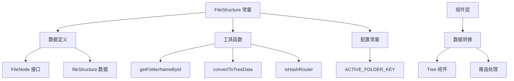
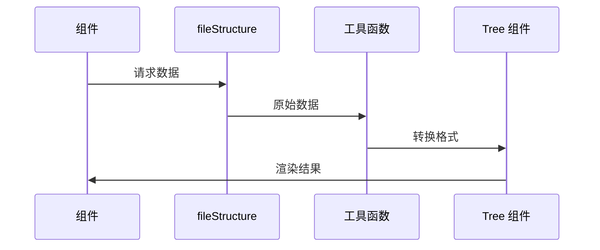

# 文件结构常量设计文档

## 概述
集中管理文件系统相关的数据结构和工具函数，为文件管理模块提供统一的数据源和工具方法。

## 核心功能



## 主要组成

### 1. 数据结构
- **FileNode**: 文件节点接口定义
- **fileStructure**: 基础文件系统数据

### 2. 工具函数
- `getFolderNameById()` - 根据 ID 获取名称
- `convertToTreeData()` - 转换为树形数据
- `isHashRouter()` - 路由模式检测

### 3. 配置常量
- `ACTIVE_FOLDER_KEY` - 本地存储键名

## 接口定义

### FileNode
```typescript
interface FileNode {
  id: string        // 唯一标识
  name: string      // 显示名称
  isFolder: boolean // 是否为文件夹
  children?: FileNode[] // 子节点
}
```

## 数据流向



## 使用场景
- **文件树渲染**: 转换为 Ant Design Tree 数据格式
- **路径解析**: 根据 ID 获取文件信息
- **路由适配**: 支持不同路由模式
- **状态持久化**: 本地存储活跃文件夹

## 关联文件
- @see apps/ai-chat/src/constants/fileStructure.ts
- @see [constants README](../README.md)
