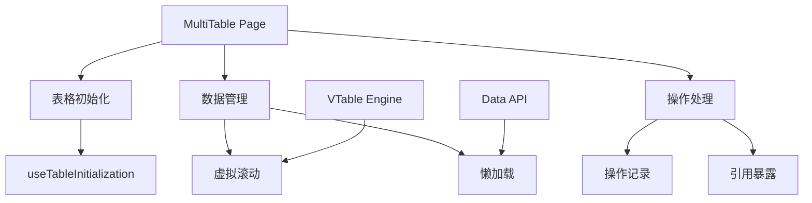
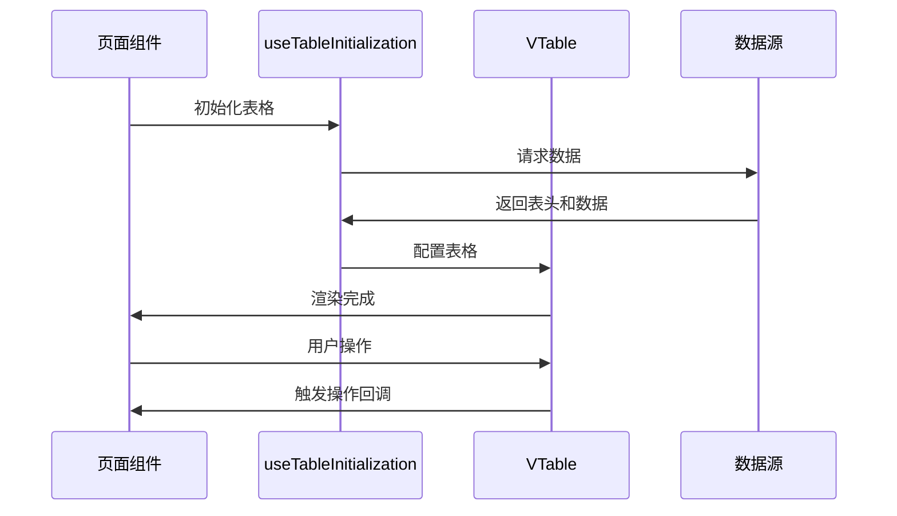

# Demo MultiTable 页面组件设计文档

## 概述
基于 VTable 的高性能表格页面组件，支持虚拟滚动和大数据量渲染，适用于需要处理大量数据的表格场景。

## 页面架构



## 核心功能
- ✅ **高性能渲染**: 基于 VTable 虚拟滚动技术
- ✅ **数据懒加载**: 批次加载优化大数据量性能
- ✅ **操作记录**: 支持撤销/重做功能
- ✅ **实例控制**: 暴露表格实例供父组件调用
- ✅ **Hook 分离**: 使用自定义 hooks 分离关注点

## Hook 架构

### useTableInitialization
- 负责表格初始化和数据加载
- 获取表头信息和行数据
- 配置表格基础属性

### useTableOperationHandlers
- 处理表格操作相关逻辑
- 管理操作记录
- 提供操作回调接口

## 接口定义

### 组件 Props
| 参数 | 类型 | 描述 |
|------|------|------|
| `id` | string | 表格唯一标识符 |
| `handleRecordOperation` | `(operation) => void` | 操作记录回调 |
| `ref` | `React.Ref<TableContentRef>` | 表格实例引用 |

### Ref 暴露内容
```typescript
interface TableContentRef {
  tableInstance: VTable.ListTable // VTable 实例
}
```

## 数据流程



## 使用示例
```typescript
const TablePage = () => {
  const tableRef = useRef<TableContentRef>(null)

  const { handleRecordOperation } = useTableOperationHandlers({
    tableInstance: { current: tableRef.current?.tableInstance || null }
  })

  return (
    <div>
      <h1>数据表格页面</h1>
      <MultiTable
        ref={tableRef}
        id="table-001"
        handleRecordOperation={handleRecordOperation}
      />
    </div>
  )
}
```

## 性能优化
- **虚拟滚动**: 只渲染可视区域内的行
- **数据分批**: 按需加载大数据集
- **Hook 分离**: 避免组件重新渲染
- **实例缓存**: 复用表格实例

## 关联文件
- @see apps/ai-chat/src/pages/Demo/component/MultiTable/index.tsx
- @see [pages README](../../README.md)
- @see [MultiTable component design](../../../components/MultiTable/design.md)
