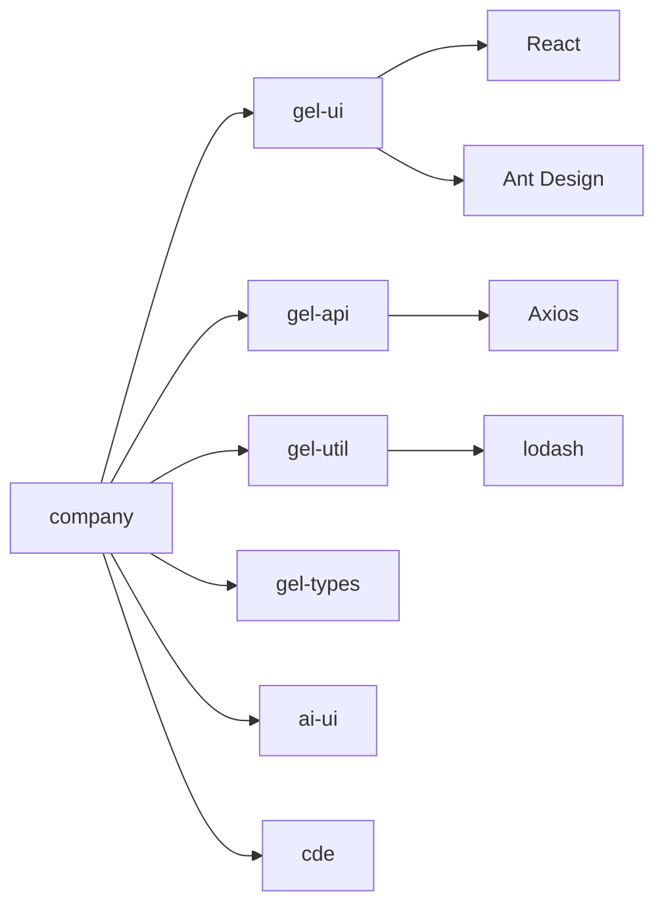

# company - 企业管理系统

企业信息查询和数据可视化应用，提供企业信息展示、智能问答和数据分析功能。

## 目录树

```
apps/company/
├── src/                      # 应用主要源代码
│   ├── api/                  # API接口层
│   │   ├── corp/            # 企业相关API
│   │   ├── chartApi.ts      # 图表API
│   │   └── homeApi.ts       # 首页API
│   ├── components/          # 应用特有的React组件
│   │   ├── corp/            # 企业相关组件
│   │   ├── chart/           # 图表相关组件
│   │   └── layout/          # 布局组件
│   ├── views/               # 页面级组件
│   │   ├── CompanyDetail/   # 企业详情页
│   │   ├── home/            # 首页相关页面
│   │   └── searchList/      # 搜索列表页面
│   ├── store/               # 状态管理
│   │   ├── reducers/        # Redux reducers
│   │   └── actions/         # Redux actions
│   ├── utils/               # 工具函数
│   ├── hooks/               # 自定义Hooks
│   ├── assets/              # 静态资源
│   └── types/               # 类型定义
├── config/                  # Webpack及其他构建工具的配置文件
├── scripts/                 # 自定义构建和开发脚本
├── docs/                    # 项目文档
│   ├── CorpDetail/          # 企业详情页文档
│   ├── corp/                # 企业相关文档
│   ├── issues/              # 问题记录文档
│   └── specs/               # 功能规格文档
└── public/                  # 公共静态资源
```

## 关键文件说明

| 文件 | 作用 |
|------|------|
| `src/api/corp/index.ts` | 企业相关API接口封装 |
| `src/views/CompanyDetail/index.tsx` | 企业详情页面组件 |
| `src/components/corp/CorpInfoCard.tsx` | 企业信息卡片组件 |
| `src/store/reducers/company.tsx` | 企业数据状态管理 |
| `src/utils/corpHelper.ts` | 企业数据处理工具函数 |

## 依赖示意



## 相关文档

- [架构设计](./architecture.md) - 系统架构和设计决策
- [企业详情页文档](./docs/CorpDetail/README.md) - 企业详情页设计文档
- [开发规范](../../docs/rule/) - TypeScript、React、样式等开发规范