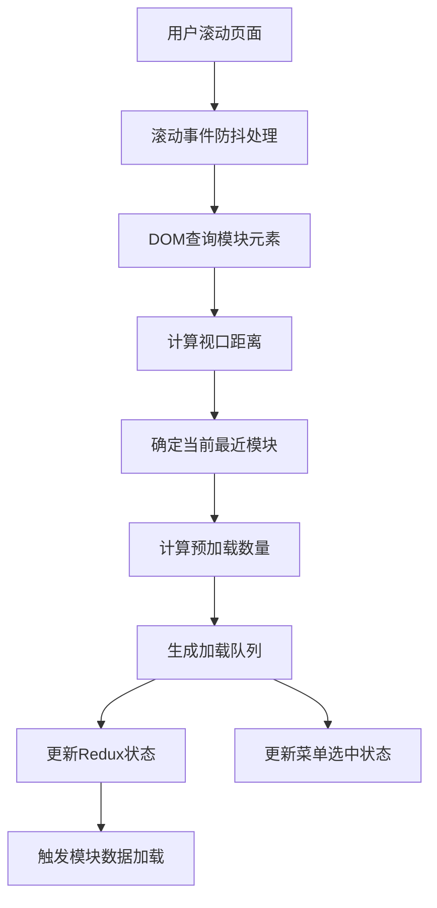
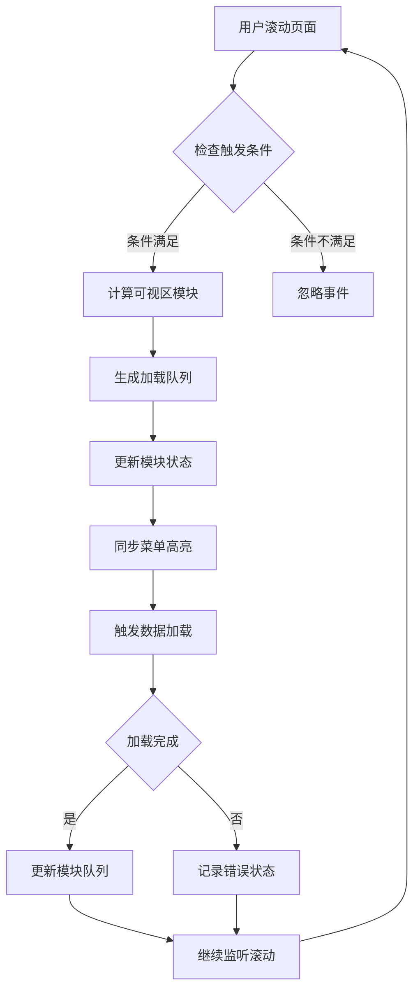

# 企业详情页懒加载设计

## 概述

企业详情页采用基于滚动事件的懒加载方案，动态加载可视区模块，优化页面性能和用户体验。支持标准版和AI版本。

**功能边界**：滚动监听、模块懒加载、菜单同步、性能优化
**目标人群**：前端开发人员、性能优化工程师
**关键场景**：页面滚动、模块加载、菜单高亮同步、预加载策略

## 信息架构

## 页面蓝图

| 组件           | 职责               | 关键特性                   |
| -------------- | ------------------ | -------------------------- |
| **滚动处理器** | 滚动事件监听和防抖 | 300ms防抖、多浏览器兼容    |
| **模块识别器** | DOM查询和模块分类  | 支持普通/子模块/多标签模块 |
| **预加载策略** | 动态计算预加载数量 | 基于屏幕大小和滚动位置     |
| **状态管理**   | Redux状态更新      | 模块加载队列、菜单同步     |

## 任务流程

## 数据与状态

### 核心数据字段

| 字段              | 来源      | 用途           | 刷新策略    |
| ----------------- | --------- | -------------- | ----------- |
| `scrollModuleIds` | Redux状态 | 已加载模块队列 | 滚动时更新  |
| `selectedKeys`    | 菜单状态  | 当前选中菜单   | 滚动/点击时 |
| `bodyOffsetTop`   | 配置参数  | 坐标系偏移量   | 版本差异    |

### 缓存策略

- **已加载模块**：Redux全局缓存，滚动触发时更新，页面刷新时清空
- **菜单状态**：组件状态缓存，模块变化时同步，页面卸载时清理

## 组件复用

### 核心组件

- **滚动处理器**：`createCorpDetailScrollCallback` - 创建带防抖的滚动回调
- **模块识别器**：DOM查询和距离计算逻辑
- **状态同步器**：Redux状态更新和菜单同步

**@see apps/company/src/handle/corp/misc/scroll.ts**

### 模块类型支持

- **普通模块**：直接计算偏移量
- **子模块**：加上父级偏移量
- **多标签模块**：特殊查询处理

## 错误处理

| 错误类型        | 处理方式         | 用户反馈       |
| --------------- | ---------------- | -------------- |
| **DOM查询失败** | 使用备用查询方案 | 静默处理       |
| **滚动值异常**  | 多种获取方式兼容 | 自动修正       |
| **模块缺失**    | 跳过加载并记录   | 不影响其他模块 |

## 性能优化

- **防抖处理**：300ms防抖避免频繁计算
- **智能预加载**：动态调整预加载数量
- **状态缓存**：避免重复加载已加载模块
- **DOM优化**：减少不必要的DOM查询

## 相关文档

- [核心业务设计](./layout-middle.md) - 菜单导航和数据展示
- [菜单与滚动交互](./menu-scroll-interaction.md) - 菜单高亮与滚动同步详情
- [React开发规范](../../../docs/rule/code-react-component-rule.md) - 组件开发规范

## 检查清单

- [x] 滚动加载流程清晰
- [x] 模块识别机制完整
- [x] 状态同步逻辑合理
- [x] 性能优化措施到位
- [x] 错误处理机制完善
- [x] 文档长度控制在1页内
