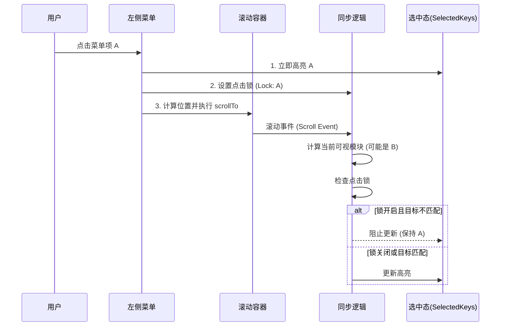

# 菜单与滚动交互同步机制设计

## 1. 概述

本文档详细阐述企业详情页中**左侧菜单**与**右侧内容区域**之间的双向交互同步机制。该机制确保用户在点击菜单导航或滚动页面浏览时，两侧的状态能够保持精确、流畅的同步，并解决了交互冲突导致的“跳变”问题。

**核心目标**：

1.  **点击精准定位**：点击菜单，右侧内容平滑滚动至指定位置。
2.  **滚动实时反馈**：滚动内容，左侧菜单实时高亮当前可视模块。
3.  **冲突抑制**：消除点击触发滚动时，中间态导致的菜单错误高亮（防抖动）。

## 2. 交互模型

交互过程是一个闭环系统，涉及两个主要的驱动源：**用户点击**和**用户滚动**。

## 3. 核心机制

### 3.1 点击驱动 (Menu Click -> Scroll)

当用户点击左侧菜单时，触发以下流程：

1.  **立即响应**：为了最佳手感，点击瞬间立即更新 `selectedKeys` 为目标菜单 ID。
2.  **位置计算**：
    - 查找目标模块的 DOM 元素（支持 `data-custom-id` 和 `multitabid`）。
    - 计算绝对偏移量：`Element.offsetTop` + `ParentOffset` - `BODYOFFSETTOP`。
3.  **设置互斥锁**：
    - 设置全局标记 `SCROLL_FROM_MENU_CLICK_ID`。
    - 记录当前时间戳 `time` (用于超时保护)。
4.  **触发滚动**：调用 `scrollTo` 方法，行为取决于是否需要重渲染（`smooth` vs `instant`）。

### 3.2 滚动驱动 (Scroll -> Menu Selected)

页面滚动时，通过 `createCorpDetailScrollCallback` 监听滚动事件（含 300ms 防抖）：

1.  **可视模块计算**：
    - 遍历所有模块，计算 `Math.abs(ModuleTop - ScrollTop)`。
    - 找出距离视口顶部最近且在视口范围内的模块。
2.  **防抖动保护 (Fix Menu Jump)**：
    - **问题**：点击菜单 A 跳转时，页面快速滑过模块 B。滚动监听逻辑可能会捕捉到 B，导致菜单从 A -> B -> A 的跳变。
    - **策略**：
      - 检查 `SCROLL_FROM_MENU_CLICK_ID` 是否存在。
      - 检查 `Date.now() - time` 是否小于 1000ms。
      - 如果处于点击滚动过程中，且计算出的模块不是点击目标，则**强制忽略**此次更新。
3.  **状态更新**：
    - 通过检查后，调用 `setSelectedKeys` 更新菜单高亮。
    - 如果目标在折叠的子菜单中，自动展开父级 (`setExpandedKeys`)。

### 3.3 懒加载协同

交互同步机制与懒加载机制紧密配合：

- **预加载**：滚动监听逻辑在计算可视模块的同时，会根据屏幕高度计算 `screenCanShowModulesN`，触发后续模块的数据加载。
- **点击预判**：如果是点击触发的滚动，会优先加载目标模块及其后续模块，确保跳转后内容可见。

## 4. 关键代码索引

| 逻辑模块         | 文件路径                                           | 关键函数/变量                                                                |
| :--------------- | :------------------------------------------------- | :--------------------------------------------------------------------------- |
| **滚动监听核心** | `src/handle/corp/misc/scroll.ts`                   | `handleCorpDetailScrollMenuChanged` `createCorpDetailScrollCallbackLogic` |
| **点击处理逻辑** | `src/views/CompanyDetailAIRight/CompanyDetail.tsx` | `treeMenuClick`                                                              |
| **互斥锁状态**   | `src/handle/corp/misc/scroll.ts`                   | `SCROLL_FROM_MENU_CLICK_ID`                                                  |

## 5. 历史修复记录

- **2025-12-04 修复菜单跳变问题**
  - **背景**：点击菜单跳转时，选中态不稳定。
  - **方案**：引入带时间戳的互斥锁机制。
  - **详情**：[Spec Analysis](../specs/2025-12/2025-12-04-fix-menu-jump/spec-analysis.md)

## 6. 关联文档

- [左侧菜单设计](./layout-left.md) - 菜单的数据结构与生成。
- [懒加载设计](./lazyLoad.md) - 模块数据的按需加载策略。
