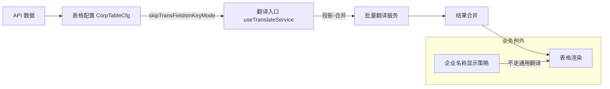
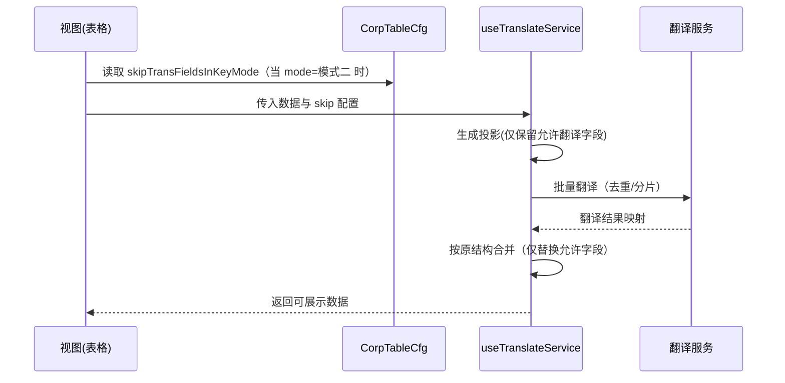

# 企业详情国际化（翻译）设计

## 概述

企业详情页目前对接口返回的对象/数组做整体翻译，存在以下问题：

- 部分字段具有独立业务展示逻辑（如企业名称），不应参与通用翻译。
- 部分字段用于业务判断或作为代码/枚举值，不应被翻译（被翻译会影响逻辑）。
- 表格模块间差异较大，需要更细粒度、可配置的“跳过字段”能力。

本设计在不破坏现有能力的前提下，引入“字段级跳过（skip-only）”，实现模块可控、按需翻译。

## 目标与原则

- 精确控制：支持对象/数组中按字段跳过翻译。
- 兼容渐进：默认行为不变，增量接入，不影响现有模块。
- 业务优先：对企业名称等有单独处理规则的字段，强制不走通用翻译。
- 配置驱动：翻译策略落在表格配置与工具函数可选参数中，便于维护和排查。

## 架构设计

## 配置落点

在 `CorpTableCfg` 上落地字段级控制：

### CorpTableCfg 字段说明

| 配置                     | 类型     | 说明                                                                    |
| ------------------------ | -------- | ----------------------------------------------------------------------- |
| skipTransFieldsInKeyMode | string[] | 仅在模式二（key-translate-official-only）下生效，跳过这些字段的通用翻译 |
| noTranslate              | boolean  | 整个模块不翻译（已有）                                                  |

示例建议：

- 股东穿透（`showShareSearch`）：`skipTransFieldsInKeyMode: ['shareholderName', 'shareholderId', 'typeName']`
- 其他模块：将用于跳转/判断/代码类字段加入 `skipTransFieldsInKeyMode`

## 处理流程

## 核心规则

- 企业名称字段永不走通用翻译（统一使用名称展示策略）。
  - 名称相关能力见 `packages/gel-util/src/misc/translate/companyName.ts`，遵循“主要位置/其余位置 + 官方/AI 标识”的展示规则。
- 默认不翻译 ID/Code/数值/布尔等非中文检测通过的字段；但若为中文文本且用于逻辑判断，需通过 `skipTransFieldsInKeyMode` 显式跳过（仅在模式二）。

## 与现有代码的对接点

- `useTranslateService`：读取 `eachTable.skipTransFieldsInKeyMode`（当 mode=模式二）调用通用包装器（skip-only）后再落回表格。
- 通用包装器：`translateWithFieldFilter(data, apiTranslate, { skipFields })`（位于 `gel-util`）。

## 迁移与验收

- 优先改造高风险模块（名称、代码、逻辑判断混杂的表格）。
- 每个改造模块提交前，检查：
  - `skipTransFieldsInKeyMode` 配置是否齐全
  - 企业名称是否已从通用翻译中隔离
  - 英文环境下交互与筛选逻辑是否不受翻译影响
- 覆盖用户主要场景的回归测试；确保中文环境不触发翻译请求。

## 相关链接

- 通用国际化文档：`docs/intl/README.md`
- 批量翻译工具设计：`docs/intl/translate.md`
- 企业名称展示规则：`docs/intl/company-name.md`
