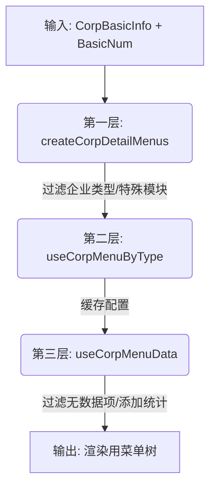

# 企业详情菜单配置重构 · 实施记录 v1

[返回 README](./README.md)

| 元信息       | 内容             |
| ------------ | ---------------- |
| **阶段**     | 已完成           |
| **适用版本** | 企业详情 2025.Q4 |
| **最近更新** | 2025-11-24       |

## 1. 背景

原有菜单配置存在以下问题：

1. **逻辑分散**：企业类型/地区相关的菜单差异散落在多个文件（`handleCorpDetailMenu`、`getMenuByCorpType`）。
2. **静态限制**：静态配置无法根据企业信息动态调整。
3. **渲染耦合**：渲染层混入了业务判断逻辑。
4. **数据冗余**：`CompanyDetail` 组件中存在三份菜单数据的冗余管理，且有两个 `useEffect` 竞争。

## 2. 架构设计

采用了 **"三层过滤 + 两阶段构建"** 的架构模式，将配置生成、缓存管理、数据过滤分层处理。

### 2.1 三层过滤架构

| 层级 | 模块 | 职责 | 输入 | 输出 |
| :--- | :--- | :--- | :--- | :--- |
| **第一层** | `menus.ts` | **配置生成**：根据企业类型、地区、用户类型决定显示哪些一级模块 | BasicInfo, BasicNum | `CorpMenuCfg` (一级模块配置) |
| **第二层** | `useCorpMenuByType` | **缓存管理**：缓存配置，错误处理 | BasicInfo, BasicNum | `CorpMenuCfg` (缓存后) |
| **第三层** | `useCorpMenuData` | **数据过滤**：根据统计数据过滤子菜单，生成渲染数据 | `CorpMenuCfg`, BasicNum | `treeDatas` (完整菜单树) |

### 2.2 两阶段构建策略 (useCorpMenuData)

为了解决首屏白屏问题，采用了两阶段构建策略：

1.  **第一阶段：简化菜单** (`basicNum` 未就绪)
    *   **触发条件**：`basicNum` 字段少于 5 个。
    *   **内容**：只显示一级菜单 + Overview 第一个子菜单。
    *   **特点**：不过滤、不显示统计数字、快速渲染。

2.  **第二阶段：完整菜单** (`basicNum` 已就绪)
    *   **触发条件**：`basicNum` 字段大于等于 5 个。
    *   **内容**：完整菜单结构。
    *   **特点**：过滤无数据项、显示统计数字、自动展开 Overview。

## 3. 实施细节

### 3.1 第一层：配置生成 (`menus.ts`)

新增 `createCorpDetailMenus` 纯函数，集中处理所有业务差异：

*   **企业类型**：个体工商户移除金融、资质、风险等模块。
*   **特殊模块**：根据 `basicNum` 动态添加 IPO、公募/私募基金模块。
*   **地区适配**：海外企业调整菜单名称（如“工商信息” -> “基本信息”）。
*   **用户类型**：海外用户移除风险模块。

### 3.2 第二层：Hook 简化 (`useCorpMenuByType.ts`)

简化为直接调用 `createCorpDetailMenus` 并使用 `useMemo` 缓存，移除原有的类型判断逻辑。

### 3.3 第三层：数据管理 (`useCorpMenuData.ts`)

新增核心 Hook `useCorpMenuData`，统一管理菜单状态：

*   **输入**：`currentMenus` (来自第二层), `basicNum`。
*   **输出**：
    *   `treeDatas`: 树形结构（渲染用）
    *   `allTreeDatas`: 扁平数组（搜索用）
    *   `allTreeDataObj`: 映射对象（查找用）
    *   `expandedKeys`, `selectedKeys`: 状态控制
*   **逻辑**：
    *   使用 `useMemo` 一次性生成三种数据结构。
    *   实现两阶段构建逻辑。
    *   提供 `onMenuReady` 回调。

### 3.4 渲染逻辑清理 (`handleCorpDetailMenu.tsx`)

*   **重构**：`buildCompleteMenuTree` 函数只负责根据统计数据过滤和生成树结构。
*   **清理**：移除了所有企业类型/地区的 `if/else` 判断。
*   **参数**：移除了废弃的 `corpArea` 参数，函数签名变更为 `(menus, nums)`。

## 4. 验收记录

### 4.1 功能验证

- [x] **普通企业**：菜单显示完整，统计数字正确。
- [x] **个体工商户**：正确隐藏了金融、资质、风险等模块。
- [x] **海外企业**：菜单名称已适配（“基本信息”）。
- [x] **特殊数据**：有 IPO/基金数据时，对应模块正确显示。
- [x] **首屏体验**：无数据时显示简化菜单，数据加载后平滑切换至完整菜单。

### 4.2 代码质量

- [x] **逻辑分层**：三层架构清晰，职责单一。
- [x] **类型安全**：完善了 `CorpMenuCfg`, `CorpMenuData` 等类型定义。
- [x] **性能优化**：`useMemo` 缓存配置和数据，避免重复计算。
- [x] **无冗余**：移除了 `CompanyDetail` 中的重复状态管理。

## 5. 更新记录

| 日期       | 修改人 | 版本 | 更新内容                                                     |
| ---------- | ------ | ---- | ------------------------------------------------------------ |
| 2025-11-24 | AI     | v1   | 创建实施记录，总结已完成改动                                 |
| 2025-11-26 | AI     | v1.1 | 更新架构描述（三层过滤+两阶段构建），修正 handleCorpDetailMenu 参数说明 |
