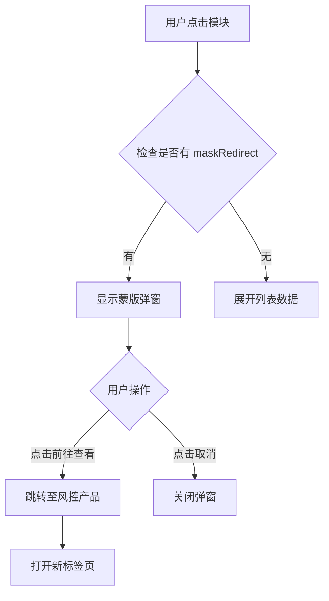
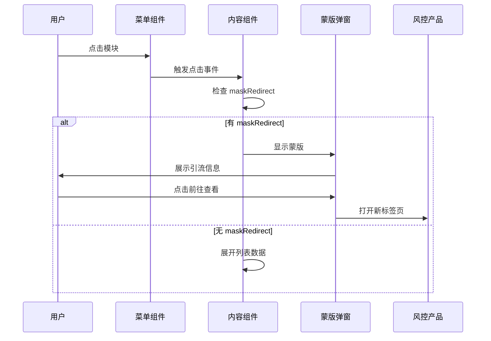

# 方案设计：司法风险与经营风险模块扩展

> 所属任务：[司法风险与经营风险模块扩展](./README.md)  
> 文档版本：v1  
> 创建日期：2025-11-11

## 设计原则

- 遵循现有模块配置结构，保持一致性
- 最小化代码改动，降低风险
- 新增模块采用"仅统计 + 蒙版引流"模式

## 核心方案

### 1. 统计类型模块配置

新增8个风险模块，调整2个现有模块，采用"仅统计"模式：

- 不配置列表展示（无 `cmd`、`thName`、`fields` 等字段）
- 仅配置统计字段（`modelNum`）和蒙版引流信息（`maskRedirect`）

**配置示例**：

```typescript
equityfreeze: {
  title: intl('xxx001', '股权冻结'),
  modelNum: 'equity_freeze_num',
  maskRedirect: {
    url: 'https://risk.wind.com.cn/company/{companyCode}/equity-freeze',
    title: '股权冻结详情',
    description: '该数据为风控专属数据，查看完整信息请前往风控产品'
  }
}
```

### 2. 配置字段说明

| 字段                       | 类型   | 说明                        | 必填 |
| -------------------------- | ------ | --------------------------- | ---- |
| `title`                    | string | 模块标题                    | 是   |
| `modelNum`                 | string | 统计字段名（对应 basicNum） | 是   |
| `maskRedirect`             | object | 蒙版引流配置                | 是   |
| `maskRedirect.url`         | string | 跳转链接（支持变量替换）    | 是   |
| `maskRedirect.title`       | string | 蒙版标题                    | 是   |
| `maskRedirect.description` | string | 蒙版描述文案                | 是   |

### 3. 模块顺序调整

通过调整配置对象的键顺序来控制模块显示顺序。

**司法风险模块**（`risk.tsx`）：
在 `getcorpconsumption`（限制高消费）后插入 `equityfreeze`（股权冻结），在 `showBankruptcy`（破产重整）后插入 `rewardnotice`（悬赏公告）和 `exitrestriction`（限制出境）。

**经营风险模块**（`bussRisk.tsx`）：
新增5个模块，调整2个现有模块位置。详细顺序参见需求文档。

- 新增：`debtoverdue`（债务逾期）、`commercialoverdue`（商票逾期）、`environmentalcredit`（环保信用）、`equitypledge`（股权质押）、`simplecancellation`（简易注销）
- 调整位置：`getdefaultbond`（债券违约）、`getnostandard`（非标违约）

### 4. 左侧菜单配置

在 `menus.ts` 中更新菜单配置，确保菜单与模块配置保持一致。

**配置结构**：

```typescript
risk: {
  title: intl('228331', '司法风险'),
  showList: [
    // ... 现有模块
    'equityfreeze',    // 新增：股权冻结
    'rewardnotice',    // 新增：悬赏公告
    'exitrestriction', // 新增：限制出境
    // ...
  ],
  showName: [
    // ... 现有模块名称
    intl('xxx001', '股权冻结'),
    intl('xxx002', '悬赏公告'),
    intl('xxx003', '限制出境'),
    // ...
  ],
  numArr: [
    // ... 现有统计字段
    'equity_freeze_num',
    'reward_notice_num',
    'exit_restriction_num',
    // ...
  ],
}
```

**配置要点**：

- `showList`：模块标识数组，与模块配置的 key 保持一致
- `showName`：模块名称数组，使用国际化函数
- `numArr`：统计字段数组，与模块配置的 `modelNum` 保持一致
- 三个数组的顺序和长度必须一致

**菜单与模块联动机制**：

参考 `layout-left.md` 和 `layout-config.md` 文档：

1. 菜单配置通过 `useCorpMenuByType` Hook 生成
2. 菜单项的显示由 `basicNum` 统计数据驱动
3. 统计数字为 0 时，菜单项不显示
4. 点击菜单项滚动到对应模块位置
5. 新增模块不在 `corpDetailBaseMenuNumHide` 列表中，需要显示统计数字

### 5. 蒙版组件设计

创建通用蒙版组件 `MaskRedirectModal`，用于引流至风控产品。

**交互流程**：



### 6. 模块渲染逻辑

在 `CompanyBase.tsx` 中判断模块配置：

- 有 `maskRedirect` 配置：渲染统计卡片，点击触发蒙版
- 无 `maskRedirect` 配置：保持现有渲染逻辑

### 7. 跳转链接处理

实现变量替换工具函数，支持 `{companyCode}` 和 `{companyName}` 占位符。

跳转链接模板示例：`https://risk.wind.com.cn/company/{companyCode}/equity-freeze`

## 数据流设计



## 样式设计

### 统计类型模块样式

采用卡片式布局，居中显示：

- 虚线边框，hover 时变为实线蓝色边框
- 标题：16px，中等字重
- 统计数字：32px，加粗，蓝色主题色
- 提示文案：14px，灰色
- 整体添加 hover 效果和过渡动画

### 蒙版弹窗样式

使用 Wind UI Modal 组件，自定义内容区域：

- 顶部图标：48px，蓝色
- 标题：18px，居中，中等字重
- 描述文案：14px，居中，灰色，行高 1.6
- 按钮：使用 Wind UI Button 组件默认样式

## 国际化处理

新增国际化文案（文案 ID 待确认）：

**模块标题**（10条）：

- 司法风险：股权冻结、限制出境、悬赏公告
- 经营风险：债券违约、非标违约、债务逾期、商票逾期、环保信用、股权质押、简易注销

**蒙版文案**（3条）：

- 该数据为风控专属数据
- 查看完整信息请前往风控产品
- 前往查看

需要提供中英文双语版本。

## 兼容性考虑

### 1. 现有模块不受影响

- 新增模块使用独立的配置字段
- 不修改现有模块的配置结构
- 通过 `maskRedirect` 字段区分新旧模块

### 2. 菜单显示逻辑

- 统计类型模块在菜单中正常显示
- 统计数字为 0 时，模块不显示（与现有逻辑一致）
- 菜单点击行为与普通模块一致（滚动到对应位置）
- 菜单配置与模块配置保持一致，通过 `showList` 数组控制显示顺序
- 菜单统计数字通过 `numArr` 字段映射到 `basicNum` 数据

### 3. 数据加载

- 统计类型模块不需要加载列表数据
- 统计数字从 `basicNum` 接口获取（与现有逻辑一致）

## 性能优化

### 1. 按需加载蒙版组件

使用 React.lazy 懒加载蒙版组件，减少首屏加载体积。

### 2. 避免重复渲染

- 使用 `React.memo` 优化统计类型模块组件
- 蒙版弹窗状态独立管理，避免影响其他模块

## 风险与应对

| 风险                     | 影响 | 应对措施                       |
| ------------------------ | ---- | ------------------------------ |
| 模块顺序调整导致配置错乱 | 高   | 充分测试，确保顺序正确         |
| 蒙版交互体验不佳         | 中   | 与设计师确认交互细节，多轮测试 |
| 跳转链接参数错误         | 中   | 编写单元测试，验证链接生成逻辑 |
| 国际化文案缺失           | 低   | 提前准备中英文文案，确保完整   |

## 更新记录

| 日期       | 修改人 | 更新内容                               |
| ---------- | ------ | -------------------------------------- |
| 2025-11-11 | -      | 创建方案设计                           |
| 2025-11-11 | -      | 精简文档，聚焦核心需求实现             |
| 2025-11-11 | -      | 补充左侧菜单配置设计，完善菜单显示逻辑 |
