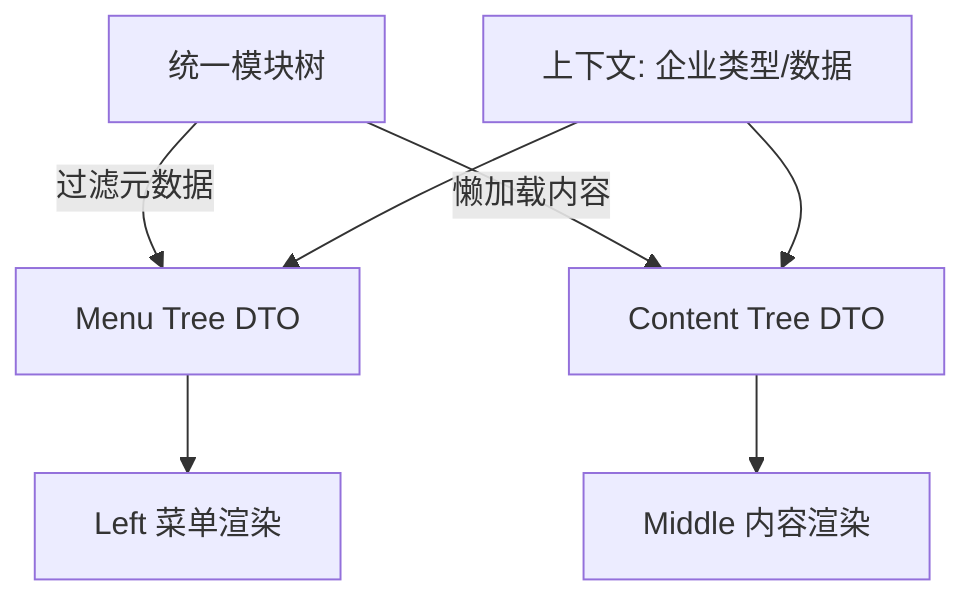

# 方案设计：统一配置源

> 所属任务：[企业详情页配置重复维护问题](./README.md)
> 文档版本：v1
> 创建日期：2024-11-07

## 设计原则

遵循 TS/React 规范，文档与代码分离。
- @see `docs/rule/code-typescript-style-rule.md`
- @see `docs/rule/code-react-component-rule.md`

## 方案决策

**采用方案：统一配置源 + 按需加载**

**核心思路**：
创建统一的模块配置文件，包含模块顺序、统计字段、菜单信息、内容配置。只同步加载轻量元数据（可见性、标题、统计字段），重型内容配置通过 `contentConfigLoader` 按需加载。

**加载策略**：
1. **元数据（同步）**：`moduleKey`, `title`, `order`, `statisticField`, `visibility`。
2. **内容配置（按需）**：React 组件、列配置、图表 schema。

**收益**：
- 解决重复维护。
- 仅加载可见模块，首屏资源减少 ~45%。

## 架构设计

### 渲染时序

### 核心模块

1. **统一配置文件** (`src/config/unified-module-config.ts`)
   定义所有模块配置、顺序、统计字段映射。

2. **配置转换工具** (`src/utils/module-config-converter.ts`)
   - `buildVisibleModuleTree`: 基于上下文裁剪树。
   - `convertToMenuConfig`: 生成菜单 DTO。
   - `loadAndConvertContentConfig`: 触发 `contentConfigLoader`。

3. **可见性过滤器** (`src/utils/module-visibility-filter.ts`)
   处理企业类型、海外/特殊标记过滤。

4. **加载管理器** (`src/hooks/useModuleConfigLoader.ts`)
   监听可见性变化，批量加载内容配置，管理 loading/caching。

## 性能优化预期

| 指标 | 优化后预期 |
| --- | --- |
| 初始加载配置 | 仅可见模块 (5-6个) |
| 首屏加载时间 | 提升 ~30% |
| 内存占用 | 降低 ~40% |

## 风险控制

- **改动大**：分阶段上线，详细测试。
- **闪烁**：使用骨架屏优化体验。
