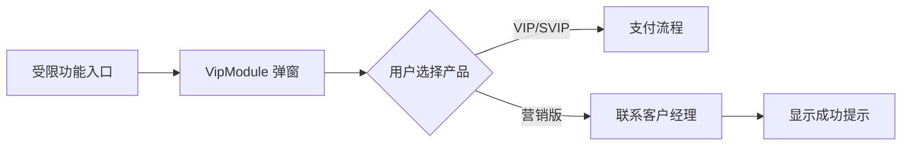
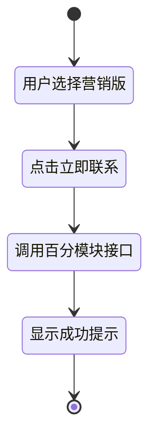
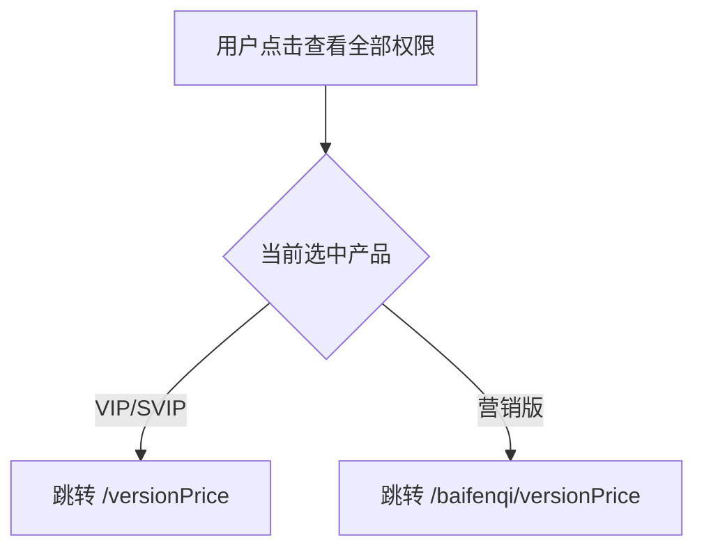

# 企业库会员权限弹窗优化 - 方案设计

[← 返回任务概览](/apps/company/docs/specs/vip-permission-popup-optimization/README.md)

**关联参考**：@see /apps/company/docs/auth/membership-permissions-interaction.md

## 信息架构

## 页面蓝图

### VipModule 弹窗结构

| 区域       | 展示内容                 | 交互动作           | 修改点                                                                                                                                                   |
| ---------- | ------------------------ | ------------------ | -------------------------------------------------------------------------------------------------------------------------------------------------------- |
| 标题区     | 弹窗标题                 | -                  | 移除"该数据由第三方提供"（@see apps/company/src/components/company/VipModuleNew.tsx:298-304）                                                            |
| 产品选择区 | VIP/SVIP/营销版 三个选项 | 点击切换选中产品   | 更新营销版名称和说明（@see apps/company/src/components/company/VipModuleNew.tsx:336-344,414-421）                                                        |
| 服务链接   | "查看全部权限和价格"     | 跳转服务说明页     | 根据选中产品动态跳转（VIP/SVIP 使用 LinkModule.VIP_CENTER；营销版使用 baiFen 常量）（@see apps/company/src/components/company/VipModuleNew.tsx:412-420） |
| 操作按钮区 | 立即支付/立即联系        | 触发支付或联系流程 | 营销版切换联系接口（@see apps/company/src/components/company/VipModuleNew.tsx:207-221）                                                                  |
| 协议勾选区 | 用户协议勾选             | 勾选同意协议       | 无变化                                                                                                                                                   |

## 任务流程

### 联系客户经理流程

### 服务链接跳转逻辑

## 数据与状态

### 产品配置变更

| 产品   | 名称               | 说明文案             | 操作按钮 | 服务链接               |
| ------ | ------------------ | -------------------- | -------- | ---------------------- |
| VIP    | VIP                | ￥398/1年            | 立即支付 | /versionPrice          |
| SVIP   | SVIP               | ￥1980/1年           | 立即支付 | /versionPrice          |
| 营销版 | 营销版（百分企业） | 联系客户经理咨询采购 | 立即联系 | /baifenqi/versionPrice |

### 接口契约

**联系客户经理接口**（待确认）

- 当前：`createCrmOrder({ product: 'svip' })`（@see apps/company/src/api/homeApi.ts:95-101）
- 目标：切换至百分模块接口（路径和参数待后端确认，现实现为 `contactBaiFenQi`，@see apps/company/src/api/homeApi.ts:103-109）
- 成功提示："专属客户经理已收到开通需求，将在一个工作日内同您联系"

## 组件复用

| 组件/方法                | 用途             | 修改点                   |
| ------------------------ | ---------------- | ------------------------ |
| VipModuleNew             | 会员弹窗主组件   | 文案、链接、接口调用     |
| VipMarketingEdition      | 营销版卡片组件   | 独立抽象，减少重复       |
| createCrmOrder           | 联系客户经理接口 | 替换为百分模块接口       |
| wftCommon.jumpJqueryPage | 页面跳转工具方法 | 根据产品类型传入不同路径 |

@see apps/company/src/components/company/VipModuleNew.tsx
@see apps/company/src/components/company/VipMarketingEdition.tsx
@see apps/company/src/api/homeApi.ts

## 待确认事项

1. **百分模块接口**：具体路径、参数格式、返回格式
2. **遮罩策略**：需求中提到的表格遮罩在当前代码中未找到实现，需与产品确认具体位置和触发条件
3. **服务链接路径**：百分企业服务说明页面是否为 `/baifenqi/versionPrice`

@see /apps/company/docs/specs/vip-permission-popup-optimization/spec-requirement-v1.md
@see /apps/company/docs/specs/vip-permission-popup-optimization/implementation-plan.json
