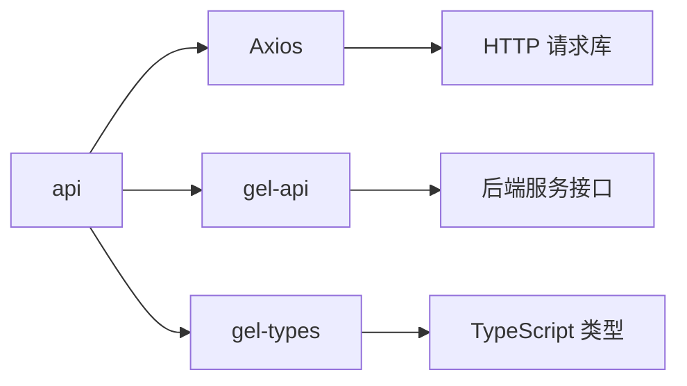

# api - API 接口层

企业管理系统的 API 接口层，负责与后端服务通信，提供统一的数据请求接口和响应处理。

## 目录树

```
api/
├── ai-graph/                 # AI 图谱相关 API
├── axios.ts                  # Axios 实例配置
├── biddingApi.ts             # 招投标 API
├── cde/                      # CDE 模块 API
├── chartApi.ts               # 图表数据 API
├── chat/                     # 聊天相关 API
├── collect&namelist.ts       # 收藏和名录 API
├── common.ts                 # 通用 API 方法
├── companyApi.ts             # 企业信息 API
├── companyDynamic.ts         # 企业动态 API
├── config/                   # API 配置
├── corp/                     # 企业详细数据 API
│   ├── HKCorp/               # 港股企业 API
│   ├── annualReport.ts       # 年报数据 API
│   ├── basicNum/             # 基础数据 API
│   ├── buss/                 # 业务数据 API
│   ├── event.ts              # 企业事件 API
│   ├── info/                 # 企业基本信息 API
│   ├── misc.ts               # 杂项数据 API
│   └── report.ts             # 企业报告 API
├── eagles/                   # Eagles 系统 API
├── entWeb/                   # 企业网页 API
├── error/                    # 错误处理
├── feturedcompany.ts         # 特色企业 API
├── feturedlist.ts            # 特色列表 API
├── findCustomer.ts           # 找客户 API
├── gameapprovalApi.ts        # 游戏审批 API
├── graph/                    # 图谱 API
├── groupApi.ts               # 集团系 API
├── handle.ts                 # API 处理工具
├── homeApi.ts                # 首页数据 API
├── index.ts                  # API 入口文件
├── interceptors/              # 请求/响应拦截器
│   ├── request.ts            # 请求拦截器
│   └── response.ts           # 响应拦截器
├── lawDetailApi.ts           # 法律详情 API
├── mapApi.ts                 # 地图数据 API
├── misc.ts                   # 杂项 API
├── noticeCenterApi.ts        # 通知中心 API
├── paths/                    # API 路径定义
│   ├── bid/                  # 招投标路径
│   ├── chat.ts               # 聊天路径
│   ├── corp/                 # 企业路径
│   ├── fetured.ts            # 特色路径
│   ├── group.ts              # 集团路径
│   ├── home.ts               # 首页路径
│   ├── patent/               # 专利路径
│   ├── report.ts             # 报告路径
│   └── search.ts             # 搜索路径
├── pay.ts                    # 支付 API
├── pointBuried/              # 埋点 API
├── qualificationsApi.ts      # 资质 API
├── rankListTableApi.ts       # 榜单表格 API
├── rankingListApi.ts         # 榜单 API
├── request.ts                # 请求封装
├── searchListApi.ts          # 搜索列表 API
├── serverApi.ts              # 服务器 API
├── services/                 # 服务层 API
│   ├── companyRecentView.ts  # 企业最近浏览
│   ├── groupRecentView.ts    # 集团最近浏览
│   ├── history.ts            # 历史记录
│   └── personRecentView.ts   # 人物最近浏览
├── settingApi.ts             # 设置 API
├── singleDetail.ts           # 单项详情 API
├── templateApi.ts            # 模板 API
├── translate/                # 翻译 API
├── types.ts                  # API 类型定义
├── userApi.ts                # 用户 API
├── user/                     # 用户相关 API
└── wmapApi.ts                # 万寻地图 API
```

## 关键文件说明

| 文件 | 作用 |
|------|------|
| `axios.ts` | Axios 实例配置，设置基础 URL、超时等 |
| `interceptors/request.ts` | 请求拦截器，处理请求头、认证等 |
| `interceptors/response.ts` | 响应拦截器，统一处理响应数据和错误 |
| `paths/index.ts` | API 路径集中管理，统一接口路径 |
| `corp/index.ts` | 企业相关 API 入口，整合企业数据接口 |
| `request.ts` | 请求方法封装，提供 GET、POST 等方法 |
| `types.ts` | API 请求和响应的 TypeScript 类型定义 |

## 依赖示意



## 相关文档

- [API 接口文档](../../docs/api/) - 后端接口详细文档
- [错误处理规范](../../../docs/rule/code-error-boundary-rule.md) - API 错误处理规范
- [API 请求规范](../../../docs/rule/code-api-client-rule.md) - API 调用规范
