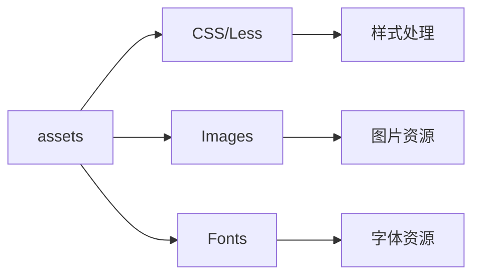

# assets - 静态资源

企业管理系统的静态资源目录，包含图片、样式、字体等静态文件。

## 目录树

```
assets/
├── fonts/                    # 字体文件
├── images/                   # 图片资源
│   ├── company/              # 企业相关图片
│   ├── icons/                # 图标文件
│   └── ...                   # 其他图片资源
├── styles/                   # 样式文件
│   ├── global.less           # 全局样式
│   ├── variables.less        # 样式变量
│   └── ...                   # 其他样式文件
└── ...                       # 其他静态资源
```

## 关键文件说明

| 文件/目录 | 作用 |
|-----------|------|
| `fonts/` | 字体文件目录，存放项目使用的字体 |
| `images/` | 图片资源目录，存放项目使用的图片 |
| `images/company/` | 企业相关图片，如企业 logo、默认头像等 |
| `images/icons/` | 图标文件，如功能图标、状态图标等 |
| `styles/global.less` | 全局样式文件，定义全局样式和重置样式 |
| `styles/variables.less` | 样式变量文件，定义颜色、尺寸等变量 |

## 依赖示意



## 相关文档

- [样式规范](../../../docs/rule/code-style-less-bem-rule.md) - Less Module + BEM 样式规范
- [项目结构规范](../../../docs/rule/code-project-structure-rule.md) - 项目目录组织规范
- [资源管理规范](../../../docs/rule/asset-management.md) - 静态资源管理规范
