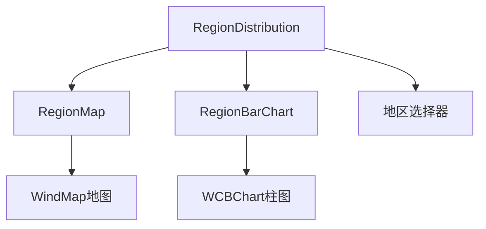
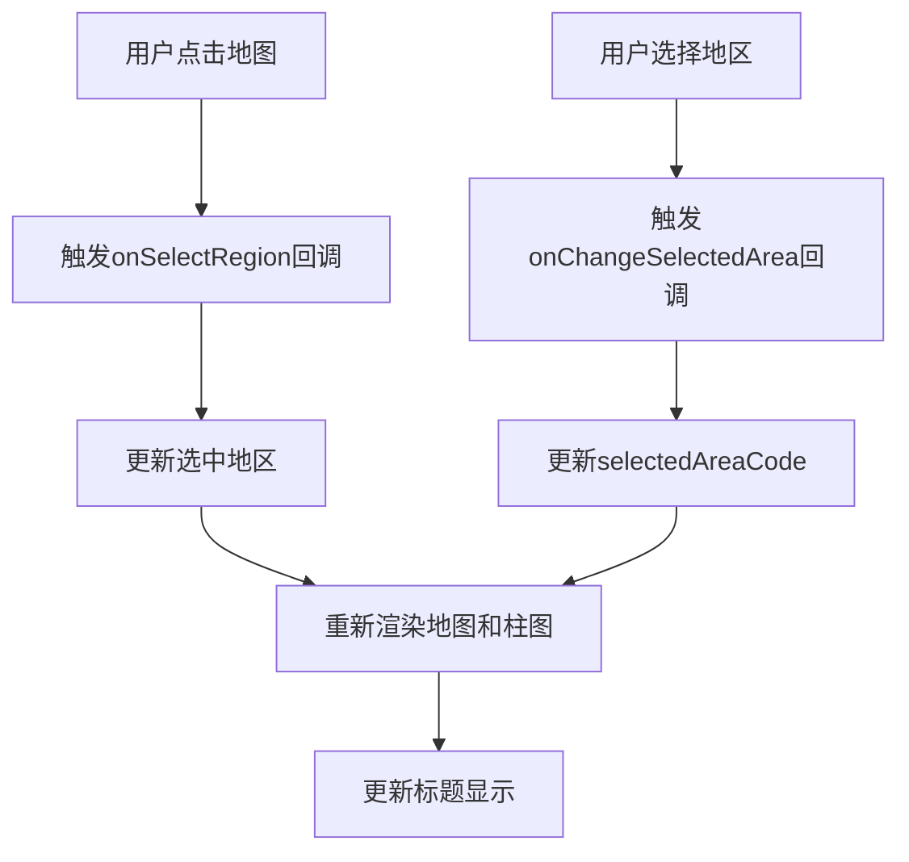

# 地区分布模块

## 概述
地区分布模块提供招投标地区分布的可视化组件，包含地图组件、柱状图组件以及组合组件。

## 组件列表
- `RegionDistribution`：地区分布组合组件（地图 + 柱状图）
- `RegionMap`：地区地图组件（独立使用）
- `RegionBarChart`：地区柱状图组件（独立使用）

## 组件架构


## 功能特性

### RegionDistribution（组合组件）
- **双视图展示**：左侧中国地图，右侧TopN横向柱图
- **地区选择器**：支持顶部地区选择器（可选）
- **地图交互**：点击地图区域触发回调
- **下钻功能**：支持从全国到具体地区的下钻
- **动态标题**：根据当前选择显示"全国/当前地区"
- **批次支持**：支持下钻批次 `batch` 参数

### RegionMap（地图组件）
- **中国地图展示**：基于 @wind/Wind.Map.mini
- **交互功能**：点击地图区域触发回调
- **下钻支持**：支持地区下钻功能
- **Tooltip**：鼠标悬停显示详细信息
- **自适应标题**：根据选中地区显示标题

### RegionBarChart（柱状图组件）
- **TopN展示**：显示排名前N的地区
- **横向柱图**：使用 @wind/chart-builder
- **自定义标题**：支持自定义柱状图标题
- **数据排序**：自动按数值排序显示

## 使用示例

### 组合组件使用
```tsx
import { RegionDistribution } from '@/bid/region-distribution';

<RegionDistribution 
  data={regionData}
  areaOptions={areaOptions}
  selectedAreaCode={selectedArea}
  onChangeSelectedArea={handleAreaChange}
  onSelectRegion={(regionCode, regionName) => {
    console.log('选中地区:', regionCode, regionName);
  }}
/>
```

### 独立组件使用
```tsx
import { RegionMap, RegionBarChart } from '@/bid/region-distribution';

// 单独使用地图组件
<RegionMap
  data={mapData}
  onSelectRegion={handleRegionSelect}
  selectedArea={selectedArea}
/>

// 单独使用柱状图组件
<RegionBarChart
  data={barData}
  topN={10}
  title="地区排名"
/>
```

## 数据结构
```typescript
interface RegionDistributionData {
  mapData: RegionItem[]
  topList: RegionBarData[]
}

interface RegionItem {
  regionCode: string
  regionName: string
  winCount: number
  winAmount?: number
}

interface RegionBarData {
  regionName: string
  winCount: number
  winAmount?: number
}
```

## 配置参数

### RegionDistribution Props
| 参数名 | 类型 | 默认值 | 说明 |
|--------|------|--------|------|
| data | RegionDistributionData | - | 地图和柱状图数据 |
| areaOptions | array | - | 地区选择器选项 |
| selectedAreaCode | string | - | 当前选中的地区代码 |
| onChangeSelectedArea | function | - | 地区选择变化回调 |
| onSelectRegion | function | - | 地图点击回调 |

### RegionMap Props
| 参数名 | 类型 | 默认值 | 说明 |
|--------|------|--------|------|
| data | RegionItem[] | - | 地图数据 |
| valueKey | string | 'winCount' | 数值字段名 |
| onSelectRegion | function | - | 地区选择回调 |
| selectedArea | SelectedArea | - | 当前选中地区 |

### RegionBarChart Props
| 参数名 | 类型 | 默认值 | 说明 |
|--------|------|--------|------|
| data | RegionBarData[] | - | 柱状图数据 |
| valueKey | string | 'winCount' | 数值字段名 |
| topN | number | 10 | 显示前N名 |
| title | string | - | 图表标题 |

## 交互流程


## 设计要点
- **组件拆分**：地图和柱状图独立为可复用组件
- **组合模式**：RegionDistribution作为组合组件提供完整功能
- **地图负责选区与概览**：提供直观的地理位置展示
- **柱图负责TopN排名与对比**：提供精确的数值对比
- **交互联动**：地图和柱图之间的交互联动
- **响应式布局**：适配不同屏幕尺寸

## 依赖
- @wind/Wind.Map.mini：中国地图组件
- @wind/chart-builder：图表构建器
- gel-util：国际化支持 