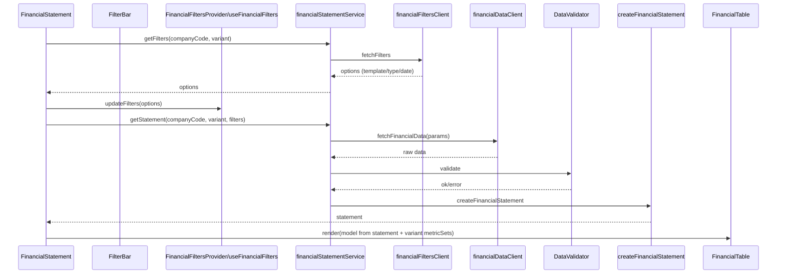
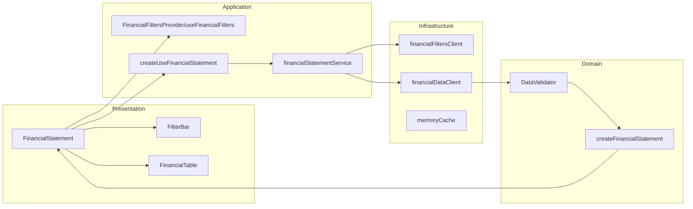

<!--
  文档概述：模块流程图与分层关系
  @author yxlu.calvin
  @example 参考时序图与分层图进行开发与排查
-->
# 模块流程图（简化版）

## 分层总览（最小节点）

## 维护建议
- 将“过滤项拉取”与“数据拉取”两个阶段明确分离，避免交叉刷新导致复杂依赖。
- 保持 `financialStatementService` 作为唯一数据入口，组件层不直接触达客户端。
- 仅在 `FinancialStatement` 维护组装逻辑（变体指标集合与组头），格式化与管线处理保持在工具层可选使用。
- `memoryCache` 作为内部优化，不暴露到 UI；缓存策略统一在服务层控制。