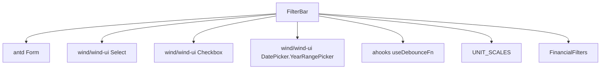
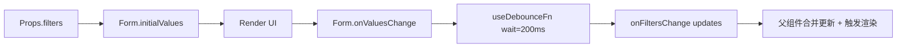

<!--
  文档概述：FilterBar 开发说明与扩展点
  @author yxlu.calvin
  @example 用于工程开发与扩展参考
-->
# FilterBar 开发文档

## 代码概览

- 路径：`/Users/luyixin/Documents/github/only-company-workspace/apps/company/src/components/company/buss/financial/copied/presentation/components/FilterBar/index.tsx`
- 样式：`/Users/luyixin/Documents/github/only-company-workspace/apps/company/src/components/company/buss/financial/copied/presentation/components/FilterBar/index.module.less`
- 依赖：
  - `@wind/wind-ui`: `Checkbox`、`DatePicker.YearRangePicker`、`Select`
  - `antd`: `Form`、`useForm`
  - `ahooks`: `useDebounceFn`
  - 本地值对象：`UNIT_SCALES`（`/src/components/company/buss/financial/copied/domain/value-objects/unitScale.ts`）
  - 类型：`FinancialFilters`（`/src/components/company/buss/financial/copied/types/index.ts`）

## 架构可视化



## 数据流图



## 扩展点

- Props扩展点（`/src/components/company/buss/financial/copied/types/index.ts`）

```ts
export interface FinancialFilters {
  scenarioIdx: number
  unitScale: keyof typeof UNIT_SCALES
  hideEmptyRows: boolean
  yearRange: [number | undefined, number | undefined]
  region: 'domestic' | 'overseas'
  reportPeriod?: 'ANNUAL' | 'INTERIM' | 'QUARTERLY'
  reportForm?: 'STANDARD' | 'CUMULATIVE'
  // TODO: 在此扩展新的筛选字段，例如：
  // customMetricScope?: 'core' | 'extended'
}
```

- 样式扩展点（`/src/components/company/buss/financial/copied/presentation/components/FilterBar/index.module.less`）

```less
@prefix: filter-bar;

.@{prefix} {
  &-container {
    display: flex;
    align-items: center;
    // TODO: 扩展间距与换行：
    // gap: 8px;
    // flex-wrap: wrap;
  }
}
```

- 逻辑扩展点（调整防抖等待时间，`/src/components/company/buss/financial/copied/presentation/components/FilterBar/index.tsx`）

```ts
// 当前：
const { run: onValuesChangeDebounced } = useDebounceFn((values) => onFiltersChange(values as any), { wait: 200 })

// 扩展：将 200ms 改为 0 以实现实时反馈，或更长以减少渲染频率
// { wait: 0 } | { wait: 500 }
```

- 子组件扩展（启用已注释的选择框，`/src/components/company/buss/financial/copied/presentation/components/FilterBar/index.tsx`）

```tsx
{/* 报表类型与报表形式（当前代码中注释，启用后确保父组件消费这两个字段） */}
<Form.Item name={'reportPeriod'} label="报表类型">
  <Select style={{ width: 120 }} options={[
    { label: '年报', value: 'ANNUAL' },
    { label: '中期报', value: 'INTERIM' },
    { label: '季报', value: 'QUARTERLY' },
  ]} />
</Form.Item>
<Form.Item name={'reportForm'} label="报表形式">
  <Select style={{ width: 120 }} options={[
    { label: '单期', value: 'STANDARD' },
    { label: '累计报', value: 'CUMULATIVE' },
  ]} />
</Form.Item>
```

## 添加新功能步骤

1. 类型更新：在 `FinancialFilters`（`/src/components/company/buss/financial/copied/types/index.ts`）添加新字段，并为其提供明确的联合类型或字面量类型
2. UI 渲染：在 `FilterBar/index.tsx` 的 `Form` 中新增 `Form.Item`，确保 `name` 与类型字段一致
3. 初始值：通过 `Form.initialValues` 从 `filters` 映射新字段的默认值
4. 变更回传：确认 `onValuesChangeDebounced` 能捕获该字段并以增量形式回传（如果需要转换，参考 `FinancialStatement/index.tsx` 的 `handleFiltersFormChange`）
5. 样式调整：在 `index.module.less` 中按需添加布局与间距
6. 业务对接：父组件（如 `FinancialStatement/index.tsx`）消费该字段并驱动数据渲染
7. 测试与文档：添加测试用例（测试目录代码中未定义），并更新使用文档（本文件）

## 性能优化提醒

- 防抖参数：根据实际交互频率调整 `wait`，在高频输入场景适当增大以降低渲染压力
- 受控渲染：父组件合并更新时使用浅比较避免不必要的子树重渲染
- 表单项数量：表单项增多会提升变更频率与渲染成本；按需渲染或懒加载非关键项
- 选择项来源：`unitOptions` 由 `UNIT_SCALES` 同步生成，保持常量引用避免每次渲染重建

## 测试策略

- 初始值映射：`filters` → `Form.initialValues` 的字段一致性（`unitScale/hideEmptyRows/yearRange/reportPeriod/reportForm`）
- 事件回传：模拟用户操作，验证 `onFiltersChange` 仅回传变更字段，且存在 200ms 防抖
- 年份范围处理：选择年份区间后值形态与父组件转换逻辑兼容（具体 `DatePicker.YearRangePicker` 返回值由组件库定义，代码中未定义）
- 单位选择：枚举键合法性与 UI 文案来源一致（`UNIT_SCALES`）
- 隐藏空行：勾选/取消时布尔值正确传递并能驱动父组件过滤逻辑

## 检查清单

- 类型安全：`FinancialFilters` 字段与表单 `name` 完全对应，避免隐式 `any`
- 兼容性：新增字段不破坏现有消费者；默认值合理且可回退
- 可维护性：常量（如选项列表）与样式保持模块化；避免在渲染期创建临时对象
- 覆盖率：为关键交互（值变更与回传）提供测试用例（测试路径代码中未定义）
- 体积控制：保持依赖精简，避免引入不必要的运行时库

代码结构简单，无复杂子组件关系
