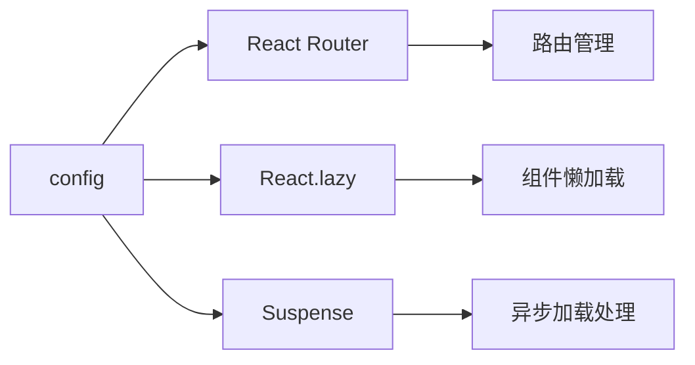

# config - 配置文件

企业管理系统的配置文件目录，包含路由配置、异步组件加载配置等。

## 目录树

```
config/
├── AsyncComponent.tsx        # 异步组件加载配置
└── routes.tsx                # 路由配置
```

## 关键文件说明

| 文件 | 作用 |
|------|------|
| `routes.tsx` | 路由配置文件，定义应用的路由结构和页面组件映射 |
| `AsyncComponent.tsx` | 异步组件加载配置，实现组件的懒加载和代码分割 |

## 依赖示意



## 相关文档

- [React Router 文档](https://reactrouter.com/docs) - React Router 官方文档
- [React.lazy 文档](https://reactjs.org/docs/code-splitting.html#reactlazy) - React 懒加载文档
- [TypeScript 规范](../../../docs/rule/code-typescript-style-rule.md) - TypeScript 配置定义规范
- [项目结构规范](../../../docs/rule/code-project-structure-rule.md) - 项目目录组织规范
