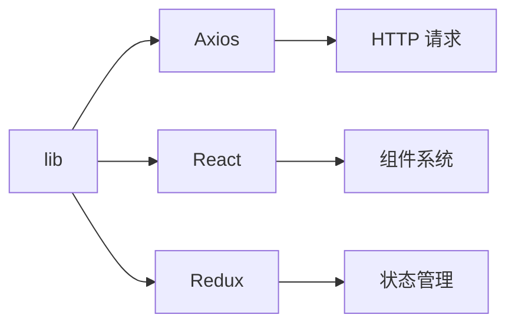

# lib - 基础库

企业管理系统的基础库目录，包含 HTTP 请求、全局配置、模态框、埋点等基础功能库。

## 目录树

```
lib/
├── ApiInterceptor/           # API 拦截器
│   ├── VIPLimit.tsx          # VIP 限制拦截器
│   └── index.ts              # 拦截器入口
├── axios.tsx                 # HTTP 请求库封装
├── global.ts                 # 全局配置
├── globalModal.tsx           # 全局模态框
├── logout.tsx                # 登出处理
├── pointBuriedGel.tsx        # 埋点功能
├── requestNeedCache.js       # 请求缓存
└── utils.tsx                 # 工具函数库
```

## 关键文件说明

| 文件 | 作用 |
|------|------|
| `axios.tsx` | HTTP 请求库封装，基于 axios 封装的请求工具 |
| `global.ts` | 全局配置，定义应用的全局变量和配置 |
| `globalModal.tsx` | 全局模态框，提供全局可用的模态框组件 |
| `logout.tsx` | 登出处理，处理用户登出逻辑 |
| `pointBuriedGel.tsx` | 埋点功能，实现数据埋点和用户行为追踪 |
| `requestNeedCache.js` | 请求缓存，实现请求结果的缓存机制 |
| `utils.tsx` | 工具函数库，提供常用的工具函数 |
| `ApiInterceptor/` | API 拦截器，处理请求和响应的拦截逻辑 |

## 依赖示意



## 相关文档

- [API 请求规范](../../../docs/rule/code-api-client-rule.md) - API 调用规范
- [TypeScript 规范](../../../docs/rule/code-typescript-style-rule.md) - TypeScript 库定义规范
- [错误处理规范](../../../docs/rule/code-error-boundary-rule.md) - 错误处理规范
