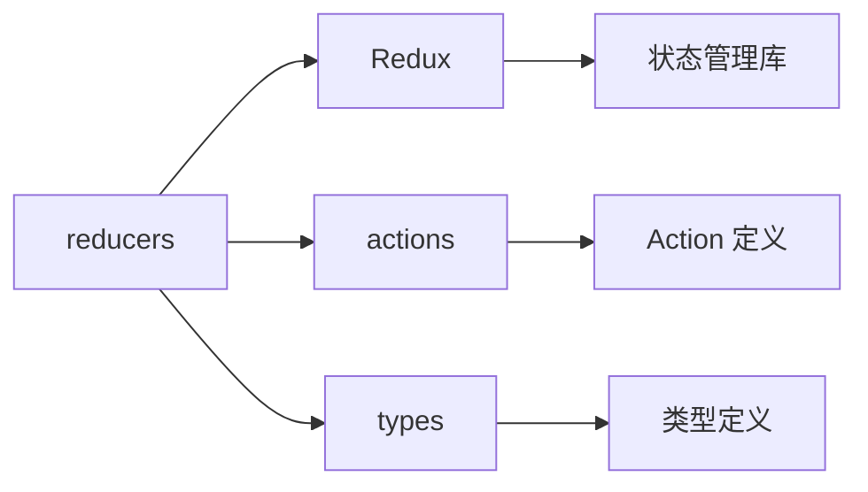

# reducers - Redux Reducers

企业管理系统的 Redux Reducers，定义状态更新逻辑，根据 Actions 处理状态变更。

## 目录树

```
reducers/
├── company.ts                # 企业状态 Reducer
├── config.ts                 # 配置状态 Reducer
├── filterRes.ts              # 筛选结果状态 Reducer
├── findCustomer.ts           # 找客户状态 Reducer
├── global.ts                 # 全局状态 Reducer
├── group.ts                  # 集团状态 Reducer
├── home.ts                   # 首页状态 Reducer
├── index.ts                  # Reducers 入口文件
├── login.ts                  # 登录状态 Reducer
├── myCollection.ts           # 我的收藏状态 Reducer
├── rankingList.ts            # 榜单状态 Reducer
├── rankingListDetail.ts      # 榜单详情状态 Reducer
├── searchList.ts             # 搜索列表状态 Reducer
├── settings.ts               # 设置状态 Reducer
├── template.ts               # 模板状态 Reducer
├── tenderingAndBidding.ts    # 招投标状态 Reducer
├── type.ts                   # 类型定义
└── user.ts                   # 用户状态 Reducer
```

## 关键文件说明

| 文件 | 作用 |
|------|------|
| `index.ts` | Reducers 入口文件，整合所有 reducers |
| `company.ts` | 企业状态 Reducer，处理企业数据状态更新 |
| `global.ts` | 全局状态 Reducer，处理语言、主题等全局状态更新 |
| `home.ts` | 首页状态 Reducer，处理首页数据状态更新 |
| `searchList.ts` | 搜索列表状态 Reducer，处理搜索结果状态更新 |
| `login.ts` | 登录状态 Reducer，处理用户登录状态更新 |
| `user.ts` | 用户状态 Reducer，处理用户信息状态更新 |
| `type.ts` | 类型定义，提供状态类型和 Action 类型 |

## 依赖示意



## 相关文档

- [Redux Reducers 文档](https://redux.js.org/tutorials/fundamentals/part-3-state-actions-reducers#reducers) - Redux Reducers 官方文档
- [TypeScript 规范](../../../docs/rule/code-typescript-style-rule.md) - TypeScript Reducer 定义规范
- [状态管理规范](../../../docs/rule/code-react-component-rule.md) - React 状态管理规范
